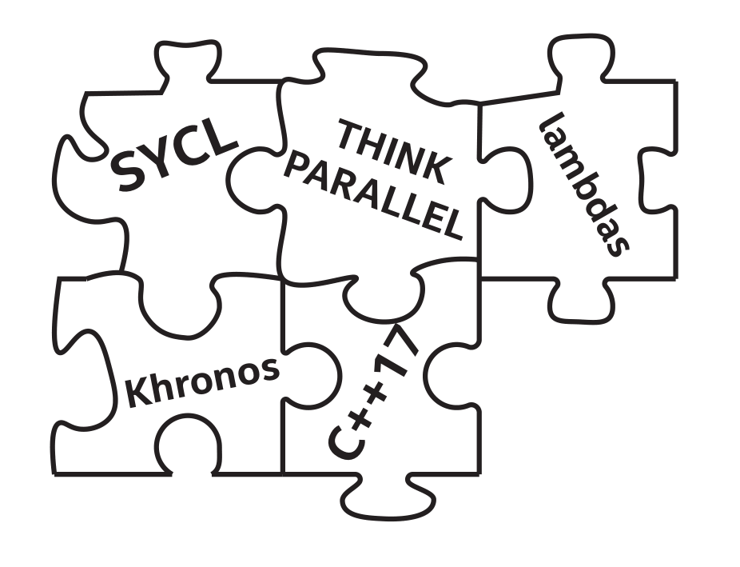

# 1 简介




本章通过介绍核心概念(包括术语)来奠定基础，这些概念在学习C++数据并行加速时非常重要。

C++中的数据并行性，允许现代异构系统访问并行资源。C++应用程序可以使用任何设备的组合——包括GPU、CPU、FPGA和AI专用硬件(ASIC)——以便解决当前的问题。

在这本书中会学到如何使用C++和SYCL进行数据并行编程。

SYCL(发音为sickle)是一个行业驱动的 `Khronos` 标准，它为异构系统在C++中增加了数据并行性。SYCL程序与支持SYCL的C++编译器(如本书中使用的开源 DPC++ 编译器)一起使用时，性能最好。SYCL不是首字母缩写，SYCL只是一个名字。

DPC++是一个开源编译器项目，最初由Intel创建，致力于支持C++中的数据并行。DPC++编译器基于SYCL、一些扩展和异构支持，包括GPU、CPU和FPGA设备。除了DPC++的开源版本，还有Intel oneAPI工具包中的商业版本。

DPC++编译器的开源版本和商业版本都支持基于SYCL的实现特性。本书中的所有例子都可以使用DPC++编译器的任何一个版本进行编译，而且所有的例子都可以使用最新的SYCL编译器进行编译。发布时，我们会特别注意使用DPC++扩展的地方。

## 1.1 读书，而不是标准规范

没有人喜欢听到“去阅读标准规范吧!”的建议吧。规范很难阅读，SYCL规范也不例外。就像所有伟大的语言规范一样，它在动机、用法和教学方面都具有足够的准确性。这本书可以作为SYCL和使用DPC++编译器的“学习指南”。

正如前言中提到的，这本书不能把一切都解释清楚。因此，本章做了其他章节不会做的事情:代码示例包含的编程结构直到以后的章节再进行解释。我们试着不去完全理解第1章的代码示例，相信每一章都会让你更加的了解SYCL。


## 1.2 SYCL 标准规范 - 1.2.1 vs 2020 与 DPC++

本书出版时，临时的SYCL 2020规范可供公众阅览。随着时间的推移，SYCL 1.2.1标准会有一个后续版本，预计会称为SYCL 2020。虽然很高兴地说，这本书介绍的是SYCL 2020，但这个标准目前还不存在。

本书介绍了SYCL的扩展，以大致了解SYCL将来的发展方向。这些扩展在DPC++编译器项目中都有实现。几乎在DPC++中实现的扩展都是暂定为SYCL 2020规范中的新特性。DPC++支持的新特性包括USM、子工作组、C++17支持的语法简化(称为CTAD——class模板参数推导)，以及无需命名就可以使用匿名Lambda函数。

发布时，SYCL编译器(包括DPC++)没有实现SYCL 2020临时规范中的功能。

本书中使用的一些特性是DPC++编译器特有的。这些特性中有许多是Intel对SYCL的扩展，后来被SYCL 2020临时规范所接受，其语法在标准化过程中发生了细微的变化。其他特性仍在开发或讨论中，可能会包含在未来的SYCL标准中，其语法也可能也会修改。语言开发过程中，非常需要这样的语法变化。实际上，我们希望特性能够进化和改进，从而满足更广泛的开发群体和更广泛的功能需求。本书中的所有代码示例都使用了DPC++语法，以确保与DPC++编译器的兼容性。

在努力接近SYCL的发展方向的同时，需要对本书中的信息进行调整，以便与标准的发展保持一致。更新信息的重要资源包括本书GitHub和勘误表，可以从本书的[网页](www.apress.com/9781484255735)找到，以及[在线oneAPI DPC++语言参考手册](https://www.intel.com/content/www/us/en/develop/documentation/oneapi-dpcpp-cpp-compiler-dev-guide-and-reference/top.html)。

## 1.3获取 DPC++ 编译器

DPC++可以从 [GitHub](https://github.com/intel/llvm)获得。如何开始使用DPC++指令，包括克隆并构建开源编译器，可以在[llvm-docs](https://intel.github.io/llvm-docs/GetStartedGuide.html)中找到。

OneAPI项目包含了打包版本的DPC++编译器，和一些增强PC++编程和支持的工具与库。该项目为异构系统带来了更广泛的支持，其中包括库、调试器和其他工具。oneAPI工具，包括DPC++，可以[免费获得](https://www.intel.com/content/www/us/en/developer/tools/oneapi/toolkits.html)。官方的oneAPI DPC++编译器文档，包括扩展列表，可以在[llvm-docs](https://intel.github.io/llvm-docs/GetStartedGuide.html)中找到。

> 本书的在线手册，[oneAPI DPC++语言在线手册](https://docs.oneapi.com/versions/latest/dpcpp/index.html)是很好的资源，对于本书介绍的内容会有更加详细的介绍。


## 1.4 Github Samples


下面的代码是最简单的应用。如果不想手动输入代码，可以从[GitHub库](https://github.com/Apress/data-parallel-CPP)下载本书中的所有示例。库中包含了构建文件中的完整代码，大多数代码都省略了一些重复的或不必要的细节。库中有示例的最新版本，如果有更新，您就能获取到最新的例程。

图1-1 简单的数据并行编程

```
#include <CL/sycl.hpp>
#include <iostream>
using namespace sycl;

const std::string secret {
	"Ifmmp-!xpsme\"\012J(n!tpssz-!Ebwf/!"
	"J(n!bgsbje!J!dbo(u!ep!uibu/!.!IBM\01"};
const auto sz = secret.size();

int main() {
	queue Q;
	
	char*result = malloc_shared<char>(sz, Q);
	std::memcpy(result,secret.data(),sz);
	
	Q.parallel_for(sz,[=](auto&i) {
		result[i] -= 1;
	}).wait();

	std::cout << result << "\n";
	return 0;
}
```


## 1.5 Hello World 

上面展示了SYCL的一个简单例程。 使用DPC++编译器编译，并运行结果如下: 

```
Hello, world!   I'm sorry, Dave. I'm afraid I can't do that. - HAL
```


第4章结束时，我们就能完全理解这个例子了。在此之前，我们可以看到包含了<sycl/sycl.hpp>(第1行)，这是定义所有SYCL组件所需要的。所有的SYCL组件都存在名为SYCL的命名空间中:

```
	- 第3行让我们避免反复写sycl::。
	- 第11行为指向特定设备的工作建立了一个队列(第2章)。
	- 第13行创建了设备共享的数据(第3章)。
	- 第16行将相应的工作加入到设备的工作队列中(第4章)。
	- 第17行是唯一在设备上运行的代码。所有其他代码都在主机(CPU)上运行。
```

第17行是我们想要在设备上运行的内核代码。该内核代码的功能是去掉一个字符。这里使用了 `parallel_for()`，内核对secret字符串中的每个字符上逐个进行处理，以便将其解码为result字符串。需要完成的工作没有顺序要求，并且当`parallel_for`将工作入队后，实际上是相对于主程序异步运行的。关键的等待(第18行)可以让我们确定，内核已经执行完成，因为在这个特定的示例中，我们使用一个特性(统一共享内存，第6章)。如果不等待，result字符串上可能会有还未解密的字符。还有很多细节需要讨论，我们会在之后的章节继续。


## 1.6 Queues and Actions

第2章将讨论队列和操作，但是现在我们可以从一个简单的解释开始了解。队列是允许应用程序在设备上完成工作的方式。有两种类型的操作可以放在队列中: (a)要执行的代码 和 (b)内存操作。执行代码通过`single_task`、`parallel_for`或`parallel_for_work_group`表示。内存操用于主机与设备之间的复制或填充，从而初始化内存。只有需要做更多的控制时，才需要使用内存操作。这些都会从本书第2章开始讨论。现在，我们知道队列是连接命令与设备的桥梁，我们有一组操作可以放入队列来执行代码和移动数据。同样重要的是，要理解请求的操作放置在队列中而不需要等待。在将操作提交到队列后，主机继续执行程序，而设备最终将以异步执行的方式执行队列请求的操作。

```
队列将连接到设备。
我们将操作提交到这些队列中，从而进行计算或数据移动。
行为是异步发生的。
```


## 1.7 关于并行


在C++中为数据并行编程与并行相关，并行编程的目标是更快地计算。事实证明有两个方向:增加吞吐量和减少延迟。

### 1.7.1 吞吐量

当在规定的时间内完成更多的工作时，吞吐量就会增加。像流水线这样的技术实际上可能会延长完成单个工作项目所需的时间，允许工作的重叠，从而在单位时间内做更多的工作。人们在一起工作时经常遇到这种情况，共享就涉及到协调的开销，这往往会减慢完成单项工作的时间。然而，多人的力量会带来更多的吞吐量。计算机也不例外——将工作扩展到更多的处理核芯中，会给每个工作单元增加开销，这可能会导致一些延迟，但可以完成更多的工作，因为有更多的处理核芯可以一起工作，。

### 1.7.2 延迟

如何更快地完成一件事，例如：分析语音命令并做出反应。 如果只关心吞吐量，那么响应时间可能会增加到无法忍受的程度。减少延迟要求我们将一项工作分解成可以并行处理的部分。对于吞吐量，图像处理可能会将每张图像分配给不同的处理单元 —— 这种情况下，目标是优化每秒处理图像的数量。对于延迟，图像处理可能会将图像中的每个像素分配给不同的处理核芯——目标是最大化单张图像每秒处理像素量。

### 1.7.3 并行思维

优秀的并行开发者在编程中会同时使用这两种技术。

想要调整思维，首先思考在算法和应用中，并行在哪里可行。还要考虑并行性的不同实现方式如何影响最终性能。这么多东西需要去理解，所以并行思维是并行开发者一生的追求。这里可以学习一些技巧。

### 1.7.4 Amdahl和Gustafson

在1967年，由超级计算机先驱吉恩·阿姆达尔(Gene Amdahl)提出的阿姆达尔定律(Amdahl’s Law)是一个公式，用来预测使用多处理器时理论上的最大速度。Amdahl遗憾地说，并行的最大收益被限制在$\frac{1}{1+p}$，其中p是并行运行的程序的部分。如果只并行运行程序的三分之二，那么最多可以加速3倍。当然要深入理解这个概念!这是因为不管让三分之二的程序以多快的速度运行，其他三分之一仍然需要相同的时间来完成。即使增加100个GPU，也只能得到3倍的性能提升。

许多年来，有些人认为这证明了并行计算的不可行性。1988年，John Gustafson发表了一篇题为“重新评估Amdahl定律”的文章。他注意到并行不是用来加速定量的工作，而是用来扩展的。大家也有同样的生活经历，1个快递员无法在更多的人和卡车的帮助下更快地递送1个包裹。然而，100个人和100辆卡车运送100件包裹比1个司机开着1辆卡车要快得多。多个司机肯定会增加吞吐量，通常也会减少交付的延迟。Amdahl定律告诉我们，1个司机不能通过增加99个司机，用1辆卡车更快地递送1个包裹。Gustafson注意到，有了这些额外的司机和卡车，可以更快地递送100个包裹。

### 1.7.5 可扩展性

“可扩展性”一词在之前的讨论中出现过。可扩展性是衡量附加计算可用时程序加速的程度(简单地称为“加速”)。如果100个包裹与1个包裹同时运送，只需用100辆卡车和司机(而不是1辆卡车和1个司机)，就可以实现加速。当然，存在限制加速的瓶颈。配送中心可能没有100个地方可以让卡车停靠。计算机程序中，瓶颈经常涉及到将数据移到将要处理的地方。分发到100个卡车类似于必须将数据分发到100个处理核心，且分发需要时间。第3章会探索如何将数据分发到异构系统需要的地方。数据分发是有成本的，而该成本会影响对应用可扩展性的预期。

### 1.7.6 异构系统

就我们的目的而言，异构系统是指包含多种类型计算设备的系统。例如：同时具有中央处理单元(CPU)和图形处理单元(GPU)的系统是一个异构系统。CPU通常称为处理器，尽管我们将异构系统中的所有处理单元称为计算处理器时，可能会混淆。为了避免这种混淆，SYCL将处理单元称为设备。第2章将开始讨论如何将工作(计算)放到异构系统中的特定设备上。

GPU已经成为高性能计算设备，因此有时也称为通用GPU或GPGPU。

现在，异构系统中的设备集合可以包括CPU、GPU、FPGA(现场可编程门阵列)、DSP(数字信号处理器)、ASIC(应用专用集成电路)和AI芯片(图形、神经拟态等)。

这类设备通常重复涉及计算处理器(多处理器)，以及增加诸如内存等数据源的连接(增加带宽)。第一个是多处理，对于提高吞吐量特别有用。我们的类比中，这通过添加额外的司机和卡车来实现。后者有更高的数据带宽，对于减少延迟特别有用。这些，可以通过使用更多的装载坞来实现，以使卡车能够并行装载。

拥有多种类型设备时，每种设备具有不同的架构，因此具有不同的特性，这就导致每种设备需要不同的编程和优化需求。这就成为了编写SYCL(DPC++编译器)的动机，也是本书的主要内容。

> SYCL的存在是为了解决异构系统中数据并行编程的挑战。

### 1.7.7 数据并行编程

数据并行编程关注的是并行性，可以将其想象为一组并行操作的数据。我们需要运送100个包裹(有效地大量数据)，以便将工作分配给100辆有司机的卡车。关键的是我们应该划分什么？处理整个图像，还是用小块，还是逐像素处理？应该将对象的集合分析为单个集合，还是将对象的一组更小的分组，或者一个对象一个对象地分析？

选择正确的工作分工并将其有效地映射到计算资源上，是使用SYCL和DPC++的并行开发者的责任。这个主题会在第4章开始讨论。


## 1.8 DPC++ 与 SYCL 的特点

每个DPC++(或SYCL)程序都是一个C++程序。SYCL和DPC++都不依赖于对C++，可以通过模板和Lambda函数实现。

SYCL编译器要以依赖于SYCL规范的内置优化。缺乏SYCL内置优化的标准C++编译器，无法达到支持SYCL的编译器的性能水平。

接下来，将了解DPC++和SYCL的关键属性:单源模式、主机、设备、内核代码和异步任务图。

### 1.8.1 单源模式

程序可以是单源的，同一个翻译单元既包含要在设备上执行的计算内核的代码，也包含协调这些计算内核执行的主机代码。开发者仍然可以将程序源划分为不同的文件，分别用于表示主机和设备代码。

### 1.8.2 主机

每个程序都是从主机开始运行的，并且程序中的大部分代码通常为主机编写。目前为止，主机一直都是CPU。标准不要求这样做，所以我们可以将其描述为主机。不过，主机似乎不太可能是CPU以外的任何东西，因为主机程序需要完全支持C++17，以便支持所有DPC++和SYCL程序。我们很快就会了解到，在设备端不需要支持所有的C++17特性。


### 1.8.3 设备

程序中使用多个设备是异构编程的原因。这就是为什么在之前对异构系统进行解释之后，“设备”这个词在本章中反复出现的原因。异构系统中的设备集合可以包括GPUI、FPGA、DSP、ASIC、CPU和AI芯片，但不限于任何固定列表。

SYCL承诺的加速目标是设备端，加速计算的想法通常是将工作转移到可以加速工作完成的设备上进行。所以，需要了解如何消弭移动数据所消耗的时间，这需要不断的思考。

### 1.8.4 共享设备

一个有设备(如GPU)的系统上，可以想象两个或更多的程序正在运行，并且希望使用一个设备。不必是使用SYCL或DPC++的程序。如果另一个程序正在使用该设备，则其他程序需要等待，这与C++程序中使用CPU的原理相同。如果在CPU上同时运行太多的活动程序(邮件、浏览器、病毒扫描、视频编辑、照片编辑等)，任何系统都可能超载。

超级计算机上，当为节点(CPU+附加设备)指定应用程序时，不需要考虑共享。非超级计算机系统上，如果有多个应用程序同时使用相同的设备，那么数据并行的程序性能会受到影响。

一切也都能正常工作，无需对此进行特别的编程。

### 1.8.5 内核代码

设备端执行的代码称为内核代码。这不是SYCL或DPC++独有的概念:它是其他加速语言包括OpenCL和CUDA的内核概念。

内核代码有一定的限制，允许更广泛的设备支持和大量并行。内核代码中不支持的特性包括动态多态性、动态内存分配(因此没有使用new或delete操作符的对象管理)、静态变量、函数指针、运行时类型信息(RTTI)和异常处理。不允许从内核代码调用虚成员函数和变参数函数。内核代码不允许递归。

第3章将描述在调用内核前后，如何完成内存分配，从而确保内核代码专注于大规模并行计算。第5章将描述如何处理设备上代码的异常。

C++的其余部分在内核中是一样的，包括Lambda、操作符重载、模板、类和静态多态性。我们还可以与主机共享数据(见第3章)，并共享(非全局)主机变量的只读值(通过Lambda捕获)。

### 1.8.6 内核代码:向量相加 (DAXPY)

任何编写过计算复杂代码的程序员都应该熟悉内核。考虑实现DAXPY，代表“双精度A乘以X加Y”。代码1-2展示了DAXPY在现代Fortran, C/C++和SYCL中实现的，计算行(第3行)实际上是相同的。第4章和第10章将详细解释内核。代码1-2应该有助于消除内核难以理解的担忧。

图1-2 DAXPY计算在Fortran, C++和SYCL的实现

```
! Fortran loop
do i = 1, n
	z(i) = alpha * x(i) + y(i)
end do

// C++ loop
for (int i=0;i<n;i++) {
	z[i] = alpha * x[i] + y[i];
}

// SYCL kernel
myq.parallel_for(range{n},[=](id<1> i) {
	z[i] = alpha * x[i] + y[i];
}).wait();
```

### 1.8.7 异步任务图

SYCL/DPC++编程的异步特性是有必要了解的。理解异步编程至关重要，原因有二:(1)正确使用可以获得更好的性能(更好的扩展性)，(2)错误会导致并行编程错误(通常是竞争条件)，从而使程序变得不可靠。

之所以具有异步特性，是因为通过请求操作的“队列”传输到设备。主程序将请求操作提交到队列中，然后程序继续运行，不等待结果。这种不等待很重要，这样就可以让计算资源(设备和主机)处于忙碌状态。如果必须等待，这将占用主机资源。当设备完成时，还会产生串行瓶颈，直到新工作入队。Amdahl定律惩罚的是花在不并行工作上的时间，我们需要构建我们的程序，以便在设备繁忙时，在设备和主机之间来回移动数据，并在执行任务时保持设备和主机的计算能力。如果不这样做，Amdahl法则将会惩罚我们。

第4章将把程序看作异步任务图，第8章会扩展这个概念。

### 1.8.8 出错时的条件竞争

第一个代码示例(代码1-1)中，在第18行做了`wait`，以避免result可用前进行使用。相同的代码示例中，还有另一件事情——第14行使用`std::memcpy`加载输入。由于`std::memcpy`在主机上运行，所以直到第15行完成后，才执行第16行及以后的代码。阅读了第3章之后，可能会使用myQ.memcpy(使用SYCL)，在代码1-3的第8行。因为这是队列提交，所以不能保证它会在第10行之前完成。这将引起条件竞争，是并行编程的Bug。当程序的两部分同时访问相同的数据时，就存在条件竞争。我们希望使用第8行写入数据，然后在第10行读取数据，所以不希望在第8行完成之前执行第17行!这样的条件竞争会使程序的结果不可预测——在不同的系统和不同的运行情况下得到不同的结果。解决这个问题的方法是显式地等待myQ，将`.wait()`添加到第8行末尾，但这不是最好的解决办法。可以使用事件来解决这个问题(第8章)。作为一种替代方案，第7章将看到如何使用缓冲区和访问器的编程方式，让SYCL管理依赖关系并自动等待。

图1-3 添加条件竞争

```
// ...we are changing one line from Figure 1-1
char *result = malloc_shared<char>(sz, Q);

// Introduce potential data race!
// We don't define a dependence
// to ensure correct ordering with
// later operations.
Q.memcpy(result,secret.data(),sz);

Q.parallel_for(sz,[=](auto&i) {
	result[i] -= 1;
}).wait();

// ...
```

添加`wait()`强制在`memcpy`和内核之间进行主机同步，这与让设备一直处于繁忙状态的建议相反。

为了检测程序中的数据条件竞争(包括内核)，可以使用一些工具，如Intel Inspector(可以使用前面“获得DPC++编译器”中提到的oneAPI工具)。这些工具使用的方式并不适用于所有设备。检测条件竞争最好的方法是让所有内核都运行在一个CPU上，这可以作为开发期间的一种调试技巧。这个调试技巧会在第2章中以方法2的形式进行讨论。


> 第4章将告诉我们“Lambda无害”，为了更好地使用DPC++、SYCL和现代C++，我们应该去了解Lambda函数。

### 1.8.9 C++ Lambda函数

并行编程技术大量使用的现代C++的特性是Lambda表达式。内核(在设备上运行的代码)可以用多种方式表示，最常见的一种是Lambda函数。第10章讨论了内核可以采用的所有形式，包括Lambda函数。这里有一个关于C++ Lambda函数的复习，以及关于使用定义内核的注意事项。前面的章节中学习了更多关于SYCL的知识之后，第10章会对内核方面进行扩展。

图1-3中的代码有一个Lambda函数。在C++中，Lambda以一个方括号开始，在结束方括号之前的信息表示如何捕获在Lambda中使用，但没有显式地作为参数传递给它的变量。对于内核，必须捕获方括号中等号表示的值。

C++11中引入了对Lambda表达式的支持。它们用于创建匿名函数对象(尽管我们可以将它们赋值给命名变量)，这些对象可以从外围作用域捕获变量。C++ Lambda表达式的基本语法是：

`[ capture-list ] ( params ) -> ret { body }`


- **capture-list** 是一个以逗号分隔的捕获列表，通过在捕获列表中列出变量名来按值捕获。通过引用来捕获变量，在它前面加上一个\&号，例如：\&v。还有适用于所有作用自动变量:[=]是用来捕获所有变量和当前对象的引用，[\&]是用来捕获所有变量以及当前对象的引用，而[]就什么都不捕获。对于SYCL，总使用[=]，因为在内核中不允许通过引用捕获变量。根据C++标准，Lambda中不包含全局变量。非全局静态变量可以在内核中使用，但只有当它们是const时才可以。
- **params** 是函数参数的列表，就像命名函数一样。SYCL提供了一些参数来标识正在调用内核处理的元素:这可以是唯一的id(一维的)，也可以是2维或3维的id。这些将在第4章中讨论。
- **ret** 是返回类型。如果->ret未指定，则从return语句推断。没有return语句或没有值的return，意味着返回类型为void。SYCL内核必须总是有一个返回类型void，所以可以不用这种方式来为内核指定返回类型。
- **body** 是函数体。对于SYCL内核的内容有一些限制(参见本章前面的“内核代码”部分)。


图1-4 C++代码中的Lambda函数

```
int i = 1, j = 10, k = 100, l = 1000;

auto lambda = [i, &j] (int k0, int &l0) -> int {
	j = 2* j;
	k0 = 2* k0;
	l0 = 2* l0;
	return i + j + k0 + l0;
};

print_values( i, j, k, l );
std::cout << "First call returned "<< lambda( k, l ) << "\n";
print_values( i, j, k, l );
std::cout << "Second call returned "<< lambda( k, l ) << "\n";
print_values( i, j, k, l );
```

图1-5 图1-4中的Lambda函数代码的输出

```
i == 1 \\
j == 10 \\
k == 100 \\
l == 1000 \\
First call returned 2221 \\
i == 1 \\
j == 20 \\
k == 100 \\
l == 2000 \\
Second call returned 4241 \\
i == 1 \\
j == 40 \\
k == 100 \\
l == 4000 
```

图1-4展示了一个C++ Lambda表达式，通过值捕获变量i，通过引用捕获变量j。还有一个参数k0和另一个通过引用接收的参数l0。运行此示例将产生如代码1-5所示的输出结果。

可以把Lambda表达式看作函数对象的实例，编译器会创建类定义。例如，前面的示例中使用的Lambda表达式类似于代码1-6中所示的类实例。无论在哪里使用C++ Lambda表达式，都可以用函数对象的实例来替代它，如图1-6所示。

当定义函数对象时，需要给它分配一个名称(图1-6中的Functor)。内联表示的Lambda(如图1-4所示)是匿名的，不需要名称。

图1-6 用函数对象代替Lambda(详见第10章)

```
class Functor{
public:
	Functor(int i, int &j) : my_i{i}, my_jRef{j} { }
	
	int operator()(int k0, int &l0) {
		my_jRef = 2 * my_jRef;
		k0 = 2 * k0;
		l0 = 2 * l0;
		return my_i + my_jRef + k0 + l0;
	}

private:
	int my_i;
	int &my_jRef;
};
```

### 1.8.10 可移植性和直接编程

可移植性是SYCL和DPC++的目标，但两者都不能保证。一种语言和编译器所能做的，就是在需要的时候更容易在应用程序中实现可移植性。

可移植性比较复杂，包括功能和性能可移植性。功能可移植性，程序可以在各种平台上编译和运行。性能可移植性，程序能够在各种平台上获得合理的性能。虽然这是相当软的定义，但相反的情况可能会更清楚——我们不想写一个程序，其在一个平台上运行得非常快，但在另一个平台上运行得非常慢。事实上，我们更希望能充分利用运行它的任何平台。作为开发者，考虑到异构系统中设备的多样性，性能可移植性需要我们付出更多的努力。

幸运的是，SYCL定义了可以提高性能可移植性的方式。首先，通用内核可以在任何地方运行。少数情况下，这可能就足够了。更常见的是，重要内核的几个版本可能是为不同类型的设备编写。具体来说，一个内核可能有一个通用GPU和通用CPU版本。有时候，可能想为特定的设备(特定的GPU)专门设计内核。当这种情况发生时，可以编写多个版本，并针对不同的GPU模型对每个版本进行定制化。或者我们可以参数化一个版本，使用GPU的属性来修改现有的GPU内核代码，以适应当前的GPU。

作为开发者，我需要设计有效的性能可移植性计划，SYCL定义了一些结构来帮助我们实现这个计划。正如前面提到的，可以通过以下方式对功能进行分层:首先是针对所有设备的内核，然后根据需要逐步引入更特化的内核。这听起来很棒，但程序的整体流程也可能产生深远的影响，因为数据移动和算法选择也很重要。了解了这一点，我们就可以理解为什么SYCL(或其他直接编程解决方案)没有解决性能可移植性。但作为工具，可以帮助我们应对这些挑战。


## 1.9 并发与并行
  
“并发”和“并行”并不等同，尽管有时会误解为等同。并发所需要的编程考虑对并行性也很重要。

“并发”是可以启动的代码，但不一定是在同一时刻。在我们的计算机上，如果打开了一个邮件程序和一个Web浏览器，那么它们是同时运行的。在只有一个处理器的系统上，通过一个时间切片(在运行每个程序之间快速来回切换)的过程可以发生并发。


> 对并发性的任何考虑，对并行性也很重要。


“并行”是可以在同一时刻启动的代码。并行要求系统可以同时做多件事。异构系统总是可以并行地做事，因为其至少有两个计算设备。当然，SYCL程序不需要异构系统，因为它可以仅在主机系统上运行。

代码的并发执行通常面临着与代码并行执行相同的问题，因为任何特定的代码都不能假设是唯一的(数据位置、I/O等)。


## 1.9.10 总结
  
本章提供了学习SYCL和DPC++所需的术语，并提供了对学习SYCL和DPC++至关重要的并行编程内容和C++关键特性方面的复习。第2章、第3章和第4章会对SYCL编程的三个关键进行了扩展:给设备分配工作(发送代码在设备上运行)，提供数据(发送数据在设备上使用)，编写代码的方法(内核)。


