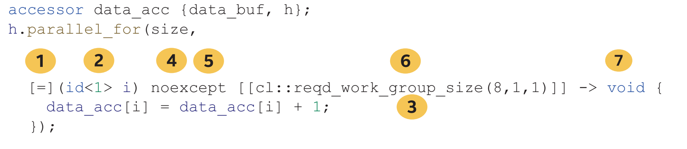

# 10 定义内核函数


目前为止，代码示例都是使用C++ Lambda表达式表示内核。Lambda表达式是表示内核的一种方法，但不是SYCL中表示内核的唯一方法。本章中，我们将探索各种详细定义内核的方法，从而选择最适合C++编码需求的内核形式。

本章解释和比较了三种表示内核的方法:

	- Lambda表达式
	- 命名函数对象(functor)
	- 与其他语言或API创建的内核

本章讨论了如何显式地操作程序对象中的内核，控制何时以及如何编译内核。


## 10.1 为什么用三种方法来表示内核函数?

深入讨论细节之前，首先了解一下为什么有三种定义内核的方式，以及每种方法的优缺点。图10-1给出了一个表。

内核是用来表示计算单元的，内核的许多实例通常会在加速器上执行。SYCL支持多种方式来表示内核，以便无缝地集成到各种代码库中，同时在各种加速器类型上高效地执行。


图10-1 三种表示内核的方法

内核表示 | 描述
-- | --
Lambda 表达式 | **优点**:<br>- Lambda表达式是一种简洁的方式，可以在使用的地方表示内核。<br>- Lambda表达式是现代C++代码库中表示类内核操作的一种方式。<br>- Lambda捕获规则自动将数据传递给内核。<br>**缺点**:<br>- 以Lambda表达式表示的内核不能模板化，不能重用，也不能作为库提供。<br>- 一些代码库可能不支持Lambda语法。
命名函数对象 | **优点**:<br>- 函数可以模板化、重用，并作为库的一部分提供。<br>- 函数提供对传递给内核数据的更多控制。<br>**缺点**:<br>- 用函数对象表示内核比用Lambda表达式表示的内核使用更多的代码。<br>- 内核参数必须显式地传递给函数对象，不能自动捕获。
与其他语言或API | **优点**:<br>- 允许重用以前编写的内核或库。<br>- 允许大型应用程序代码库增量地添加对SYCL的支持。<br>- 来自其他API的内核语言可能支持尚未添加或难以用SYCL表达的特性。<br>**缺点**:<br>- 互操作性是一个可选特性，不是所有SYCL实现或设备都支持该特性。<br>- 用其他API编写的内核不是由SYCL设备编译器编译的，这可能会限制编译时对语法、内核参数的类型检查和优化。<br>- 用其他API编写的内核可能不支持最新的C++特性。


## 10.2 使用Lambda表示内核函数

C++ Lambda表达式，也称为匿名函数、未命名函数、闭包。本节介绍了如何将内核表示为C++ Lambda。本节扩展了第1章中关于C++ Lambda函数的介绍。

C++ Lambda表达式非常强大，表示内核时，只需要(并支持)完整C++ Lambda语法的子集即可。


图10-2 使用Lambda表达式定义的内核
```
h.parallel_for(size,
	// This is the start of a kernel lambda expression:
	[=](id<1> i) {
		data_acc[i] = data_acc[i] + 1;
	}
	// This is the end of the kernel lambda expression.
);
```


### 10.2.1 内核Lambda的构成

图10-2展示了用Lambda编写的内核———书中目前为止的代码示例都使用这种语法。

图10-3中的图显示了可以与内核一起使用的Lambda的更多组件，其中许多都不是必须的。大多数情况下，默认值就足够了，所以内核Lambda看起来更像图10-2中的表达式，而不是图10-3中那样。


图10-3 内核Lambda的更多要素，包括可选组件



	- Lambda的第一部分描述捕获。从周围捕获变量使其可以在Lambda表达式中使用，而不用显式地将其作为参数传递给表达式。
	C++ Lambda表达式支持通过复制或创建对变量的引用的方式来捕获变量，但对于内核Lambda，变量只能通过复制来捕获。一般的做法是简单地使用默认捕获模式[=]，隐式地按值捕获所有变量，不过也可以显式地命名每个捕获的变量。在内核中使用的任何未捕获的变量都会将导致编译时错误。
	- Lambda的第二部分是传递给表达式的参数，就像传递参数给命名函数一样。
	对于内核Lambda，参数取决于调用内核的方式，并且通常标识为并行执行空间中工作项的索引。关于各种并行执行空间，以及如何识别执行空间中工作项的索引的细节信息，请参阅第4章。
	- Lambda的最后一部分定义了函数体。对于内核Lambda，函数体描述了在并行执行空间中的每个索引处执行的操作。
	内核也支持Lambda的其他部分，要么是可选的，要么不常用:
	- 可能会支持一些说明符(比如mutable)，但不建议使用，并且在未来的SYCL版本(在SYCL 2020中已经没有了)或DPC++中可能会删除这种支持。
	- 如果提供了异常，就必须是noexcept，因为内核不支持异常。
	- 支持Lambda属性，可以用来控制如何编译内核。例如，reqd_work_group_size属性可用与定义工作组大小。
	- 可以指定返回类型，但必须返回void，因为内核不支持非void返回类型。


#### 隐式捕获还是显式捕获?
一些C++风格指南建议不要使用隐式(或默认)捕获Lambda，因为可能存在悬空指针问题，特别是在表达式跨越作用域边界时。当Lambda用于表示内核时，也会出现同样的问题，因为内核在设备上与主机代码异步执行。

因为隐式捕获简单好用，是SYCL内核的常见做法，也是本书中经常使用的一种方法，但最终需要权衡隐式捕获的简洁和显式捕获的清晰。


### 10.2.2 命名表示内核的Lambda

当内核写成Lambda时，某些情况下必须提供另外一个标识:因为表达式是匿名的，有时SYCL需要显式的内核名称模板参数来标识写成表达式的内核。


图10-4 命名内核的Lambda
```
// In this example, "class Add" names the kernel lambda:

h.parallel_for<class Add>(size, [=](id<1> i) {
	data_acc[i] = data_acc[i] + 1;
});
```

命名内核Lambda是由主机代码编译器确定，再由单独的设备代码编译器编译内核时，确定调用哪个内核的一种方法。命名内核Lambda还可以对已编译的内核进行运行时选择，或通过名称构建内核，如图10-9所示。

为了在不需要内核名的情况下支持更简洁的代码，DPC++编译器支持通过-fsyclnamed -lambda编译器选项来省略内核名。使用该选项时，不需要显式的内核名模板参数，如图10-5所示。


图10-5 使用未命名的内核Lambda
```
// In many cases the explicit kernel name template parameter
// is not required.
h.parallel_for(size, [=](id<1> i) {
	data_acc[i] = data_acc[i] + 1;
});
```

大多数情况下不需要Lambda的内核名称模板参数，所以可以从未命名的Lambda开始，只有在需要内核名称的情况下添加即可。

> 不需要内核名称时，首选未命名的内核Lambda。


## 10.3 使用命名的函数对象表示内核函数

命名函数对象，也称为函子，允许在定义接口的同时操作任意数据集合。当用于内核时，已命名函数对象的成员变量定义了内核可能操作的状态，重载函数调用operator()将为并行执行的每个工作项调用。

命名函数对象需要比Lambda更多的代码来表示内核，但提供了更多的功能。例如，更容易分析和优化以命名函数对象表示的内核，因为内核使用的任何缓冲区和数据都必须显式地传递给内核，而不是自动捕获。

最后，因为命名函数对象就像C++类一样，表示为命名函数对象的内核可以模板化。以命名函数对象表示的内核也更容易重用，可以作为头文件或库的一部分。


### 10.3.1 内核命名函数对象的组成

图10-6中的代码描述了用命名函数对象表示的内核。


图10-6 内核作为命名函数对象
```
class Add {
public:
	Add(accessor<int> acc) : data_acc(acc) {}
	void operator()(id<1> i) {
		data_acc[i] = data_acc[i] + 1;
	}

private:
	accessor<int> data_acc;
};

int main() {
	constexpr size_t size = 16;
	std::array<int, size> data;
	
	for (int i = 0; i < size; i++)
		data[i] = i;
		
	{
		buffer data_buf{data};
		
		queue Q{ host_selector{} };
		std::cout << "Running on device: "
				  << Q.get_device().get_info<info::device::name>() << "n";
				  
		Q.submit([&](handler& h) {
			accessor data_acc {data_buf, h};
			h.parallel_for(size, Add(data_acc));
		});
	}
});
```

当内核表示为命名函数时，必须遵循C++11规则才能复制。命名函数对象可以安全地逐字节地复制，使命名函数对象的成员变量能够传递给在设备上执行的内核代码。

重载函数调用operator()的参数取决于内核，就像用Lambda表示的内核一样。

因为是命名的函数对象，所以主机代码编译器可以使用函数对象类型与设备代码编译器生成的内核代码相关联。因此，命名内核函数对象不需要内核名称。


## 10.4 与其他API的互动性

当SYCL实现构建在另一个API上时，该实现可能能够与使用底层API机制定义的内核进行互操作。这允许应用程序将SYCL集成到现有代码库中。

因为SYCL实现可能基于许多API，所以本节中描述的功能是可选的，并不是所有实现都支持。底层API甚至可能根据特定的设备类型，或设备供应商而有所不同!

广义地说，一个实现可能支持两种互操作性机制:从API定义的源或中间表示(IR)或从特定于API的句柄。这两种机制中，从API定义的源或中间表示创建内核的能力更具可移植性，因为一些源或IR格式由多个API支持。例如，OpenCL C内核可直接使用，或者可以编译成某个API可以理解的形式，但是来自某个API的特定于API的内核句柄，不太可能让另一个API理解。

> 记住，所有形式的操作都是可选的!不同的SYCL实现可能支持从不同API句柄创建的内核——或者根本不支持。要了解详细信息，请查阅文档!


### 10.4.1 与API定义的互动性

使用这种形式的互动性，内核的内容描述为源代码或使用不是由SYCL定义的中间表示，但是内核对象仍然使用SYCL API创建。这种形式的互动性可以重用，使用其他源语言编写的内核库，或者使用中间表示形式生成代码的特定语言(DSl)。

实现必须理解内核源代码或中间表示，才能利用这种形式的互动性。例如，如果内核以源码的形式使用OpenCL C编写，那么实现必须支持从OpenCL C内核源代码构建SYCL程序。

图10-7展示了如何将SYCL内核编写为OpenCL C内核源代码。


图10-7 使用OpenCL C内核源码创建SYCL内核
```
// Note: This must select a device that supports interop!
queue Q{ cpu_selector{} };

program p{Q.get_context()};

p.build_with_source(R"CLC(
		kernel void add(global int* data) {
			int index = get_global_id(0);
			data[index] = data[index] + 1;
		}
		)CLC",
		"-cl-fast-relaxed-math");
		
std::cout << "Running on device: "
		  << Q.get_device().get_info<info::device::name>() << "n";

Q.submit([&](handler& h) {
	accessor data_acc {data_buf, h};
	
	h.set_args(data_acc);
	h.parallel_for(size, p.get_kernel("add"));
});
```

例子中，内核以字符串形式表示，在同一个文件中对SYCL的主机API进行调用(但这并不是必须的)，一些程序可以从文件读取内核字符串然后生成内核。

因为SYCL编译器无法看到用内核，所以必须使用 `set_arg()` 或 `set_args()` 接口显式地传递内核参数。SYCL运行时和API定义语言必须将对象作为内核参数。本例中，访问器dataAcc作为内核的全局指针参数进行数据传递。

`build_with_source()` 接口支持传递API定义的构建选项，来控制内核的编译方式。例子中，编译选项为 `-cl-fast- relaxation -math`，用于表示内核编译器可以使用更快、低精度的数学库。编译选项是可选的，如果不需要生成选项，可以省略。。


### 10.4.2 与API定义内核的互动性

内核对象本身在另一个API中创建，然后导入SYCL。这种形式的互动性使，应用程序的一部分可以使用底层API直接创建和使用内核对象，而应用程序的另一部分可以使用SYCL API重用相同的内核。图10-8中的代码展示了如何从OpenCL内核对象创建SYCL内核。


图10-8 OpenCL内核对象创建的内核
```
// Note: This must select a device that supports interop 
// with OpenCL kernel objects!
queue Q{ cpu_selector{} };
context sc = Q.get_context();

const char* kernelSource =
	R"CLC(
	kernel void add(global int* data) {
		int index = get_global_id(0);
		data[index] = data[index] + 1;
	}
	)CLC";
cl_context c = sc.get();
cl_program p =
	clCreateProgramWithSource(c, 1, &kernelSource, nullptr, nullptr);
clBuildProgram(p, 0, nullptr, nullptr, nullptr, nullptr);
cl_kernel k = clCreateKernel(p, "add", nullptr);

std::cout << "Running on device: "
	 	  << Q.get_device().get_info<info::device::name>() << "n";
	 	  
Q.submit([&](handler& h) {
	accessor data_acc{data_buf, h};
	
	h.set_args(data_acc);
	h.parallel_for(size, kernel{k, sc});
});

clReleaseContext(c);
clReleaseProgram(p);
clReleaseKernel(k);
```

与其他形式的互动性一样，SYCL编译器对API定义的内核对象不可见。因此，必须使用 `set_arg()` 或 `set_args()` 接口显式传递参数，并且SYCL运行时和底层API必须遵循传递参数的约定。

## 10.5 程序对象中的内核函数

前面的部分中，内核是API定义的，或者是由特定的句柄创建的，内核通过两个步骤创建:首先创建程序对象，然后从程序对象创建内核。程序对象是内核及其调用的函数集合，这些函数编译为一个单元。

对于以Lambda或命名函数对象表示的内核，包含内核的程序对象是隐式的，对应用程序来说不可见。对于需要更多控制的应用程序，可以显式地管理内核和封装程序对象。为了说明为什么这样做，简要地了解下有多少SYCL实现管理即时(JIT)内核编译就能知道了。

虽然规范并不要求，但许多实现使用“惰性的”方式编译内核。这是一个很好的策略，因为可以确保快速启动程序，并且仅编译执行的内核。这种策略的缺点是，第一次使用内核的时间通常比后续要长，因为包括编译所需的时间，以及提交和执行内核的时间。对于某些复杂的内核，编译内核的时间可能很长，因此需要在应用程序执行期间将编译进行转移，比如：在应用程序加载时，或者在后台线程中。

一些内核还可能受益于实现定义的“构建选项”，以精确地控制内核的编译方式。例如：可以指示内核编译器使用精度较低，但性能更好的数学库。

为了更好地控制编译内核的时间和方式，应用程序可以使用特定的构建选项，在使用内核之前显式地编译内核。然后，将预编译的内核提交到一个队列中执行。原理如图10-9所示。


图10-9 使用构建选项编译内核Lambda函数
```
// This compiles the kernel named by the specified template
// parameter using the "fast relaxed math" build option.
program p(Q.get_context());

p.build_with_kernel_type<class Add>("-cl-fast-relaxed-math");

Q.submit([&](handler& h) {
	accessor data_acc {data_buf, h};
	
	h.parallel_for<class Add>(
		// This uses the previously compiled kernel.
		p.get_kernel<class Add>(),
		range{size},
		[=](id<1> i) {
			data_acc[i] = data_acc[i] + 1;
	});
});
```

本例中，从SYCL上下文创建程序对象，使用 `build_with_kernel_type` 函数构建由指定的模板形参定义的内核。对于这个示例，程序构建选项 `-cl-fast-relaxed-math` 表示内核编译器可以使用更快的数学库，但程序构建选项是可选的，如果不需要特殊的程序构建选项，可以省略。本例中，需要指定内核Lambda的模板参数，以确定要编译的内核。

也可以从特定设备的上下文上创建程序对象，程序对象可以使用不同的构建选项，将内核编译到不同的设备对象上。

除了内核Lambda外，之前编译的内核使用 `get_kernel` 将内核传递给 `parallel_for`。这可以确保使用使用高效数学库构建的内核。如果之前编译的内核没有传递给 `parallel_for`，那么内核将再次编译，不需要任何构建选项。这可能在功能上是正确的，但肯定不是预期的行为!

许多情况下，这些步骤不太可能对应用程序的行为产生影响，但是在调优应用程序的性能时，需要考虑这些步骤所带来的性能影响。

#### 改进互动性和程序对象管理

虽然本章介绍了描述的用于互动性和程序对象管理的SYCL接口，但它们可能会在SYCL和DPC++的未来版本中得到改进和增强。请参考最新的SYCL和DPC++文档，以找到更新。


## 10.6 总结


本章中，探索了定义内核的不同方法。描述了如何通过将内核表示为C++ Lambda或命名函数对象，来集成到现有的C++库中。对于新的代码，还讨论了不同内核表示的优缺点，以帮助应用程序或库的需要选择定义内核的最佳方式。

还介绍了如何与其他API进行互动，通过API的表示中创建内核，或者通过句柄到内核的API表示创建内核对象。互动性使应用程序可以随着时间的推移从底层API迁移到SYCL，或者与为其他API编写接口。

最后，描述了在SYCL应用程序中内核是如何编译的，以及如何直接操作程序对象中的内核来控制编译。尽管大多数应用程序不需要这种级别的控制，但在调优时了解这一点这方面的知识是有用的。