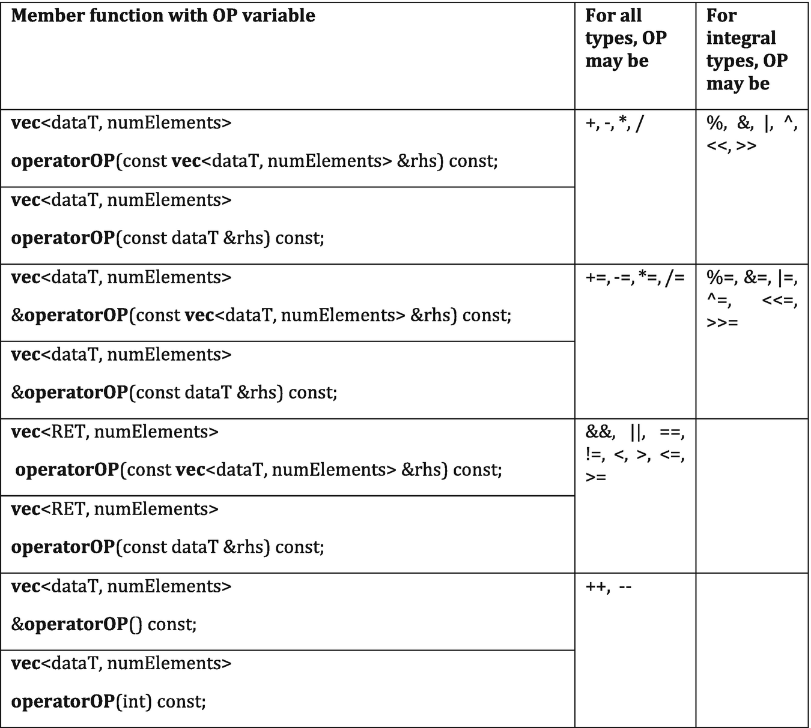
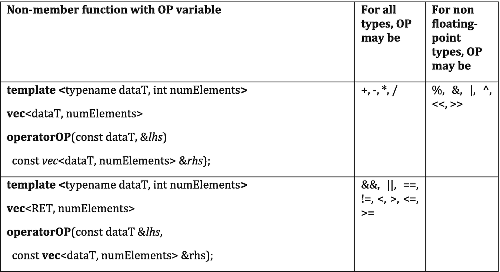
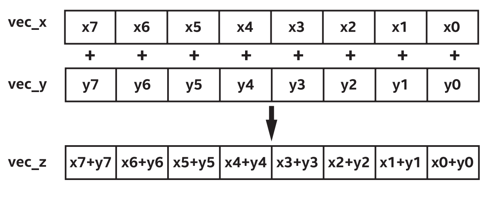

# 11 向量


向量是数据的集合，计算机中的并行性来自于计算硬件的集合，数据通常以相关的分组进行处理(例如，RGB像素中的颜色通道)。如此重要的特性，值得用一章来讨论向量类型的优点，以及如何使用它们。本章中，不会深入到向量化，因为它会根据设备类型和实现而变化。向量化将在第15和16章中讨论。

本章旨在解决以下问题:


	- 什么是向量类型?
	- 关于向量接口，需要知道多少?
	- 应该使用向量类型来表示并行性吗?
	- 什么时候使用向量类型?


我们将使用代码示例讨论可用向量类型的优缺点，并重点介绍向量类型的使用。


## 11.1 如何使用向量的方式思考

当与并行编程专家交谈时，向量是一个有争议话题。根据作者的经验，这是因为不同的人以不同的方式定义和思考这个术语。

有两种对向量数据类型(数据的集合)的理解:

	- **作为一种方便类型**：例如，将像素的颜色通道(例如RGB、YUV)分组为单个变量(例如：float3)，可以是一个向量。可以定义一个像素类或结构，并在其上定义像+这样的数学运算符，但向量类型可以方便地使用。其类型可以在许多着色器语言中找到，所以这种思维方式在许多GPU开发者中已经是共识了。
	- 作为一种描述代码机制，是如何映射到硬件适配的**SIMD指令集**上的呢？例如，一些语言和实现中，float8上在理论上可以映射到硬件中的8通道SIMD指令。Vector类型在多种语言中作为特定指令集的一种高级替代存在。

尽管这两种解释非常不同，但当SYCL和其他语言同时适用于CPU和GPU时，可以将其组合在一起。SYCL 1.2.1规范中的向量与这两种理解兼容(稍后将再次讨论这一点)。在进一步讨论之前，需要了解DPC++中的理解。

本书中，讨论了如何将工作项组合在一起以便使用强大的通信和同步原语，例如：子工作组栅栏和混洗。为了使这些操作在向量硬件上效率最优，假设子工作组中的不同工作项可以合并，并映射到SIMD指令。换句话说，编译器可以将多个工作项组合在一起，可以映射到硬件的SIMD指令上。第4章中，SPMD编程模型操作需要在支持向量操作的硬件上进行，一个通道的工作项构成的SIMD指令，而不是一个工作项定义了整个操作的SIMD指令。当硬件中映射到SIMD指令，并使用DPC++编译器以SPMD风格编程时，可以认为编译器总是在跨工作项进行向量化。

对于本书中描述的特性和硬件，向量主要用于本节的第一个解释——向量是一种类型，不应该认为是对SIMD指令的映射。工作项分组在一起，在指令的(CPU、GPU)硬件上形成SIMD指令。向量应该认为是提供方便的操作符，如swizles和math函数，使代码中对数据组的通用操作更加方便(例如，添加两个RGB像素)。

若开发者没有接触过GPU渲染语言中的向量，可以将SYCL向量作为一个本地工作项，如果有两个具有4个元素向量做加法，可能需要四个指令的硬件(这是从标量的角度)。向量的每个元素可以通过不同的指令/时钟周期相加。解释一下应该很容易懂，可以在源代码的单个操作中直接操作两个向量，而非对四个标量进行操作。

对于有CPU背景的开发人员，应该知道对SIMD硬件的隐式向量在编译器中以几种独立于向量类型的方式默认发生。编译器在工作项之间执行这种隐式向量化，从循环中提取向量操作，或者在映射到指令操作的向量类型—更多信息请参见第16章。

#### 其他可能的实现

SYCL和DPC++的不同编译器和实现在理论上，可以对代码中的向量数据类型如何映射到向量硬件指令做出不同的决定。应该阅读供应商的文档和优化指南，以理解如何编写将映射到有效SIMD指令的代码。本书主要是针对DPC++编译器编写，因此介绍了DPC++的编程思维和模式。

#### 变化即将发生

要将向量类型视为方便类型，并在考虑到设备上的硬件映射，并期待跨工作项的向量化。这将成为DPC++编译器和工具链的默认行为。然而，还有另外两个变化需要注意。

首先，可以期待一些DPC++特性，这些特性将允许编写直接映射到硬件中SIMD指令的代码，特别是对于那些希望为特定体系结构进行代码调优，并从编译器向量器获得控制权的专家来说。虽然只会有少数开发人员使用的小众特性，但是可以期待这种编程机制。这些编程机制将确定代码风格(显式向量化风格)，这样就不会在编写现有代码时，与显式(且不那么可移植)风格之间产生混淆。

其次，本书这一节(讨论向量的解释)的需要强调了向量的含义存在混淆，这将在SYCL中解决。SYCL 2020临时规范中描述了一种数学数组类型(marray)，这是本节的第一个解释——与向量硬件指令无关的类型。应该期望另一种类型最终会覆盖第二种解释，很可能与C++的 `std::simd` 模板一致。有了这两种类型与向量数据类型的解释相关联，作为开发者将在编写的代码中清楚地传递信息。这将减少错误和混乱，当“什么是向量?”问题出现时，甚至可能减少专家级开发人员之间的激烈讨论，


## 11.2 向量的类型

SYCL中的向量类型是跨平台的类模板，可以在设备和主机C++代码中工作，并允许在主机和设备之间共享向量。向量类型包括允许从混合组件元素构造新向量，这样新向量的元素可以按照任意顺序从旧向量的元素中挑选。vec是一种向量类型，可编译为目标设备后端上的内置向量类型，并在主机上提供兼容支持。

vec类是根据元素数量和元素类型模板化。参数numElements的元素个数可以是1、2、3、4、8或16中的一个，任何其他值都将产生编译失败。元素类型参数dataT，必须是设备代码中支持的标量类型。

SYCL ec类模板提供了与vector_t定义的底层vector类型的互动，该类型仅在为设备编译时可用。vec类可以从vector_t的实例构造，并可以隐式地转换为vector_t实例，以支持与内核函数(例如，OpenCL后端)的本地SYCL后端的互操作。当元素的数量为1时，还可以隐式地将vec类模板的实例转换为数据类型的实例，以便单元素在向量和标量间的互换。

为便于编程，SYCL提供了许多使用的单类型别名 `<type><elems> = vec< <storage-type>, <elems> >`,，这里的 `<elems>` 为2，3，4，8和16和 `<type>` 配对，并且 `<storage-type>` 为整型 `char ` → `int8_t`, `uchar  ` → ` uint8_t`, `short ` → `int16_t`, `ushort ` → `uint16_t`, `int ` → `int32_t`, `uint ` → `uint32_t`, `long ` → `int64_t`, 以及 `ulong ` → `uint64_t` 对于浮点类型，`half`, `float` 和 `double`。例如: `uint4` 是 `vec<uint32_t, 4>` 的别名，`float16` 是 `vec<float, 16>` 的别名。


## 11.3 向量的接口

vector类型的功能是通过vec类使用，vec类表示一组数据元素。vec类模板的构造函数、成员函数和非成员函数的接口描述在图11-1、11-4和11-5中。

图11-2中的XYZW成员只有在 `numElements <= 4` 时才可用。RGBA成员只有在 `numElements == 4` 时可用。

图11-3中的成员lo、hi、odd和even只有在 `numElements > 1` 的情况下才可用。


图11-1 vec类声明和成员函数
```
vec Class declaration
template <typename dataT, int numElements> class vec; 
vec Class Members 
using element_type = dataT; 
vec(); 
explicit vec(const dataT &arg); 
template <typename … argTN> vec(const argTN&... args); 
vec(const vec<dataT, numElements> &rhs); 

#ifdef __SYCL_DEVICE_ONLY__ // available on device only
vec(vector_t openclVector); 
operator vector_t() const; 
#endif

operator dataT() const; // Available only if numElements == 1 
size_t get_count() const; 
size_t get_size() const;

template <typename convertT, rounding_mode roundingMode> 
vec<convertT, numElements> convert() const; 
template <typename asT> asT as() const;
```


图11-2 `swizzled_vec` 的成员函数
```
template<int… swizzleindexes>
__swizzled_vec__ swizzle() const; 
__swizzled_vec__ XYZW_ACCESS() const; 
__swizzled_vec__ RGBA_ACCESS() const; 
__swizzled_vec__ INDEX_ACCESS() const; 

#ifdef SYCL_SIMPLE_SWIZZLES
// Available only when numElements <= 4 
// XYZW_SWIZZLE is all permutations with repetition of: 
// x, y, z, w, subject to numElements
__swizzled_vec__ XYZW_SWIZZLE() const;

// Available only when numElements == 4 
// RGBA_SWIZZLE is all permutations with repetition of: r, g, b, a. 
__swizzled_vec__ RGBA_SWIZZLE() const; 
#endif
```


图11-3 vec的函数操作符
```
__swizzled_vec__ lo() const; 
__swizzled_vec__ hi() const; 
__swizzled_vec__ odd() const; 
__swizzled_vec__ even() const; 

template <access::address_space addressSpace> 
	void load(size_t offset, mult_ptr ptr<dataT, addressSpace> ptr); 
template <access::address_space addressSpace>
	void store(size_t offset, mult_ptr ptr<dataT, addressSpace> ptr) const;
	
vec<dataT, numElements> &operator=(const vec<dataT, numElements> &rhs);
vec<dataT, numElements> &operator=(const dataT &rhs); 
vec<RET, numElements> operator!(); 

// Not available for floating point types:
vec<dataT, numElements> operator~();
```


图11-4 vec的成员函数




图11-5 vec的非成员函数



### 11.3.1 加载和存储成员函数

向量的加载和存储操作，是用于加载和存储向量元素的vec类的成员。这些操作可以是指向或来自与向量通道类型相同的元素数组。如图11-6所示。


图11-6 使用加载和存储成员函数。
```
buffer fpBuf(fpData);
queue Q;
Q.submit([&](handler& h){
	accessor buf{fpBuf, h};
	
	h.parallel_for(size, [=](id<1> idx){
		size_t offset = idx[0]/16;
		float16 inpf16;
		inpf16.load(offset, buf.get_pointer());
		float16 result = inpf16 * 2.0f;
		result.store(offset, buf.get_pointer());
	});
});
```

vec类中，dataT和numElements是反映vec的组件类型和维数的模板参数。

load()成员函数模板从multi_ptr地址的内存中读取dataT类型的值，dataT元素的offset乘以 `numElements*offset`，并将这些值写入vec的通道中。

store()成员函数模板将读取向量的通道，并将这些值写入multi_ptr地址的内存中，dataT元素中的offset乘以 `numElements*offset`。

形参是 `multi_ptr`，而不是访问器，可以使用本地创建的指针，以及主机指针。

`multi_ptr` 的数据类型是 `dataT`，即vec类专门化组件的数据类型。这要求传递给 `load()` 或 `store()` 的指针必须与vec实例本身的类型匹配。


### 11.3.2 混合(Swizzle)操作

图形应用程序中，混合意味着重新安排矢量的数据元素。例如，如果 `a = {1,2,3,4，}`，并且知道一个四元向量的分量可以称为 `{x, y, z, w}`，可以写成 `b = a.wxyz()`，变量b的结果是 `{4,1,2,3 }`。这种形式的代码在GPU程序中很常见，GPU应用程序中有高效的硬件进行此类操作。混合可以通过两种方式进行:


	- 通过调用vec的swizzle成员函数，该函数接受从 `0` 到 `numElements-1` 之间的可变数目的整型模板参数，指定swizzle索引
	- 通过调用简单的swizzle成员函数，如 `XYZW_SWIZZLE` 和 `RGBA_SWIZZLE`


简单的swizzles函数只对最多4个元素的向量可用，并且只有在包含 `SYCL.hpp` 之前定义了宏 `SYCL_SIMPLE_SWIZZLES` 时才可用。这两种情况下，返回类型是一个 `__swizzled_vec__` 实例，实现定义的临时类表示原始vec实例的swizzle。swizle成员函数模板和简单的swizle成员函数都允许重复swizle索引。图11-7展示了 `__swizled_vec__` 的简单用法。


图11-7 使用 `__swizled_vec__` 类的示例
```
constexpr int size = 16;

std::array<float4, size> input;
for (int i = 0; i < size; i++)
	input[i] = float4(8.0f, 6.0f, 2.0f, i);

buffer B(input);

queue Q;
Q.submit([&](handler& h) {
	accessor A{B, h};
	
	// We can access the individual elements of a vector by using 
	// the functions x(), y(), z(), w() and so on.
	//
	// "Swizzles" can be used by calling a vector member equivalent
	// to the swizzle order that we need, for example zyx() or any
	// combination of the elements. The swizzle need not be the same
	// size as the original vector.
	h.parallel_for(size, [=](id<1> idx) {
		auto b = A[idx];
		float w = b.w();
		float4 sw = b.xyzw();
		sw = b.xyzw() * sw.wzyx();;
		sw = sw + w;
		A[idx] = sw.xyzw();
	});
});
```


## 11.4 在并行内核中使用向量

如第4章和第9章所述，工作项是并行层次结构的叶节点，并表示内核函数的单个实例。工作项可以以任何顺序执行，并且不能相互通信或同步，除非通过对局部和全局内存的原子内存操作，或者通过组集合函数(例如shuffle、barrier)。

正如本章开始所描述的，DPC++中的向量是为了方便使用，每个向量对于单个工作项都是本地的(而不是与硬件中的向量化相关)，因此可以看作是工作项中的numElements的私有数组。例如，`float4 y4` 声明的存储等价于 `float y4[4]`。如图11-8所示。


图11-8 向量执行示例
```
Q.prallel_for(8, [=](id<1> i){
	...
	float  x  = a[i]; // i = 1,2,3...,7
	float4 y4 = b[i]; // i = 1,2,3...,7
	...
});
```

对于标量变量x，在具有SIMD指令(例如，CPU、GPU)的硬件上使用多个工作项的内核执行可能会使用向量寄存器和SIMD指令，但向量化是跨工作项的，并且与代码中的任何向量类型无关。每个工作项可以在vec_x中的不同位置上操作，如图11-9所示。工作项中的标量数据，可以看作在工作项之间的隐式向量化(合并到SIMD硬件指令中)，但编写的工作项代码没有对此进行编码——这是SPMD编程风格的核心。


图11-9 从标量变量 `x` 到 `vec_x[8]` 的向量展开

work-item ID | w0 | w1 | w2 | w3 | w4 | w5 | w6 | w7
-- | -- | -- | -- | -- | -- | -- | -- | --
vec_x | a0 | a1 | a2 | a3 | a4 |a5 |a6 |a7


通过编译器标量变量x到 `vec_x[8]` 的隐式向量展开(如图11-9所示)，编译器从出现在多个工作项中的标量操作创建一个SIMD操作。

对于向量变量y4，内核执行多个工作项(例如：8个工作项)的结果不会通过在硬件中使用向量操作来处理vec4。每个工作项独立地使用向量，并且该向量上元素的操作发生在多个时钟周期/指令上(编译器扩展了向量)，如图11-10所示。


图11-10 垂直展开到y4的 `vec_y[8][4]` 的等量，横跨8个工作项

work-item ID | vec_y0 | vec_y1 | vec_y2 | vec_y3
-- | -- | -- | -- | --
w0 | b0 | b0 | b0 | b0
w1 | b1 | b1 | b1 | b1
w2 | b2 | b2 | b2 | b2
w3 | b3 | b3 | b3 | b3
w4 | b4 | b4 | b4 | b4
w5 | b5 | b5 | b5 | b5
w6 | b6 | b6 | b6 | b6
w7 | b7 | b7 | b7 | b7


每个工作项都看到y4的原始数据布局，这提供了一个直观的模型来进行推理和调优。性能的缺点是编译器必须为CPU和GPU生成收集/分散内存指令，如图11-11所示(向量在内存中是连续的，并且相邻的工作项并行地在不同的向量上操作)，因此，当编译器将跨工作项(例如：跨子组)向量化时，标量通常是显式向量的有效方法。详见第15章和第16章。


图11-11 带有地址转义的向量代码示例
```
Q.prallel_for(8, [=](id<1> i){
	...
	float  x  = a[i]; // i = 1,2,3...,7

	//"dowork" expects y4 with vec_y[8][4] data layout
	float x = dowork(&y4);
	...
});
```

当编译器能够证明y4的地址没有从当前内核工作项中转移，或者所有调用的函数都将内联，那么编译器可能会执行优化，就像使用一组向量寄存器从y4水平展开到 `vec_y[4][8]` 一样，如图11-12所示。这种情况下，编译器可以在不收集/分布SIMD指令的情况下获得最佳性能。编译器优化报告向程序员提供了关于这种类型转换的信息，可以提供关于如何调整代码以提高性能的提示。


图11-12 将y4扩展到 `vec_y[4][8]`

work-item ID | w0 | w1 | w2 | w3| w4 | w5 | w6 | w7
-- | -- | -- | -- | -- | -- | -- | -- | --
y0 | b0 | b1 | b2 | b3 | b4 | b5 | b6 | b7
y1 | b0 | b1 | b2 | b3 | b4 | b5 | b6 | b7
y2 | b0 | b1 | b2 | b3 | b4 | b5 | b6 | b7
y3 | b0 | b1 | b2 | b3 | b4 | b5 | b6 | b7

## 11.5 向量并行

尽管DPC++中的向量应该解释为仅适用于单个工作项的工具，但不提到硬件中的SIMD指令是如何操作的话，这一章关于向量的内容就不完整。这个主题并不与向量耦合，而是与向量无关，本书后面描述特定设备类型(GPU, CPU, FPGA)的章节时，就会了解讨论这个话题的重要性了。

现代的CPU和GPU包含SIMD指令硬件，对包含在一个向量寄存器或寄存器文件中的多个数据值进行操作。例如，对于Intel x86 AVX-512和其他现代CPU SIMD硬件，SIMD指令可以用来利用数据并行性。在提供SIMD的CPU和GPU上，可以考虑向量加法操作，例如：一个8元素向量上，如图11-13所示。


图11-13 SIMD增加了8路数据并行性



本例中的向量加法可以在向量硬件上的一条指令中执行，将向量寄存器vec_x和vec_y与SIMD指令并行地相加。

以一种与硬件无关的方式公开并行性，确保应用程序可以扩展(或缩小)规模，以适应不同平台的功能，包括那些带有向量指令的平台。在应用程序开发过程中，工作项和其他形式的并行性之间的平衡，是我们必须面对的挑战，这将在第15、16和17章中详细讨论。


## 11.6 总结


编程语言中，向量一词有多种解释，想要编写高性能和可扩展的代码时，理解语言或编译器的解释很重要。DPC++编译器围绕这样的思想构建:源码中的向量是工作项的本地函数，编译器跨工作项的隐式向量值，可能映射到硬件中的SIMD指令。当我们想要编写显式映射到SIMD指令集时，应该查看供应商的文档和对SYCL和DPC++的扩展。使用多个工作项(例如ND-Range)编写内核，并依赖编译器跨工作项向量化应该是大多数应用程序的方式，这样做利用了SPMD强大的抽象功能，它提供了一个简单的编程模型，提供了跨设备和架构的可扩展性。

本章描述了vec接口，想要对类似的数据类型进行操作(例如，一个具有多个颜色通道的像素)时，提供了便利。本章还简要介绍了硬件中的SIMD指令，以便在第15和16章中进行更详细的讨论。

