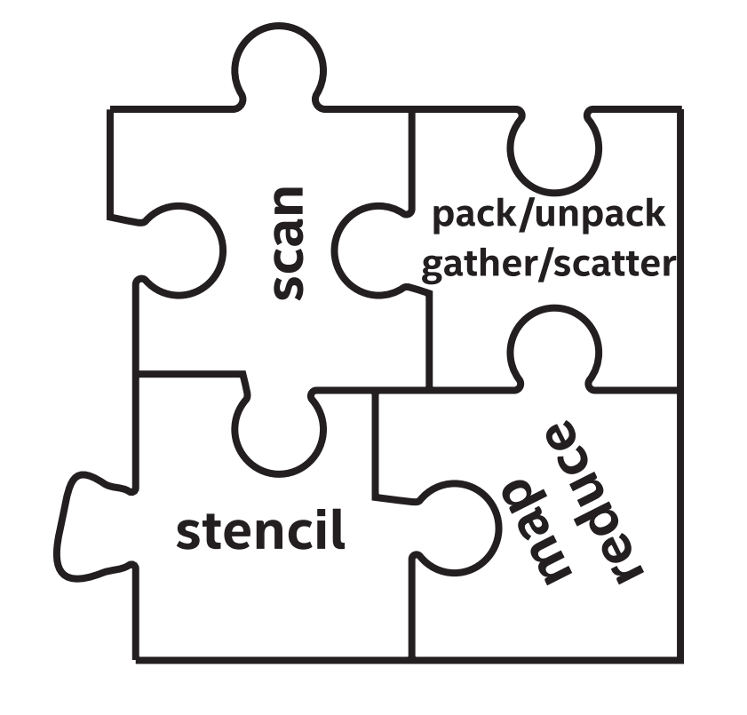
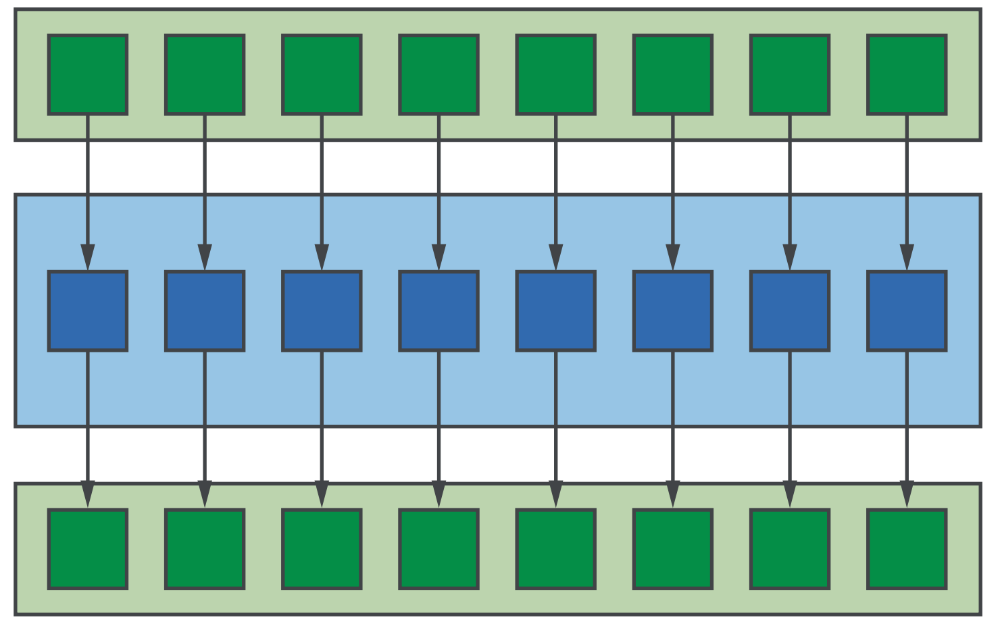
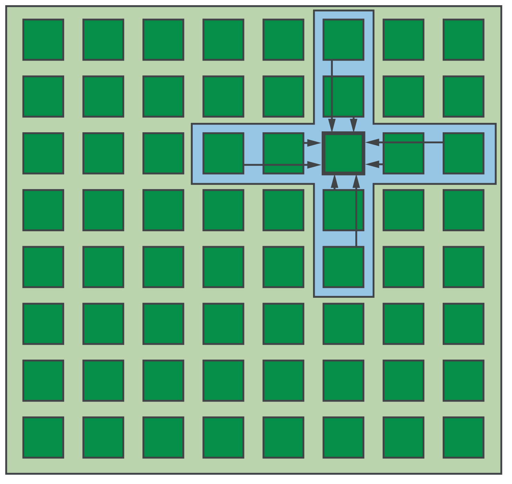
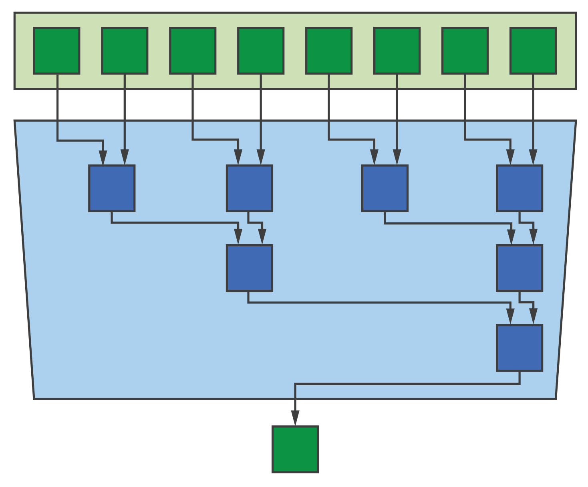
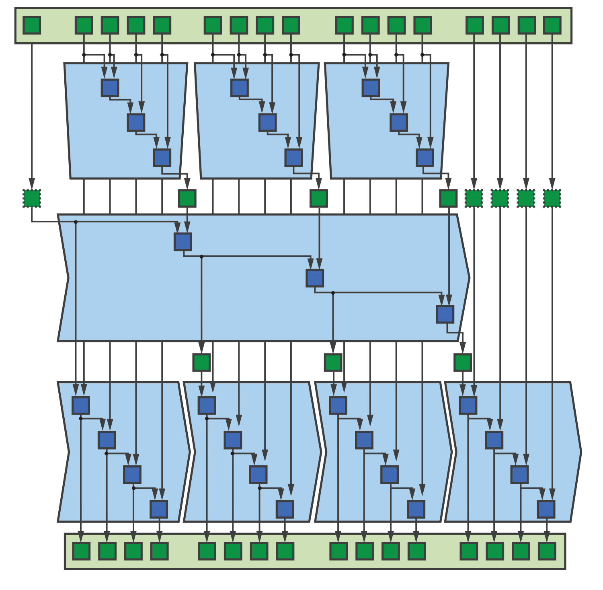
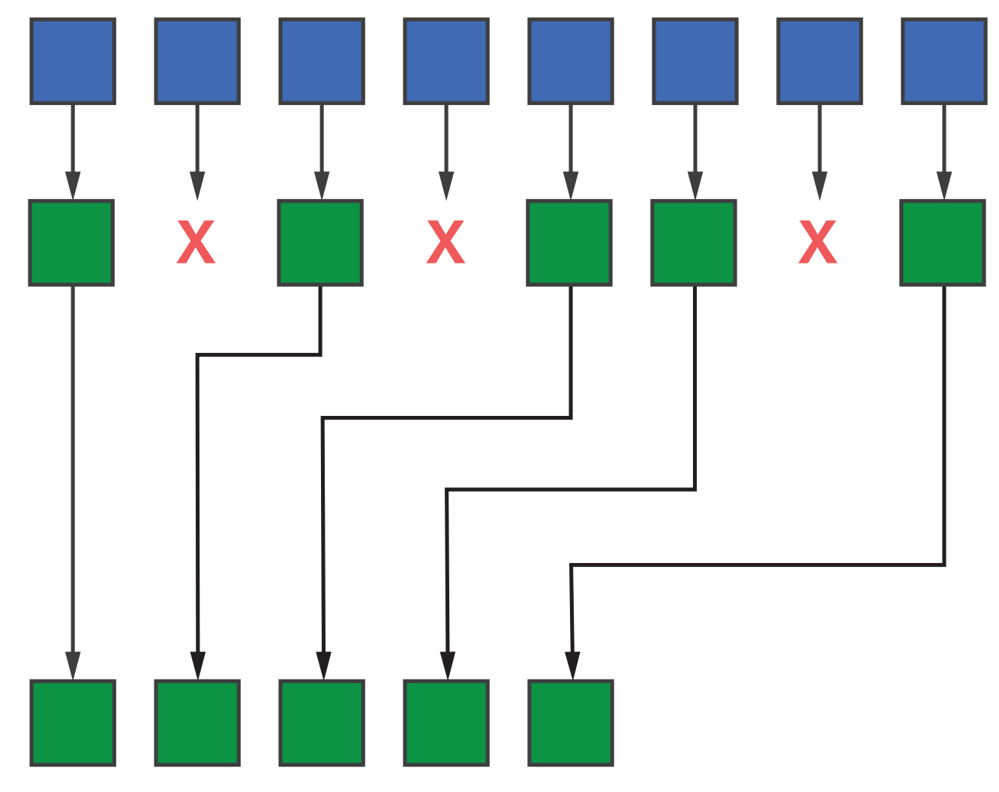
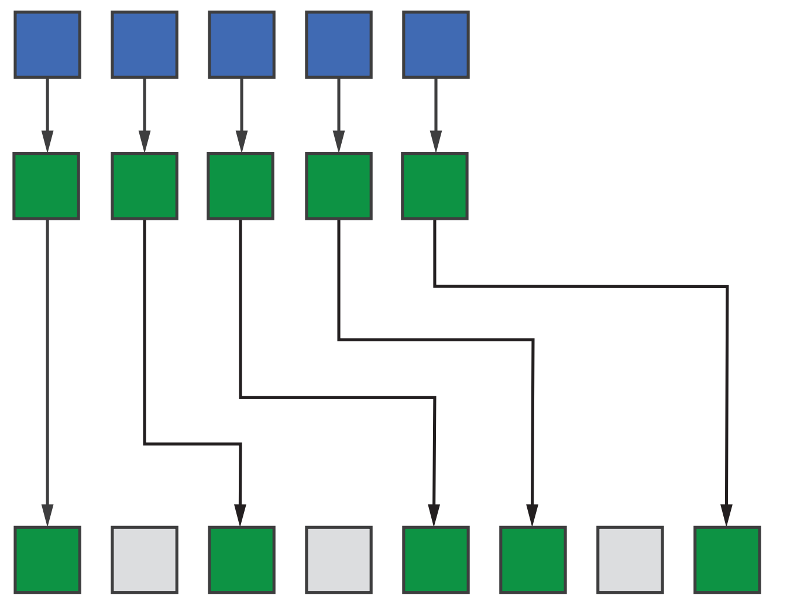

# 14 常见的并行模式



当我们在工作中认识到模式，并且证明了其是最佳解决方案的技术。并行编程也不例外，需要研究已有的模式。考虑大数据应用中的MapReduce框架，他们的成功原因是基于两个简单而有效的并行模式——map和reduce。

并行编程中有很多常见的模式，与编程语言无关。这些模式是通用的，可以进行任何级别的并行(例如：子工作组、工作组、设备)和在任何设备(例如：CPU, GPU, FPGA)上使用。但是，模式的某些属性(例如可扩展性)可能会影响其不同的设备。某些情况下，使应用程序适应新设备可能只需要选择适当的参数或微调模式的实现，我们可以通过选择完全不同的模式来提高性能。

理解如何、何时以及在何处使用这些常见的并行模式，是提高对DPC++(以及一般的并行编程)熟练程度的关键。对于那些具有并行编程经验的人来说，了解这些模式是如何在DPC++中表达的，可以快速了解该语言的功能。

本章旨在解答以下问题:


	-  理解哪些模式是最重要的?
	-  模式如何与不同设备的功能相关联?
	-  哪些模式已经作为DPC++函数和库提供?
	-  如何使用直接实现模式?


## 14.1 了解模式

这里讨论的模式是McCool等人在《结构化并行编程》一书中描述并行模式的子集。我们不讨论与并行性类型相关的模式(例如fork-join、分支绑定)，而是关注对编写数据并行内核最有用的算法模式。

理解并行模式的这个子集对于成为一个高效的DPC++程序员至关重要。图14-1中的表给出了不同模式的概述，包括主要用例、关键属性，以及属性如何影响不同硬件设备的亲和性。


图14-1 并行模式及其对不同设备类型的亲和性
begin{table}[H]
	begin{tabular}{|l|l|l|l|}
		hline
		textbf{模式}                                           & textbf{用于}                                                        & textbf{关键属性}                                                            & textbf{设备亲和度}                                           hline
		Map                                                        & begin{tabular}[c]{@{}l@{}}简单的并行内核end{tabular}          & begin{tabular}[c]{@{}l@{}}无数据依赖性和高可扩展性end{tabular} & 所有设备                                                                hline
		Stencil                                                    & begin{tabular}[c]{@{}l@{}}结构化数据依赖性end{tabular}      & begin{tabular}[c]{@{}l@{}}数据依赖和数据重用end{tabular}         & begin{tabular}[c]{@{}l@{}}取决于模具的大小end{tabular}  hline
		Reduction                                                  & begin{tabular}[c]{@{}l@{}}合并部分结果end{tabular}        & 数据依赖                                                                   & 所有设备                                                                 hline
		begin{tabular}[c]{@{}l@{}}Scan Pack/Unpackend{tabular} & begin{tabular}[c]{@{}l@{}}筛选和重组数据end{tabular} & 有限的可扩展性                                                                & begin{tabular}[c]{@{}l@{}}取决于问题的大小end{tabular}  hline
	end{tabular}
end{table}


textbf{Map——映射}

映射模式是所有并行模式中最简单的，具有函数式编程语言经验的读者很快就会熟悉它。如图14-2所示，范围内的每个输入元素通过应用某个函数独立映射到一个输出。许多数据并行操作可以表示为映射模式(例如，向量加法)。


图14-2 映射模式



由于每个应用程序的函数都完全独立，所以映射的表达式通常非常简单，依赖于编译器和/或运行时来做大部分工作。写入映射模式的内核应该能够适用于任何设备，并且这些内核的性能能根据可用的硬件并行度进行很好地扩展。

然而，在决定将整个应用程序重写为一系列映射内核之前，应该仔细考虑!这样的开发方法是高效的，保证了应用程序可以移植到各种设备类型，但却忽略那些可能显著提高性能的优化(例如，数据重用，融合内核)。


textbf{Stencil——模具}

模具模式与映射模式密切相关。如图14-3所示，一个函数应用到一个输入和一组由模板描述的邻近输入，以产生单个输出。模板模式经常出现在许多领域，包括科学/工程应用(如有限差分)和计算机视觉/机器学习应用(如图像卷积)。


图14-3 模具模式



当模具模式在不同的地方执行时(例如，将输出写入一个单独的存储位置)，该函数可以独立地应用于每个输入。现实中调度模板通常比这更复杂:计算相邻的输出需要相同的数据，并且多次从内存中加载该数据会降低性能；我们可能希望就地应用模板(即，重写原始输入值)，以减少应用程序的内存占用。

因此，模板内核对不同设备的适用性高度依赖于模具的属性和输入。以下有一些经验法则:


	-  小模具可以利用GPU的便笺存储器。
	-  大型模具可以利用于CPU(相对而言)的缓存。
	-  通过在FPGA上实现收缩阵列，在小输入上操作的小模板可以获得显著的性能增益。


模具很容易描述，但要有效地实现却很复杂，所以模具是领域特定语言(DSL)开发中最活跃的领域之一。已经有一些嵌入式的DSL利用C++的模板元编程能力在编译时生成高性能的模具内核，我们希望这些移植到DPC++上只是时间问题。


textbf{Reduction——归约}

归约模式是一种常见的并行模式，使用典型的关联和交换操作符(例如加法)组合内核调用的每个实例的部分结果。例子是计算一个和(例如，计算一个点积)或计算最小/最大值(例如，使用最大速度来设置时间步长)。


图14-4 归约模式



图14-4显示了通过树归约实现的归约模式，需要对N个输入元素的范围进行log2(N)组合操作。尽管树型归约很常见，但是其他的实现也是可能的——归约一个以特定的顺序组合值。

内核间很少会地并行，即使是并行的，也经常与归约(如MapReduce框架)配对。这使得归约成为需要理解的最重要的并行模式之一，也是必须能够在任何设备上有效执行的模式。

针对不同设备进行扩展需要进行性能权衡，即计算部分所花费的时间和组合它们所花费的时间。使用过少的并行度会增加计算时间，而使用过多的并行度会增加合并时间。

通过使用不同的设备来执行计算和组合步骤，来提高系统的整体利用率可能很不错，但是这种调优工作必须注意在设备之间移动数据的成本。实践中，我们发现在产生数据的同时在同一设备上直接执行数据归约通常是最好的方法。因此，使用多个设备来提高归约模式的性能并不依赖于任务的并行性，而是依赖于另一种级别的数据并行性(即，每个设备对输入数据的一部分执行归约)。


textbf{Scan——扫描}

扫描模式使用二进制关联运算符计算一个广义前缀和，输出的每个元素表示一个部分结果。扫描包容第一个元素，如果元素的部分和的范围在[0,i](即之和(包括i)。扫描排除第一个元素，如果元素的部分和的范围在[0,i])(例如：和不包括i)。

乍一看，扫描似乎是一个固有的串行操作，因为每个输出的值取决于前一个输出的值!虽然与其他模式相比，扫描获得并行性的机会确实较少(因此可能伸缩性较差)，但图14-5显示了使用对相同数据的多次扫描实现并行扫描是可能的。


图14-5 扫描模式



因为在扫描操作中并行性的机会是有限的，所以执行扫描的最佳设备高度依赖于问题的大小:较小的问题更适合CPU，因为只有较大的问题才会包含足够的数据并行性使GPU饱和。对于FPGA和其他架构来说，问题的大小不太重要，因为扫描本身就有助于管道并行性。处理归约的一个经验法则是，在产生数据的设备上执行扫描操作——考虑在优化期间扫描操作适合应用程序的位置和方式——通常会比专注于单独优化扫描操作产生更好的结果。


textbf{打包和解包}

打包和解包模式与扫描密切相关，通常在扫描功能的基础上实现。在这里单独讨论，因为它们是常见操作(例如，添加到列表)的高性能实现，这些操作可能与求前缀和没有明显的联系。


textbf{打包}

打包模式，如图14-6所示，基于布尔条件丢弃输入范围中的元素，将未丢弃的元素打包到输出范围的连续位置。这个布尔条件可以是预先计算的掩码，也可以通过对每个输入元素应用某个函数在线计算。


图14-6 打包模式



与扫描一样，打包操作具有串行性。给定要打包/复制的输入元素，计算在输出范围中的位置需要关于有多少先前的元素也打包/复制到输出中的信息。这个信息相当于对布尔条件的独占性扫描。


textbf{解包}

如图14-7所示(顾名思义)，解包模式与打包模式相反。输入范围内的连续元素被解包为输出范围内的非连续元素，而不影响其他元素。这个模式最明显的用例是解包以前打包的数据，也可以用来填充以前计算产生的数据中的“空白”。


图14-7 解包模式




## 14.2 使用内置函数和库

这些模式中的许多都可以直接使用DPC++的内置函数，或用DPC++使用供应商提供的库来编写。利用这些功能和库是在真正的大型软件工程项目中，是平衡性能、可移植性和生产力的最佳方法。


textbf{DPC++中的归约库}

DPC++不要求每个人都维护自己的归约内核库，而是提供了一个抽象来用归约语义描述变量。这种抽象简化了内核的表达式，并使显式执行成为可能，允许实现为不同的设备、数据类型和归约操作组合选择不同的归约算法。


图14-8 reduce表示为使用归约库的ND-Range数据并行内核
```
h.parallel_for(
	nd_range<1>{N, B},
	reduction(sum, plus<>()),
	[=](nd_item<1> it, auto& sum) {
		int i = it.get_global_id(0);
		sum += data[i];
});
```

图14-8中的内核展示了使用归约库的示例。注意，内核体不包含任何对归约的引用——必须指定包含归约的内核，使用加法算子组合了sum变量的实例。这为实现自动生成优化的归约序列提供了足够的信息。

编写本文时，归约库只支持具有单个归约变量的内核。未来版本的DPC++预计将支持同时执行多个归约的内核，方法是在传递给parallel_for的nd_range和函数参数之间指定多个归约，并将多个归约作为内核函数的参数。

归约的结果在内核完成之前不能保证会写回到原来的变量。除了这个限制，访问归约的结果与访问SYCL中的任何其他变量的行为相同:访问存储在缓冲区中的归约结果需要创建适当的设备或主机访问器，访问存储在USM分配中的归约结果可能需要显式的同步和/或内存移动。

DPC++的归约库与其他语言中的归约抽象的区别是，限制了在内核执行期间对归约变量的访问——不能检查归约变量的中间值，禁止使用除了指定的组合函数以外的任何东西来更新归约变量。这些限制可以避免一些难以调试的错误(例如，在计算最大值的同时添加一个归约变量)，并确保归约可以在各种不同的设备上高效地实现。


textbf{归约类}

归约类是用来描述内核中归约的接口。构造归约对象的唯一方法是使用图14-9所示的函数。


图14-9 归约函数的原型
```
template <typename T, typename BinaryOperation>
unspecified reduction(T* variable, BinaryOperation combiner);

template <typename T, typename BinaryOperation>
unspecified reduction(T* variable, T identity, BinaryOperation combiner);
```

该函数的第一个版本允许指定归约变量和用于组合每个工作项的操作符。第二个版本允许提供与归约操作符相关联的可选标识值——这是对用户定义归约的优化。

请注意，归约函数的返回类型未指定，归约类本身完全由实现定义。虽然对于C++类来说有点不寻常，但它允许实现使用不同的类(或具有任意数量模板参数的单个类)来表示不同的约简算法。未来版本的DPC++可能会重新考虑这个设计，以便在特定的执行上下文中显式地请求特定的归约算法。


textbf{reducer类}

reducer类的实例封装了一个归约变量，暴露了有限的接口，就可以进行安全的归约变量更新。reducer类的简化定义如图14-10所示。像归约类一样，reducer类是实现定义的——reducer的类型取决于reduce是如何执行的，为了最大化性能，在编译时知道这一点很重要。允许更新归约变量的函数和操作符是定义好的，并且保证DPC++可以支持。


图14-10 reducer类的简化定义
```
template <typename T,
		  typename BinaryOperation,
	      /* implementation-defined */>
class reducer {
	// Combine partial result with reducer's value
	void combine(const T& partial);
};

// Other operators are available for standard binary operations
template <typename T>
auto& operator +=(reducer<T,plus::<T>>&, const T&);
```

每个reducer都提供一个combine()，它将部分结果(来自单个工作项)与reducer变量的值组合在一起。这个组合函数的行为由实现定义，但不是在编写内核时需要考虑的问题。还需要一个reducer，使其他操作可依赖于reducer变量，例如：+=运算符定义为加归约。这些附加操作符仅作为开发者方便和提高可读性提供，操作符具有与直接调用combine()相同的行为。


textbf{用户定义的归约}

一些常见的归算法(例如，树状归约)不会看到每个工作项直接更新单个共享变量，而是将一些部分结果累加到私有变量中，这些私有变量将在将来的某个时候合并在一起。这样的私有变量引入了一个问题:实现应该如何初始化?从每个工作项初始化到第一个贡献的变量有潜在的性能后果，因为需要额外的逻辑来检测和处理未初始化的变量。将变量初始化为归运算符的标识来避免性能损失，但只有当标识已知时才有可能。

DPC++实现只能在还原操作简单的算术类型，且还原操作符是标准函数(例如，plus)时自动确定要使用的正确标识值。对于用户定义的归约(例如，对用户定义的类型进行操作和/或使用用户定义的函数)，可以通过指定标识来提高性能。


图14-11 使用用户定义的归约查找具有ND-Range内核的最小值的位置
```
template <typename T, typename I>
struct pair {
	bool operator<(const pair& o) const {
		return val <= o.val || (val == o.val && idx <= o.idx);
	}
	T val;
	I idx;
};

template <typename T, typename I>
using minloc = minimum<pair<T, I>>;

constexpr size_t N = 16;
constexpr size_t L = 4;

queue Q;
float* data = malloc_shared<float>(N, Q);
pair<float, int>* res = malloc_shared<pair<float, int>>(1, Q);
std::generate(data, data + N, std::mt19937{});

pair<float, int> identity = {
	std::numeric_limits<float>::max(), std::numeric_limits<int>::min()
};
*res = identity;

auto red = reduction(res, identity, minloc<float, int>());

Q.submit([&](handler& h) {
	h.parallel_for(nd_range<1>{N, L}, red, [=](nd_item<1> item, auto& res) {
		int i = item.get_global_id(0);
		pair<float, int> partial = {data[i], i};
		res.combine(partial);
	});
}).wait();

std::cout << "minimum value = " << res->val << " at " << res->idx << "n";
```

对用户定义归约的支持，仅限于简单的可复制类型和没有副作用的组合函数，但这足以支持许多实际用例。例如，图14-11中的代码演示了如何使用用户定义的归约来计算向量中的最小元素及其位置。


textbf{oneAPI DPC++库}

C++标准模板库(STL)包含了几种算法，对应于本章讨论的并行模式。STL中的算法通常适用于由迭代器指定的序列。从C++17开始，可以使用执行策略参数，表示算法应该顺序执行还是并行执行。

oneAPI DPC++库(oneDPL)利用了这个执行策略参数来提供高效的并行编程方法，这种方法在底层利用了用DPC++编写的内核。如果应用程序可以仅使用STL算法的功能来表达，那么oneDPL就可以在系统中使用加速器，而无需编写任何DPC++内核代码!

图14-12中的表格显示了STL中可用的算法如何与本章描述的并行模式以及在适当的情况下与串行算法(在C++17之前可用)相关。关于如何在DPC++应用程序中，使用这些算法的更详细的说明可以在第18章找到。


图14-12 将并行模式与C++17算法库相关联
begin{table}[H]
	begin{tabular}{|l|l|l|}
		hline
		textbf{模式} & textbf{串行算法} & textbf{并行算法}                                                                                                       hline
		Map              & transform                    & transform                                                                                                                            hline
		Stencil          & transform                    & transform                                                                                                                            hline
		Reduction        & accumulate                   & begin{tabular}[c]{@{}l@{}}reduce transform_reducend{tabular}                                                                    hline
		Scan             & partial_sum                 & begin{tabular}[c]{@{}l@{}}inclusive_scan exclusive_scan transform_inclusive_scan transform_exclusive_scanend{tabular}  hline
		Pack             & N/A                          & copy_if                                                                                                                             hline
		Unpack           & N/A                          & N/A                                                                                                                                  hline
	end{tabular}
end{table}


textbf{组函数}

DPC++设备代码中对并行模式的支持是由单独的组函数库提供的。这些组函数利用特定工作项组(例如，一个工作组或一个子工作组)的并行性，在有限的范围内实现通用的并行算法，并且可以作为构建块来构建更复杂的算法。

如oneDPL一样，DPC++中组函数的语法基于C++。每个函数的第一个参数接受一个group或sub_group对象来代替执行策略，C++算法的任何限制都适用。组功能是由指定组中的所有工作项协作执行的，因此必须以类似于组栅栏的方式对待——组中的所有工作项必须在控制流中遇到相同的算法(即，组中的所有工作项必须以类似的方式执行或不执行到算法调用)，并且所有工作项必须提供相同的参数，以确保操作的一致性。

reduce、exclusive_scan和inclusive_scan函数仅限于基本数据类型和最常用的归约操作符(例如，plus、minimum和maximum)。这对于许多用例来说已经足够了，但DPC++的未来版本预计将扩展对用户定义类型和操作符的支持。


## 14.3 直接编程

尽管建议尽可能利用库，但是通过观察如何使用“原生”DPC++内核实现每个模式，可以学到更多东西。

本章剩余部分的内核不会达到与高度调优库相同的性能水平，但是对于更好地理解DPC++的功能很有用——甚至可以作为新库的功能原型。

begin{tcolorbox}[colback=blue!5!white,colframe=blue!75!black, title=使用供应商提供的库!]
当供应商提供函数库实现时，使用它而不是将函数重新实现总是有益的!
end{tcolorbox}


textbf{Map——映射模式}

由于其简单性，映射模式可以作为基本的并行内核直接实现。图14-13所示的代码显示了这样一个实现，使用映射模式计算范围内每个输入元素的平方根。


图14-13 数据并行内核中实现映射模式
```
Q.parallel_for(N, [=](id<1> i) {
	output[i] = sqrt(input[i]);
}).wait();
```


textbf{Stencil——模具模式}

如图14-14所示，将模具直接实现为多维缓冲区的数据并行内核，很简单，也很容易理解。


图14-14 数据并行内核中实现模具模式
```
id<2> offset(1, 1);
h.parallel_for(stencil_range, offset, [=](id<2> idx) {
	int i = idx[0];
	int j = idx[1];
	
	float self = input[i][j];
	float north = input[i - 1][j];
	float east = input[i][j + 1];
	float south = input[i + 1][j];
	float west = input[i][j - 1];
	output[i][j] = (self + north + east + south + west) / 5.0f;
});
```

不过，这个模式的表达式非常简单，不能期望能执行得很好。正如本章前面提到的，需要使用局部性(通过空间或时间阻塞)来避免从内存中重复读取相同的数据。一个使用工作组本地内存的空间阻塞如图14-15所示。


图14-15 使用工作组本地内存在ND-Range内核中实现模具模式
```
range<2> local_range(B, B);
// Includes boundary cells
range<2> tile_size = local_range + range<2>(2, 2);
auto tile = local_accessor<float, 2>(tile_size, h);

// Compute the average of each cell and its immediate neighbors
id<2> offset(1, 1);

h.parallel_for(
nd_range<2>(stencil_range, local_range, offset), [=](nd_item<2> it) {
	// Load this tile into work-group local memory
	id<2> lid = it.get_local_id();
	range<2> lrange = it.get_local_range();
	for (int ti = lid[0]; ti < B + 2; ti += lrange[0]) {
		int gi = ti + B * it.get_group(0);
		for (int tj = lid[1]; tj < B + 2; tj += lrange[1]) {
			int gj = tj + B * it.get_group(1);
			tile[ti][tj] = input[gi][gj];
		}
	}
	it.barrier(access::fence_space::local_space);
	
	// Compute the stencil using values from local memory
	int gi = it.get_global_id(0);
	int gj = it.get_global_id(1);
	
	int ti = it.get_local_id(0) + 1;
	int tj = it.get_local_id(1) + 1;
	
	float self = tile[ti][tj];
	float north = tile[ti - 1][tj];
	float east = tile[ti][tj + 1];
	float south = tile[ti + 1][tj];
	float west = tile[ti][tj - 1];
	output[gi][gj] = (self + north + east + south + west) / 5.0f;
});
```

要对给定的模具进行最佳优化，需要对块大小、邻域和模板函数本身进行压缩时检查，这其实很复杂，需要有更多讨论才能理解。。


textbf{Reduction——归约模式}

通过利用提供工作项之间同步和通信功能(例如，原子操作、工作组和子工作组功能、子工作组混合)的特性，在DPC++中实现归约内核。图14-16和图14-17中的内核显示了两种可能的归约实现:使用parallel_for和工作项的原子操作的简单归约，以及稍微一些简化，可以使用ND-Range paralle_for和工作组reduce函数对局部性进行利用。我们将在第19章更详细地讨论这些原子操作。


图14-16 为数据并行内核的简单归约
```
Q.parallel_for(N, [=](id<1> i) {
	atomic_ref<
	int,
	memory_order::relaxed,
	memory_scope::system,
	access::address_space::global_space>(*sum) += data[i];
}).wait();
```


图14-17 为ND-Range内核的简单归约
```
Q.parallel_for(nd_range<1>{N, B}, [=](nd_item<1> it) {
	int i = it.get_global_id(0);
	int group_sum = reduce(it.get_group(), data[i], plus<>());
	if (it.get_local_id(0) == 0) {
		atomic_ref<
		int,
		memory_order::relaxed,
		memory_scope::system,
		access::address_space::global_space>(*sum) += group_sum;
	}
}).wait();
```

还有许多其他方法可以编写归约内核，由于对原子操作的硬件支持、工作组本地内存大小、全局内存大小、快速设备范围栅栏的可用性、甚至专用归约指令的可用性也不同，不同的设备可能更喜欢不同的实现。某些体系结构上，使用log2(N)单独的内核调用来执行树形归约可能会更快(或更必要)。

强烈建议只有在DPC++归约库不支持的情况下，或者在为特定设备的功能对内核进行微调时，才需要考虑手动实现归约——即使这样，也要在100%确定归约库的性能不佳之后才考虑这样做!


textbf{Scan——扫描模式}

实现并行扫描需要对数据进行多次扫描，每次扫描之间都要进行同步。由于DPC++没有提供同步ND-Range内所有工作项的机制，所以必须使用多个内核来实现设备范围内扫描的实现，这些内核通过全局内存传递结果。

图14-18、14-19和14-20所示的代码演示了使用多个内核实现的包含第一个元素扫描。第一个内核将输入值分布到多个工作组，在工作组本地内存中，计算工作组本地扫描(注意，可以使用工作组inclusive_scan函数来代替)结果。第二个内核使用单个工作组计算本地扫描，对每个块的最终值进行计算。第三个内核结合这些中间结果来最后确定前缀和。这三个内核对应图14-5中的三个层。


图14-18 ND-Range内核中实现全局包含扫描的第1阶段:跨工作组计算
```
// Phase 1: Compute local scans over input blocks
q.submit([&](handler& h) {
	auto local = local_accessor<int32_t, 1>(L, h);
	h.parallel_for(nd_range<1>(N, L), [=](nd_item<1> it) {
		int i = it.get_global_id(0);
		int li = it.get_local_id(0);
		
		// Copy input to local memory
		local[li] = input[i];
		it.barrier();
		
		// Perform inclusive scan in local memory
		for (int32_t d = 0; d <= log2((float)L) - 1; ++d) {
			uint32_t stride = (1 << d);
			int32_t update = (li >= stride) ? local[li - stride] : 0;
			it.barrier();
			local[li] += update;
			it.barrier();
		}
	
		// Write the result for each item to the output buffer
		// Write the last result from this block to the temporary buffer
		output[i] = local[li];
		if (li == it.get_local_range()[0] - 1)
			tmp[it.get_group(0)] = local[li];
	});
}).wait();
```


图14-19 ND-Range内核中实现全局包含扫描的第2阶段:扫描每个工作组的结果
```
// Phase 2: Compute scan over partial results
q.submit([&](handler& h) {
	auto local = local_accessor<int32_t, 1>(G, h);
	h.parallel_for(nd_range<1>(G, G), [=](nd_item<1> it) {
		int i = it.get_global_id(0);
		int li = it.get_local_id(0);
		
		// Copy input to local memory
		local[li] = tmp[i];
		it.barrier();
		
		// Perform inclusive scan in local memory
		for (int32_t d = 0; d <= log2((float)G) - 1; ++d) {
			uint32_t stride = (1 << d);
			int32_t update = (li >= stride) ? local[li - stride] : 0;
			it.barrier();
			local[li] += update;
			it.barrier();
		}
	
		// Overwrite result from each work-item in the temporary buffer
		tmp[i] = local[li];
	});
}).wait();
```


图14-20 ND-Range内核中实现全局包含扫描的第三阶段(最终阶段)
```
// Phase 3: Update local scans using partial results
q.parallel_for(nd_range<1>(N, L), [=](nd_item<1> it) {
	int g = it.get_group(0);
	if (g > 0) {
		int i = it.get_global_id(0);
		output[i] += tmp[g - 1];
	}
}).wait();
```

图14-18和14-19非常相似，唯一的区别是范围的大小，以及如何处理输入和输出值。该模式的实际实现可以使用带有不同参数的函数来实现这两个阶段，这里将它们作为不同的代码。


textbf{打包和解包}

打包和解包也称为收集和分散操作。这些操作处理数据在内存中的排列方式，以及呈现给计算资源的方式上。


textbf{打包}

由于打包依赖于排除第一个元素扫描，实现一个适用于ND-Range的所有元素的打包，必须通过全局内存和在几个内核排队的过程中进行。但是，对于包有一个通用的用例，不需要在ND-Range的所有元素上应用操作——仅在特定工作组或子工作组中的项上应用打包。

图14-21中的代码片段展示了如何在排除第一个元素的扫描中，实现组打包操作。


图14-21 排除第一个元素的扫描中实现组打包操作
```
uint32_t index = exclusive_scan(g, (uint32_t) predicate, plus<>());
if (predicate)
	dst[index] = value;
```

图14-22中的代码演示了如何在内核中使用这样的包操作，来构建一个元素列表，这些元素需要一些额外的后处理(在将来的内核中)。所示的示例基于分子动力学模拟中的一个真实内核:分配给粒子i的子工作组中的工作项协作识别与i固定距离内的所有其他粒子，只有这个“相邻列表”中的粒子将被用于计算作用于每个粒子上的力。。


图14-22 使用工作组打包操作构建需要额外后处理的元素列表
```
range<2> global(N, 8);
range<2> local(1, 8);
Q.parallel_for(
nd_range<2>(global, local),
[=](nd_item<2> it) [[cl::intel_reqd_sub_group_size(8)]] {
	int i = it.get_global_id(0);
	sub_group sg = it.get_sub_group();
	int sglid = sg.get_local_id()[0];
	int sgrange = sg.get_max_local_range()[0];
	
	uint32_t k = 0;
	for (int j = sglid; j < N; j += sgrange) {
		
		// Compute distance between i and neighbor j
		float r = distance(position[i], position[j]);
		
		// Pack neighbors that require post-processing into a list
		uint32_t pack = (i != j) and (r <= CUTOFF);
		uint32_t offset = exclusive_scan(sg, pack, plus<>());
		if (pack)
			neighbors[i * MAX_K + k + offset] = j;
		
		// Keep track of how many neighbors have been packed so far
		k += reduce(sg, pack, plus<>());
	}
	num_neighbors[i] = reduce(sg, k, maximum<>());
}).wait();
```

注意，打包模式不重新排序元素——打包到输出数组中的元素的顺序与输入数组中的顺序相同。打包的这个属性很重要，使我们能够使用打包功能来实现其他更抽象的并行算法(比如std::copy_if和std::stable_partition)。然而，在打包功能上还可以实现其他并行算法，这些算法不需要维护顺序(比如：std::partition)。


textbf{解包}

和打包一样，可以使用scan实现解包。在排除第一个元素扫描的基础上实现子工作组解包操作，如图14-23所示。


图14-23 排除第一个元素扫描的基础上实现子工作组解包操作
```
uint32_t index = exclusive_scan(sg, (uint32_t) predicate, plus<>());
return (predicate) ? new_value[index] : original_value;
```

图14-24中的代码展示了如何使用这样的子工作组解包，来改平衡有不同控制流的内核(本例中，是计算Mandelbrot集)。每个工作项分配了单独的像素来计算和迭代，直到收敛或达到最大迭代次数。然后使用解包操作将已完成的像素替换为新像素。


图14-24 使用子工作组解包操作来平衡不同控制流的内核
```
// Keep iterating as long as one work-item has work to do
while (any_of(sg, i < Nx)) {
	uint32_t converged =
		next_iteration(params, i, j, count, cr, ci, zr, zi, mandelbrot);
	if (any_of(sg, converged)) {
		3
		// Replace pixels that have converged using an unpack
		// Pixels that haven't converged are not replaced
		uint32_t index = exclusive_scan(sg, converged, plus<>());
		i = (converged) ? iq + index : i;
		iq += reduce(sg, converged, plus<>());
		
		// Reset the iterator variables for the new i
		if (converged)
		reset(params, i, j, count, cr, ci, zr, zi);
	}
}
```

这种方法提高效率(并减少执行时间)的程度高度依赖于应用程序和输入，因为检查完成和执行解包操作都会带来开销!因此，在实际应用程序中成功地使用此模式，需要一些基于发散量和正在执行的计算的微调(例如，引入启发式方法，仅在活动工作项的数量低于某个阈值时执行解包操作)。


## 14.4 总结


本章演示了如何使用DPC++和SYCL特性实现一些最常见的并行模式，包括内置函数和库。

SYCL和DPC++的生态仍在开发中，随着开发人员从该语言以及生产级应用程序和库的开发中获得更多经验，我们希望为这些模式找到最佳实践。


textbf{更多信息}


	-  结构化并行编程:高效计算模式，Michael McCool, Arch Robison, and James Reinders，©2012,Morgan Kaufmann出版，ISBN 978-0-124-15993-8
	-  英特尔oneAPI DPC++库指南， https://software.intel.com/en-us/oneapi-dpcpp-library-guide
	-  算法库，C++在线手册，https://	en.cppreference.com/w/cpp/algorithm


