# 15 GPU编程


过去的几十年里，图形处理单元(GPU)已经从在屏幕上绘制图像的硬件设备，发展到能够执行复杂并行内核的通用设备。现在，几乎每台计算机都有一个GPU和一个CPU，许多程序可以通过将部分并行算法从CPU转移到GPU来加速。

本章中，我们将描述GPU是如何工作的，GPU软件和硬件是如何执行SYCL应用程序的，以及当我们为GPU编写和优化并行内核时需要的技巧和技术。


## 15.1 性能说明

与处理器类型一样，不同厂商的GPU，甚至不同产品的GPU也有所不同。因此，对于一种设备的最佳实践可能并不适用于不同的设备。本章的建议可能利于多数GPU，无论是现在还是将来，但是……

begin{tcolorbox}[colback=red!5!white,colframe=red!75!black]
为了实现特定GPU的最佳性能，请查阅GPU供应商的文档!
end{tcolorbox}

本章末尾提供了许多GPU厂商的文档链接。

## 15.2 GPU的工作原理

本节描述了常规GPU的工作原理，以及GPU与其他类型加速器的区别。


textbf{GPU构建块}

图15-1展示了一个非常简化的GPU，由三个构建块组成:


	-  执行资源:GPU是执行计算工作的处理器。不同的GPU供应商对其执行资源使用不同的名称，所有现代GPU都由多个可编程处理器组成。处理器可以是异构和专门的，也可以是同构的。大多数现代GPU的处理器都是同构的。
	-  固定功能:GPU是硬件单元，其可编程性低于执行资源，专门用于单个任务。当GPU用于图形时，图形管道的许多部分(如栅格化或光线追踪)都使用GPU来执行，以提高能效和性能。当GPU用于数据并行计算时，可能用于工作负载调度、纹理采样和依赖跟踪等任务。
	-  缓存和内存:像其他处理器类型一样，GPU有缓存来存储执行资源访问的数据。GPU缓存可能是隐式的，不需要开发者做什么，或者显式的暂存存储器，开发者只要在使用数据之前，有目的地将数据移动到缓存中即可。许多GPU也有很大的内存池，来提供对执行资源使用数据的快速访问。


图15-1 常规GPU的构建块

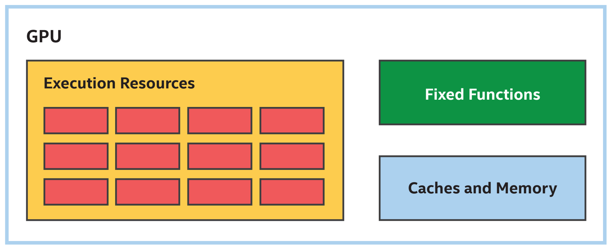


textbf{更简单的处理器}

以前执行图形操作时，GPU处理大量数据。例如，游戏帧或渲染工作量涉及数千个顶点，这些顶点每帧产生数百万个像素。为了保持帧率，必须尽快处理这些大量数据。

常规GPU设计权衡是消除形成执行资源的处理器特性，从而加速单线程性能，并使用节省来资源进行额外的构建，如图15-2所示。例如，GPU处理器可能不包括复杂的乱序执行能力或其他类型处理器使用的分支预测逻辑。由于这些权衡，单个数据元素在GPU上的处理速度可能会比在其他处理器上慢，但更多的处理器数量使GPU能够快速有效地处理许多数据元素。


图15-2 GPU处理器更简单，但数量多

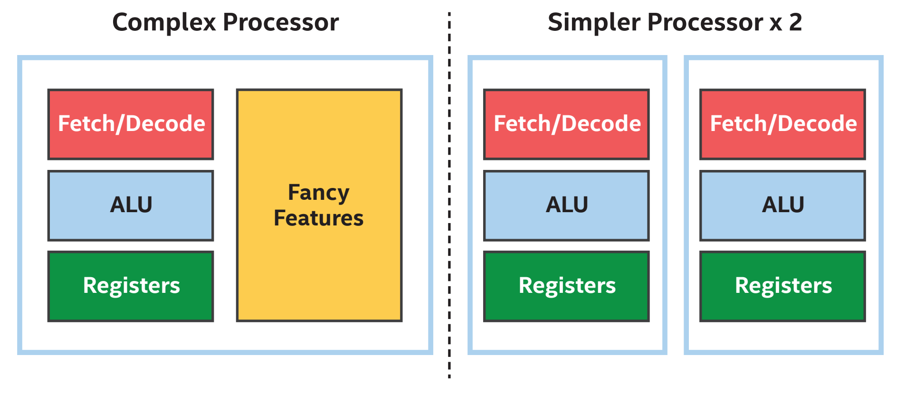

为了利用这种权衡，给GPU足够大的数据范围就很重要。为了说明加载大量数据的重要性，请参考本书中的矩阵乘法内核。

begin{tcolorbox}[colback=blue!5!white,colframe=blue!75!black, title=关于矩阵乘法]
本书中，矩阵乘法内核用于演示内核中的更改或它的分配方式是如何影响性能的。虽然使用本章描述的技术可以显著提高矩阵乘法的性能，但矩阵乘法是如此重要和常见的操作，许多硬件(GPU、CPU、FPGA、DSP等)供应商已经实现了许多例程的高度调优版本，包括矩阵乘法。供应商投入大量的时间和精力来实现和验证特定设备的功能，在某些情况下可能会使用在标准内核中难以或不可能使用的功能或技术。
end{tcolorbox}

begin{tcolorbox}[colback=blue!5!white,colframe=blue!75!black, title=使用供应商提供的库!]
当供应商提供函数库实现时，使用它而不是重新实现内核!对于矩阵乘法，可以将oneMKL作为适合DPC++开发者的英特尔oneAPI解决方案工具包的一部分。
end{tcolorbox}

矩阵乘法内核可以通过将其作为单个任务，提交到一个队列中，并在GPU上执行。这个矩阵乘法内核的主体，看起来就像在主机CPU上执行的函数，如图15-3所示。


图15-3 单个任务矩阵乘法看起来很像CPU主机代码
```
h.single_task([=]() {
	for (int m = 0; m < M; m++) {
		for (int n = 0; n < N; n++) {
			T sum = 0;
			for (int k = 0; k < K; k++)
			sum += matrixA[m * K + k] * matrixB[k * N + n];
			matrixC[m * N + n] = sum;
		}
	}
});
```

如果尝试在CPU上执行这个内核，可能会执行得很好——如果不是很好，因为没利用CPU的并行能力，但对于较小的矩阵大小来说可能就足够了。如图15-4所示，如果试图在GPU上执行这个内核，可能会执行得非常糟糕，因为单个任务将只使用单个GPU处理器。


图15-4 GPU上的单个任务内核会使许多执行资源闲置

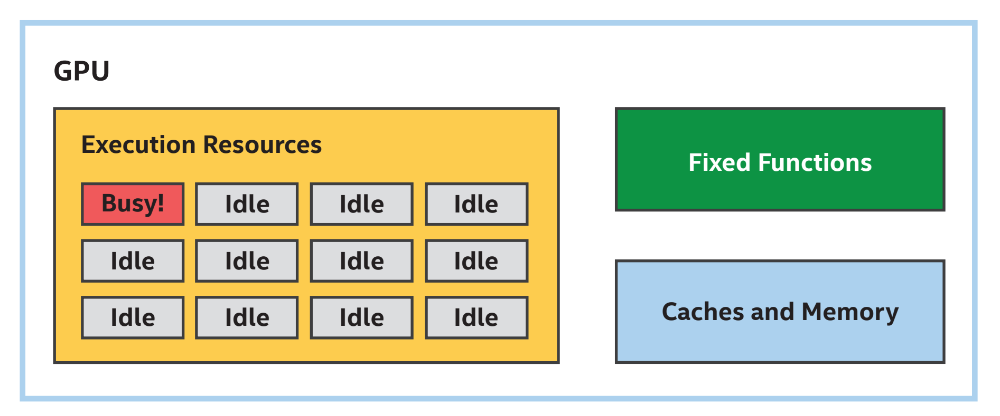


textbf{表达并行性}

提高这个内核在CPU和GPU上的性能，可以通过将一个循环转换为parallel_for来代替提交要并行处理的数据元素。对于矩阵乘法内核，可以选择提交表示两个最外层循环的数据元素。图15-5中，选择并行处理结果矩阵的行。


图15-5 类似矩阵乘法
```
h.parallel_for(range{M}, [=](id<1> idx) {
	int m = idx[0];
	for (int n = 0; n < N; n++) {
		T sum = 0;
		for (int k = 0; k < K; k++)
		sum += matrixA[m * K + k] * matrixB[k * N + n];
		matrixC[m * N + n] = sum;
	}
});
```

begin{tcolorbox}[colback=blue!5!white,colframe=blue!75!black, title=选择如何并行化]
选择并行化哪个维度是对GPU和其他设备类型调优的重要方法。本章的后续部分将描述，为什么在一个维度上并行比在不同维度上并行执行得更好。
end{tcolorbox}

尽管并行内核与单任务内核非常相似，但应该在CPU上运行得更好，在GPU上运行得更好。如图15-6所示，paralle_for使表示结果矩阵行的工作项能够在多个处理器资源上并行处理，因此所有执行资源都保持忙碌。


图15-6 某种程度上的并行内核使更多的处理器资源处于繁忙状态

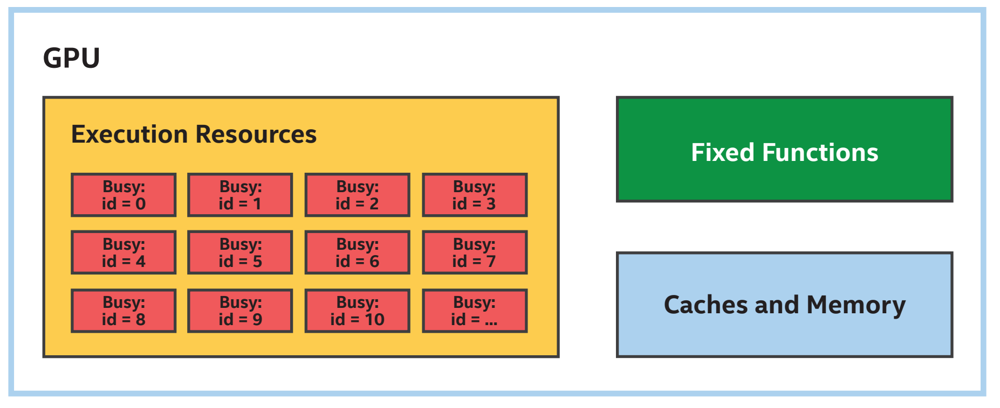

注意，没有指定将行分区并分配给不同处理器资源的确切方式，这为选择在设备上执行内核提供了灵活性。例如，可以选择在同一个处理器上执行连续的行，而不是在处理器上执行单个行，以利用局域性。


textbf{表达更多的并行性}

通过选择并行处理两个外部循环，可以将矩阵乘法内核更加的并行化。因为paralle_for可以表示最多三个维度上的并行循环，如图15-7所示。图中，传递给paralle_for的范围和表示并行执行空间中索引的项都是二维的。


图15-7 更多的并行矩阵乘法
```
h.parallel_for(range{M, N}, [=](id<2> idx) {
	int m = idx[0];
	int n = idx[1];
	T sum = 0;
	for (int k = 0; k < K; k++)
		sum += matrixA[m * K + k] * matrixB[k * N + n];
	matrixC[m * N + n] = sum;
});
```

在GPU上运行时，并行性可能会提高矩阵乘法内核的性能。即使当矩阵的行数超过GPU处理器的数量时，这也可能是正确的。接下来的几节将描述这种情况的原因。


textbf{简化控制逻辑(SIMD指令)}

许多GPU处理器通过大多数数据元素在内核中采用相同的控制流路径来优化控制逻辑。例如，在矩阵乘法内核中，每个数据元素执行最内层循环的次数相同，因为循环边界不变。

当数据元素以相同的控制流通过内核时，处理器可以通过在多个数据元素之间共享控制逻辑，并将它们作为一个组来执行来降低管理指令流的成本。一种方法是实现单指令、多数据或SIMD指令集，其中多条数据元素由一条指令同时处理。

begin{tcolorbox}[colback=blue!5!white,colframe=blue!75!black, title=线程与指令流]
在许多并行编程上下文中和GPU文献中，术语“线程”用来表示“指令流”。上下文中，“线程”与传统的操作系统线程不同，通常更轻量级。但情况并非总是如此，在某些情况下，“线程”用来描述完全不同的东西。

由于术语“线程”是重载的，很容易误解，本章使用术语“指令流”代替。
end{tcolorbox}


图15-8 4个宽SIMD处理器:4个ALU共享取/解码逻辑

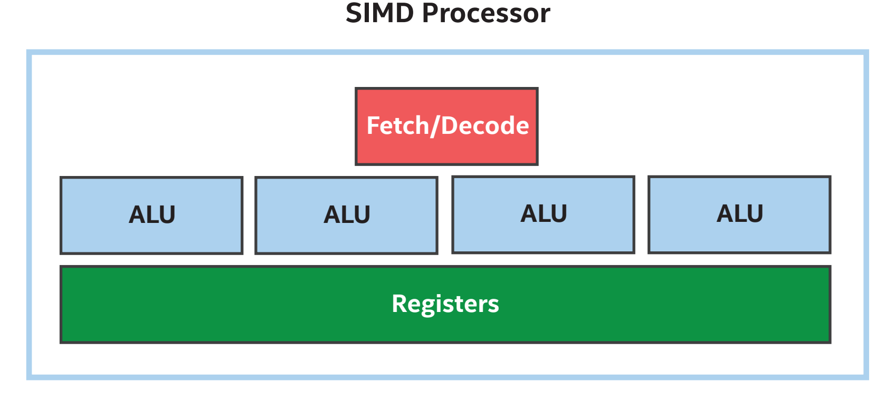

单个指令同时处理的数据元素的数量，有时称为指令的SIMD宽度或执行指令的处理器。图15-8中，4个ALU共享相同的控制逻辑，因此可以将其描述为一个宽度为4的SIMD处理器。

GPU并不是唯一实现SIMD指令集的处理器。其他处理器类型也实现了SIMD指令集，以提高处理大型数据集时的效率。GPU和其他处理器类型之间的主要区别是，GPU依赖于并行执行多个数据元素来获得良好的性能，而且GPU可能比其他处理器类型支持更宽的SIMD宽度。例如，GPU支持16、32或更多数据元素的SIMD宽度并不少见。

begin{tcolorbox}[colback=blue!5!white,colframe=blue!75!black, title=编程模型:SPMD和SIMD]
虽然GPU实现不同宽度的SIMD指令集，但这通常是实现细节，并且对在GPU上执行数据并行内核的应用程序是透明的。这是因为许多GPU编译器和运行时API实现了单程序、多数据或SPMD编程模型，其中GPU编译器和运行时API决定用SIMD指令流处理最有效的一组数据元素，而不是显式地表达为SIMD指令。第9章的“子工作组”一节探讨了数据元素分组对应用程序可见的情况。
end{tcolorbox}

图15-9扩展了执行资源，以支持宽度为4的SIMD，允许并行处理四倍的矩阵行。


图15-9 SIMD处理器上执行并行的内核

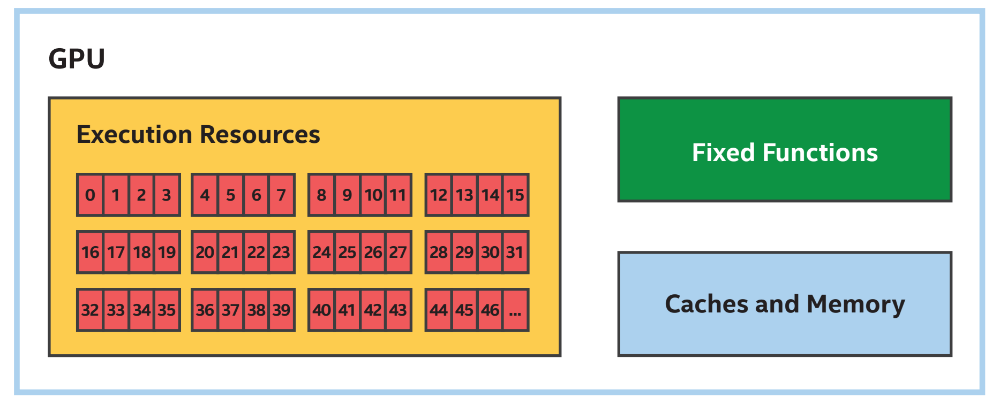

通过使用并行处理多个数据元素的SIMD指令，图15-5和15-7中的并行矩阵乘法内核的性能可以超越单个处理器的数量。通过在同一个处理器上执行连续的数据元素，SIMD指令的使用还在许多情况下提供了局域性优势，包括矩阵乘法。

begin{tcolorbox}[colback=red!5!white,colframe=red!75!black]
内核受益于处理器之间的并行性和处理器内部的并行性!
end{tcolorbox}


textbf{预测和屏蔽}

只要在内核中所有数据元素通过相同的路径通过条件代码，那么在多个数据元素之间共享指令流就可以很好地工作。当数据元素在条件代码中采取不同的路径时，控制流称为分叉。当控制流在SIMD指令流中分叉时，通常执行两个控制流路径，并屏蔽或预测一些通道。这确保了正确的行为，但是这种正确性以性能为代价，因为屏蔽的通道不会执行有用的操作。

为了展示预测和屏蔽是如何工作的，请考虑图15-10中的内核，将具有“奇数”索引的每个数据元素乘以2，并将具有“偶数”索引的每个数据元素加1。


图15-10 具有发散控制流的内核
```
h.parallel_for(array_size, [=](id<1> i) {
	auto condition = i[0] & 1;
	if (condition)
		dataAcc[i] = dataAcc[i] * 2; // odd
	else
		dataAcc[i] = dataAcc[i] + 1; // even
});
```

假设在图15-8所示的宽度为4的SIMD处理器上执行这个内核，并且在一个SIMD指令流中执行前4个数据元素，在不同的SIMD指令流中执行接下来的4个数据元素，以此类推。图15-11显示了屏蔽通道和预测执行的一种方式，正确地使用不同的控制流执行了这个内核。


图15-11 发散型内核可能的通道掩码

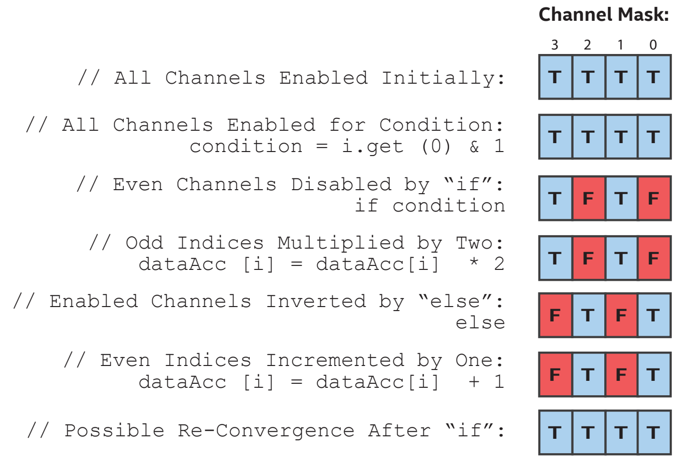


textbf{SIMD效率}

SIMD效率度量的是与等效标量指令流相比SIMD指令流执行得有多好。图15-11中，由于控制流将通道划分为两个相等的组，所以发散控制流中的每条指令执行效率只有一半。最坏的情况下，对于高度分散的内核，效率可能会降低。

所有实现SIMD指令集的处理器都会受到影响SIMD效率的差异惩罚，但因为GPU通常比其他处理器类型支持更宽的SIMD，当优化GPU的内核时，重新构造算法来最小化不同的控制流和最大化融合执行可能特别有用。但也并不总是可以这样做，选择以更收敛的执行并行化维度，可能比以高度发散的执行并行化另一个维度执行要好。


textbf{SIMD效率和组中工作项}

目前为止，本章中的所有内核都是基本的数据并行内核，没有在执行范围内指定任何项目分组，这给了实现为设备选择最佳分组的机会。例如，具有较宽SIMD的设备可能更喜欢较大的分组，具有较窄SIMD的设备可能适合较小的分组。

当内核具有明确工作项分组的ND-Range内核时，应该注意选择能够最大化SIMD效率的ND-Range工作组大小。当工作组的大小不能被处理器的SIMD宽度整除时，部分工作组可能会在内核的整个过程中禁用通道。可以使用preferred_work_group_size_multiple查询来选择有效的工作组大小。关于如何查询设备属性的更多信息，请参阅第12章。

选择包含单个工作项的工作组大小可能会表现得非常糟糕，因为许多GPU将通过屏蔽除其他所有SIMD通道来实现单个工作项工作组。例如，图15-12中的内核可能比图15-5中非常相似的内核性能要差得多，两者之间唯一显著的区别是从一个基本的数据并行内核，改为一个低效的单工作项ND-Range内核(nd_range<1>{M, 1})。


图15-12 低效的单项矩阵乘法
```
// A work-group consisting of a single work-item is inefficient!
h.parallel_for(nd_range<1>{M, 1}, [=](nd_item<1> idx) {
	int m = idx.get_global_id(0);
	
	for (int n = 0; n < N; n++) {
		T sum = 0;
		for (int k = 0; k < K; k++)
			sum += matrixA[m * K + k] * matrixB[k * N + n];
		matrixC[m * N + n] = sum;
	}
});
```


textbf{切换工作以隐藏延迟}

许多GPU实现了另一种技术来简化控制逻辑，最大化执行资源，并提高性能:许多GPU允许多个指令流同时驻留在一个处理器上，而不是在处理器上执行单个指令流。

处理器上驻留多个指令流利于性能，可以让处理器选择要执行的工作。如果指令流执行了长延迟的操作，比如：从内存读取，处理器可以切换并运行的不同指令流，而不是阻塞等待操作完成。有了足够的指令流，当处理器切换回原始指令流时，长延迟的操作可能已经完成，而不需要处理器阻塞等待。

图15-13展示了处理器如何使用多个并发指令流，来隐藏延迟并提高性能。尽管第一个指令流在多个指令流中执行的时间要长一些，但通过切换到其他指令流，处理器能够找到准备执行的工作，而不需要等待长操作完成。


图15-13 切换指令流以隐藏延迟

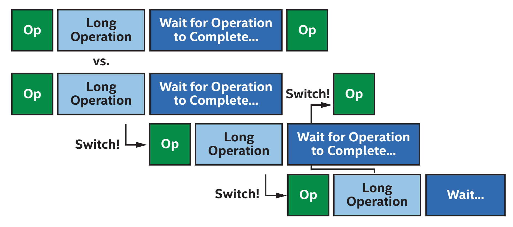

GPU分析工具可以使用占用率等术语，来描述GPU处理器当前执行的指令流数量与理论指令流总数的对比。

低占用率并不一定意味着低性能，因为少量指令流可能会使处理器繁忙。同样，高占用率并不一定意味着高性能，因为如果所有指令流执行低效的、长延迟的操作，GPU仍然需要等待。其他条件相同的情况下，增加占用率可以最大化GPU隐藏延迟的能力，通常也会提高性能。增加占用率是图15-7中并行的内核提高性能的另一个原因。

这种在多个指令流之间切换，以隐藏延迟的技术特别适合于GPU和数据并行处理。从图15-2中可以看出，GPU通常比其他处理器更简单，因此缺乏复杂的延迟隐藏特性。这使得GPU更容易受到延迟问题的影响，但是由于数据并行编程涉及到处理大量的数据，GPU通常有大量指令流要执行!


## 15.3 将内核函数加载到GPU

本节描述一个应用程序、SYCL运行库和GPU软件驱动程序如何一起在GPU硬件上加载内核。图15-14中展示了这些抽象层的软件堆栈。许多情况下，这些层的存在对程序是透明的，但在调试或分析应用程序时，理解它们就很重要了。


图15-14 将并行内核加载到GPU(简化)

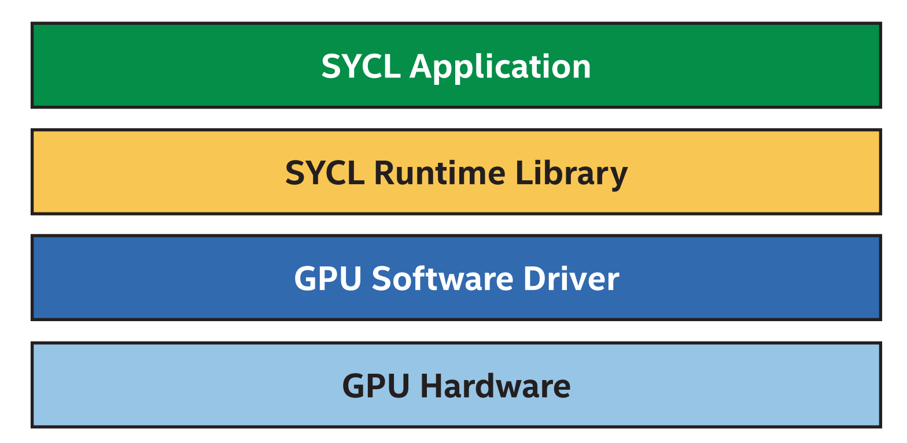


textbf{SYCL运行时库}

SYCL运行库是SYCL应用程序交互的主要软件库。运行时库负责实现类，如队列、缓冲区和访问器，以及这些类的成员函数。运行时库的部分实现可能位于头文件中，因此可以直接编译为应用程序可执行文件。运行时库的其他部分作为库函数实现，这些库函数作为应用程序构建过程的一部分链接到应用程序可执行文件。运行时库通常不是特定于设备的，同一个运行时库可能会将负载分配到CPU、GPU、FPGA或其他设备上。


textbf{GPU软件驱动}

虽然从理论上讲，SYCL运行库可以直接加载给GPU，但大多数SYCL运行库都与GPU软件驱动程序接口，以便将工作提交给GPU。

GPU软件驱动程序通常是API的实现，如OpenCL、Level Zero或CUDA。大多数GPU软件驱动程序是在SYCL运行时调用的用户模式驱动程序库中实现的，用户模式驱动程序可以调用操作系统或内核模式驱动程序来执行系统级的任务，比如：分配内存或向设备提交工作。用户模式驱动程序也可以调用其他用户模式库，例如：GPU驱动程序可以调用GPU编译器来实时编译一个内核，从中间表示到GPU ISA(指令集架构)。各个软件模块，及其相互作用如图15-15所示。


图15-15 GPU软件驱动模块

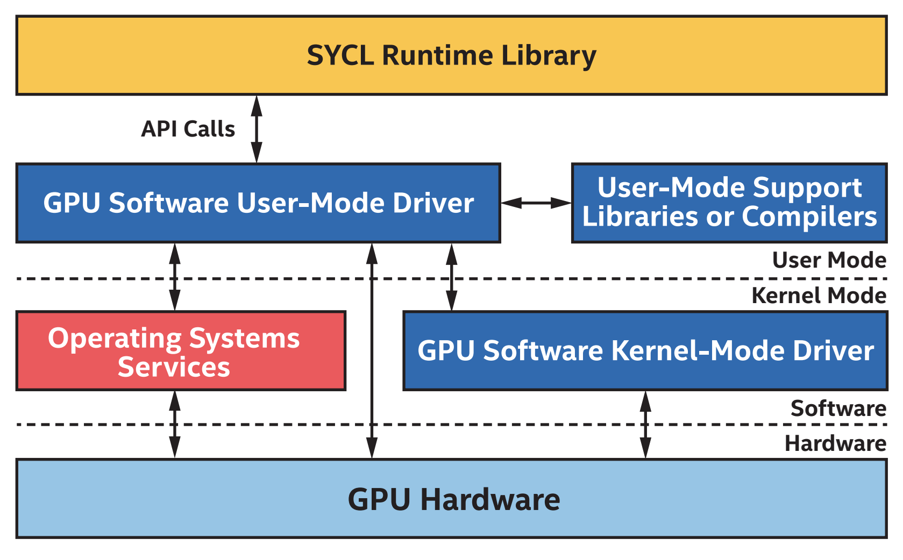


textbf{GPU硬件}

当运行时库或GPU软件用户模式驱动程序被显式请求提交工作时，或者GPU软件启发式地决定应该开始工作时，通常会通过操作系统或内核模式驱动程序调用来开始在GPU上执行工作。某些情况下，GPU软件用户模式驱动程序可能会直接向GPU提交工作，但不是所有设备或操作系统都支持。

当工作在GPU上执行的结果需要在主机处理器或另一个加速器，GPU必须发出工作完成的信号。工作完成所涉及的步骤与工作提交的步骤非常相似，但执行方式相反:GPU可能会向操作系统或内核驱动程序发出信号，表示已经完成了执行，然后驱动程序会得到通知，最后运行时库会通过GPU软件API调用观察到相应的工作已经完成。。

每一步都引入了延迟，运行库和GPU软件需要在较低的延迟和较高吞吐量之间进行权衡。例如，频繁地向GPU提交工作可能会减少延迟，但频繁地提交也可能由于提交产生的开销而降低吞吐量。收集大量的工作将增加延迟，但将提交开销分摊到更多的工作上，就会引入更多并行执行的机会。运行时和驱动都作出了权衡，但如果怀疑驱动启发式的提交导致工作效率低下，应该查阅文档确定是否有方法来替代默认驱动程序行为，这里可能会使用特定于API，甚至是使用特定的机制。


textbf{注意加载成本！}

尽管SYCL实现和GPU供应商正在不断创新和优化，以降低将工作转移到GPU的成本，但在启动GPU工作和在主机或其他设备上观察结果时，总会有开销。当选择在哪里执行算法时，要考虑在设备上执行算法的好处，以及将算法和需要的数据移动到设备上的成本。某些情况下，最有效的方法可能是使用主机处理器执行并行操作——或者在GPU上低效地执行算法的串行部分——以避免将算法从一个处理器移动到另一个处理器的开销。

begin{tcolorbox}[colback=red!5!white,colframe=red!75!black]
从整体上考虑算法的性能——在设备上执行算法的部分效率可能最高，而不是将执行转移到另一个设备上!
end{tcolorbox}


textbf{与设备存储器之间的传输}

对于使用专用内存的GPU，要特别注意内存和主机或其他设备上内存之间的传输成本。系统中不同内存类型的内存带宽差异如图15-16所示。


图15-16 设备内存、远程内存和主机内存之间的差异

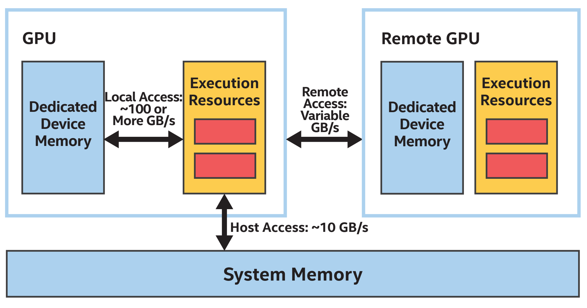

回顾一下第3章，GPU更喜欢在专用设备内存上运行，这比在主机内存或其他设备内存上运行要快多个数量级。尽管访问专用设备内存比访问远程内存或系统内存要快得多，但如果数据尚未在专用设备内存中，则必须复制或迁移数据。

频繁访问数据的话，将其移到专用设备内存中是性能有益的，特别是当GPU执行资源忙于处理另一个任务时，传输任务可以异步执行。当数据访问频率不高或不可预测时，最好是节省传输成本，并在远程或系统内存中操作数据(即使每次访问成本更高)。第6章描述了控制内存分配、复制和预取数据到专用设备内存的不同方法。这些技术在为GPU优化程序执行时非常重要。

## 15.4 GPU内核最佳实践

前几节描述了传递给parallel_for的参数，如何影响内核分配给GPU资源，以及在GPU上执行内核所涉及的软件层和开销。本节介绍了内核在GPU上执行的最佳实践。

内核要么是内存式的，其性能受到数据读写操作在GPU上执行资源的限制，要么是计算式的，其的性能受到GPU上执行资源的限制。这是为GPU和许多其他处理器优化内核的良好第一步!——用来确定内核是内存式，还是计算式的，因为改进内存式内核的技术通常不会有益于计算式内核，反之亦然。所以供应商通常提供分析工具来帮助确定。

begin{tcolorbox}[colback=red!5!white,colframe=red!75!black]
需要不同的优化技术，这取决于内核是内存式还是计算式!
end{tcolorbox}

因为GPU倾向于拥有许多处理器和较宽的SIMD，内核倾向于内存式，而不是计算式。如果不确定从哪里开始，检查内核如何访问内存是很好的一步。


textbf{访问全局内存}

高效地访问全局内存对于优化应用程序性能至关重要，因为工作项或工作组操作的几乎所有数据都源自全局内存。当内核在全局内存上的操作效率很低，那性能会很差。尽管GPU通常包含专用硬件集合和计算单元，用于读写内存中的任意位置，但访问全局内存的性能通常是由数据访问的局域性驱动。当工作组中的工作项正在访问内存中的一个元素，该元素与工作组中另一个工作项访问的元素相邻，则全局内存访问性能可能会很好。如果工作组中的工作项访问的内存是跨步的或随机的，则全局内存访问性能会差。一些GPU文档将附近内存访问操作描述为textbf{合并访问}。

在图15-15中某种程度上并行的矩阵乘法内核，可以选择是并行处理一行还是一列，这里选择并行处理结果矩阵的行。这是一个糟糕的选择:如果一个id等于m的工作项与一个id等于m-1或m+1的相邻工作项分组，用于访问matrixB的索引对于每个工作项都是相同的，但是用于访问matrixA的索引不同于K，这意味着访问是高度跨步的。matrixA的访问模式如图15-17所示。


图15-17 对matrixA的访问是高度跨越和低效的

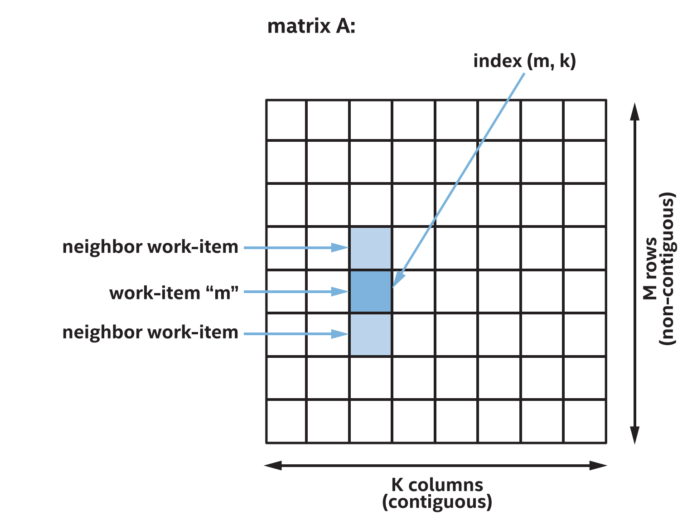

如果选择并行处理结果矩阵的列，则访问模式具有更好的局部性。图15-18中的内核在结构上与图15-5中相似，唯一的区别是图15-18中的每个工作项操作的是结果矩阵的一列，而不是结果矩阵的一行。


图15-18 并行计算结果矩阵的列，而不是行
```
// This kernel processes columns of the result matrix in parallel.
h.parallel_for(N, [=](item<1> idx) {
	int n = idx[0];
	
	for (int m = 0; m < M; m++) {
		T sum = 0;
		for (int k = 0; k < K; k++)
			sum += matrixA[m * K + k] * matrixB[k * N + n];
		matrixC[m * N + n] = sum;
	}
});
```

尽管这两个内核在结构上非常相似，但在许多GPU上操作数据列的内核将显著优于操作数据行的内核，纯粹是因为更高效的内存访问:如果一个id等于n的工作项与一个id等于n-1或n+1的相邻工作项分组，用于访问matrixA的索引现在对于每个工作项都是相同的，并且用于访问matrixB的索引是连续的。matrixB的访问模式如图15-19所示。


图15-19 对matrixB的访问是连续的和有效的

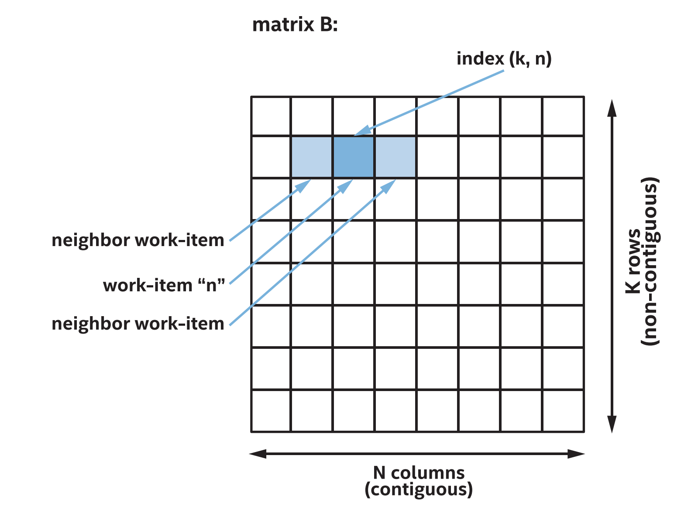

对连续数据的访问通常非常有效。根据经验，访问一组工作项的全局内存的性能取决于访问的GPU缓存行的数量有访问都在一个缓存行内，访问将以最高性能执行。一个访问需要两条缓存线，比如通过访问每个其他元素或者从缓存不对齐的地址开始，访问可能会以一半的性能运行。组中的每个工作项访问唯一的高速缓存行，例如：对于非常频繁的或随机的访问，就可能以最低的性能运行。

begin{tcolorbox}[colback=blue!5!white,colframe=blue!75!black, title=设置内核变体]
对于矩阵乘法，选择沿着一个维度并行化，显然可以提高内存访问效率，但对于其他内核，选择可能不那么明显。在实现最佳性能非常重要的内核中，如果不清楚并行化的维度，那么有时值得开发和分析沿每个维度并行化的不同内核变体，以了解哪种方法更适合设备和数据集。
end{tcolorbox}


textbf{访问工作组本地内存}

前一节中，我们描述了对全局内存的访问如何从局部性中获益，从而最大化缓存性能。某些情况下，可以设计算法来有效地访问内存，比如选择在一个维度上并行化。然而，并非所有情况下都能使用这种技术。本节描述如何使用工作组本地内存来有效地支持更多的内存访问模式。

从第9章开始，工作组中的工作项可以通过工作组本地内存通信和使用工作组栅栏同步来协作解决问题。这种技术对GPU有利，因为典型的GPU有专属硬件来实现栅栏和工作组本地内存。不同的GPU厂商和不同的产品可能会以不同的方式实现工作组本地内存，但是工作组本地内存与全局内存相比通常有两个优势:本地存储器可以支持比对全局存储器的访问更高的带宽和更低的等待时间，即使当全局存储器访问命中高速缓存时，并且本地存储器通常被划分为不同的存储器区域，称为存储库。只要组中的每个工作项访问不同的存储库，本地内存访问就会以完全的性能执行。存储库访问允许本地存储器支持比全局存储器更多的具有峰值性能的访问模式。

许多GPU供应商会将连续的本地内存地址分配给不同的存储地址。这确保了连续的内存访问总是完全的性能操作，而不管起始地址是什么。但当内存访问是有跨距访问时，组中的一些工作项可能访问分配给同一存储地址。当发生这种情况时，认为是存储地址冲突，从而导致序列化访问和较低的性能。

begin{tcolorbox}[colback=red!5!white,colframe=red!75!black]
为了获得最大的全局内存性能，应尽量减少访问的高速缓存行的数量。

为了获得最大的本地内存性能，尽量减少内存地址冲突!
end{tcolorbox}

图15-20概述了全局内存和本地内存的访问模式和预期性能。假设当ptr指向全局内存时，指针与GPU缓存行的大小对齐。访问全局内存时，可以通过从缓存对齐的地址连续访问内存来获得最佳性能。访问未对齐的地址可能会降低全局内存性能，因为访问可能需要访问额外的缓存行。因为访问未对齐的本地地址不会导致存储地址冲突，所以本地内存性能没有改变。

有跨距的案例值得更详细地描述。访问全局内存中的每一个元素都需要访问更多的缓存行，这可能会导致较低的性能。访问本地内存中的每一个元素可能会导致存储地址冲突和性能下降，但只有当存储地址的块数量能被2整除时。如果存储地址块的数量是奇数，这种情况也将全速运行。

当访问之间的跨越非常大时，每个工作项访问唯一的缓存行，从而导致最差的性能。但是对于本地内存，性能取决于步幅和存储地址块的数量。当步长N等于存储地址块数量时，每次访问都会导致内存块冲突，所有访问都会序列化，导致性能最差。但是，如果步数M和内存块数量没有关系，则访问将以全速运行。因此，许多优化的GPU内核会在本地内存中填充数据结构，以选择减少或消除内存块冲突的方法。


图15-20 对于不同的访问模式，全局和本地内存可能的性能情况

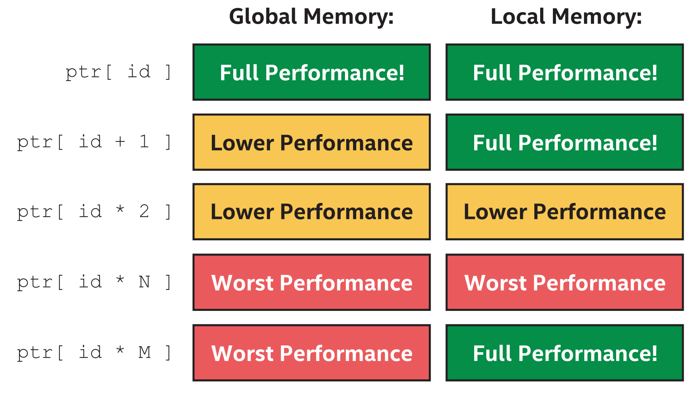


textbf{子工作组不使用本地内存}

正如第9章所讨论的，子工作组集合功能是在组中的工作项之间交换数据的一种替代方法。对于许多GPU，子工作组代表由单个指令流处理的工作项集合。这些情况下，子工作组中的工作项可以在不使用工作组本地内存的情况下，低成本地交换数据和同步。许多性能好的GPU内核都使用子工作组，所以对于内核，我们的算法是否可以重新定义，为使用子工作组集合函数是值得研究的课题。


textbf{使用小数据类型优化计算}

本节描述消除或减少内存访问瓶颈后优化内核的技术。记住，GPU以前是用来在屏幕上绘制图片的。尽管GPU的纯计算能力随着时间的推移不断发展和改进，但在传统的图形学领域能力优势仍然很明显。

例如，考虑对内核数据类型的支持。许多GPU都为32位浮点操作进行了高度优化，因为这些操作在图像和游戏中很常见。对于处理较低精度的算法，许多GPU还支持较低精度的16位浮点型，以精度换取更快的处理速度。相反，尽管许多GPU支持64位双精度浮点操作，但高精度是有代价的，32位操作通常比64位操作执行得更快。

整数类型也是如此，32位整数数据类型通常比64位整数数据类型执行得更好，而16位整数可能执行得更好。如果可以用更小的整数来组织计算，那么内核可能会执行得更快。特别需要注意的是寻址操作，这些操作通常在64位的size_t数据类型上进行，但有时可以重新安排以使用32位的数据类型执行大部分计算。某些本地内存情况下，16位就足够了。


textbf{优化数学函数}

内核可能为了性能而牺牲精确性的另一个领域涉及了SYCL内置函数。SYCL包含一组丰富的数学函数，在一系列输入中具有定义良好的精度。大多数GPU本身并不支持这些函数，而是使用一长串其他指令来实现。虽然数学函数实现通常为GPU进行了很好的优化，但如果应用程序可以容忍较低的精度，应该考虑较低精度和更高性能的不同实现。关于SYCL内置函数的更多信息，请参阅第18章。

对于常用的数学函数，SYCL库包括快速或本机函数变体，这些变体有较少的或精度要求。对于某些GPU来说，这些函数比等价的函数快一个数量级，所以对于算法来说是否有足够的精度值得考虑。例如，许多图像后处理算法具有定义良好的输入，可以容忍较低的精度，因此是使用快速或原生数学函数的好选择。

begin{tcolorbox}[colback=red!5!white,colframe=red!75!black]
如果算法可以容忍较低的精度，可以使用较小的数据类型或较低的精度数学函数来提高性能!
end{tcolorbox}


textbf{专用的功能和扩展}

为GPU优化内核时的最后一个考虑是在许多GPU中常见的专用指令。例如，几乎所有的GPU都支持mad或fma乘加指令，在一个时钟中执行两个操作。GPU编译器通常非常擅长识别和优化单独的乘法和加法，而不是使用一条指令，SYCL也包括mad和fma函数，还可以显式调用。当然，如果希望GPU编译器优化乘法和加法，应该确保不会通过禁用浮点截断来阻止优化!

其他特定的GPU指令可能只能通过编译器优化或对SYCL语言的扩展来使用。例如，一些GPU支持一种特殊的“点乘加”指令，编译器将试图识别并优化它，或者可以直接调用。关于如何查询GPU实现支持的扩展的更多信息，请参阅第12章。


## 15.5 总结


本章中，首先描述了传统的GPU是如何工作的，以及GPU与传统CPU的不同之处。介绍了GPU是如何针对大量数据进行优化的，通过交换处理器特性，为其他处理器加速单个指令流。

介绍了GPU如何使用宽SIMD指令并行处理多个数据元素，以及GPU如何使用预测和隐藏延迟来使用SIMD指令执行具有复杂流控制的内核。讨论了预测和隐藏延迟如何提高SIMD的效率和内核的性能，以及如何选择在一个维度上并行处理，以减少SIMD的发散执行。

因为GPU有如此多的处理资源，讨论了如何给GPU足够的工作来保持高占用率。还介绍了GPU如何使用指令流来隐藏延迟，这使得让GPU执行大量工作变得更加重要。

接下来，讨论了将内核加载到GPU所涉及的软件和硬件层，以及加载的成本。讨论了如何在单个设备上执行算法比在一个设备到另一个设备上执行更有效。

最后，介绍了在GPU上执行内核时的最佳实践。介绍了有多少内核从内存式开始，如何有效地访问全局内存和本地内存，如何通过使用子工作组操作来避免使用本地内存。当为计算式内核时，介绍了如何通过用较低的精度换取更高的性能，或使用自定义的GPU扩展来访问专门的指令来优化计算。


textbf{更多信息}

关于GPU编程还有很多需要学习的内容，而这一章只是皮毛而已!

GPU规格和白皮书是学习更多关于特定GPU和GPU架构的好方法。许多GPU供应商提供了关于他们的GPU和如何编程的非常详细的信息。

撰写本文时，有关图形处理器的相关信息可以在software.intel.com、devblogs.nvidia.com和amd.com上找到。

一些GPU供应商有开源驱动程序或驱动程序组件。在可用的情况下，检查或遍历驱动程序代码，可以了解哪些操作是昂贵的，或者应用程序中可能存在哪些开销，或是有益的。。

本章主要讨论通过缓存访问器或统一共享内存对全局内存的传统访问，但大多数GPU也有纹理采样器，可以加速对图像的操作。有关图像和采样器的更多信息，请参阅SYCL规范。