# 17 FPGA编程


基于内核的编程最初是作为一种访问GPU的方式而流行起来的。由于现在已经在许多加速器中得到了推广，理解编程风格如何影响代码到FPGA的映射非常重要。

对大多数软件开发人员来说，对于可编程门阵列(FPGA)并不熟悉，部分原因是大多数桌面计算机在典型的CPU和GPU之外没有FPGA。FPGA的确很值得了开发人员来了解，因为它在很多应用中都有优势。和其他加速器一样，也需要问同样的问题，比如“什么时候使用FPGA?”，“应用程序的哪些部分应该加载到FPGA?”，以及“如何编写在FPGA上表现良好的代码?”

本章为我们提供了开始回答这些问题的知识，至少可以确定对FPGA是否感兴趣，并知道哪些构造可用于实现性能。我们可以阅读供应商文档来了解特定产品和工具链的详细信息。首先概述程序如何映射到FPGA等空间架构，然后讨论FPGA作为加速器的一些特性，最后介绍实现性能的编程结构。

本章的“如何使用FPGA”一节适用于任何FPGA。SYCL允许供应商指定CPU和GPU之外的设备，但没有具体说明如何支持FPGA。目前，对于特定的FPGA支持是DPC++的优势，即可以使用FPGA选择器和管道。FPGA选择器和管道是本章中使用的DPC++扩展。我们希望厂商能够使用类似或兼容的方式来支持FPGA，而DPC++作为一个开源项目非常鼓励这种做法。


## 17.1 性能说明

与任何处理器或加速器一样，FPGA设备因厂商而异，甚至因产品而异，因此对于一种设备的最佳实践可能并不适用于不同的设备。这一章的建议可能会使许多FPGA设备受益，不管是现在还是将来……

begin{tcolorbox}[colback=red!5!white,colframe=red!75!black]
……为了实现特定FPGA的最佳性能，请始终参考供应商提供的文档!
end{tcolorbox}


## 17.2 FPGA的工作原理

FPGA通常归类为空间架构，其受益于与使用指令集体系结构(ISA)的设备(包括大多数人更熟悉的CPU和GPU)，从而形成非常不同的编码风格和并行形式。为了理解FPGA，我们将简要介绍基于ISA的加速器的一些思想。

就目的而言，基于ISA的加速器设备可以执行许多不同的指令。这些指令通常比较简单，比如“从地址A的内存中加载数据”或“添加一组数字”。操作链串在一起形成程序，处理器就一条一条的执行指令。

基于ISA的加速器中，芯片的单个区域(或整个芯片)在每个时钟周期中执行来自程序的不同指令。这些指令在固定的硬件架构上执行，不同的硬件架构可以在不同的时间运行不同的指令，如图17-1所示。输入加法的内存负载单元可能与输入减法的内存负载单元相同，同样的算术单元可能用于执行加法和减法指令。随着时间的推移，随着程序的执行，芯片上的硬件可以重用不同的指令。


图17-1 简单的基于ISA的(临时)处理:随着时间的推移重用硬件(区域)

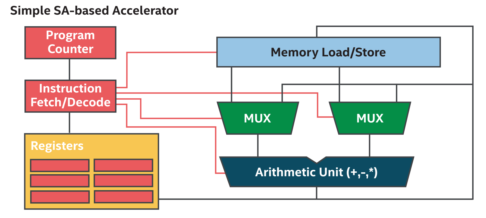

由于空间架构不同，它们不是基于在共享硬件上执行各种指令的芯片，而是从相反的角度出发。程序空间在概念上把程序作为一个整体，并立即放在设备上执行，设备的不同区域在程序中执行不同的指令。空间架构中，专用硬件会接受到相应的指令，这些硬件可以与其他硬件同时执行(相同的时钟周期)。图17-2展示了这种思想，其为整个程序(本例中是一个非常简单的程序)的“空间”实现。


图17-2 空间处理:每个操作使用设备的不同区域

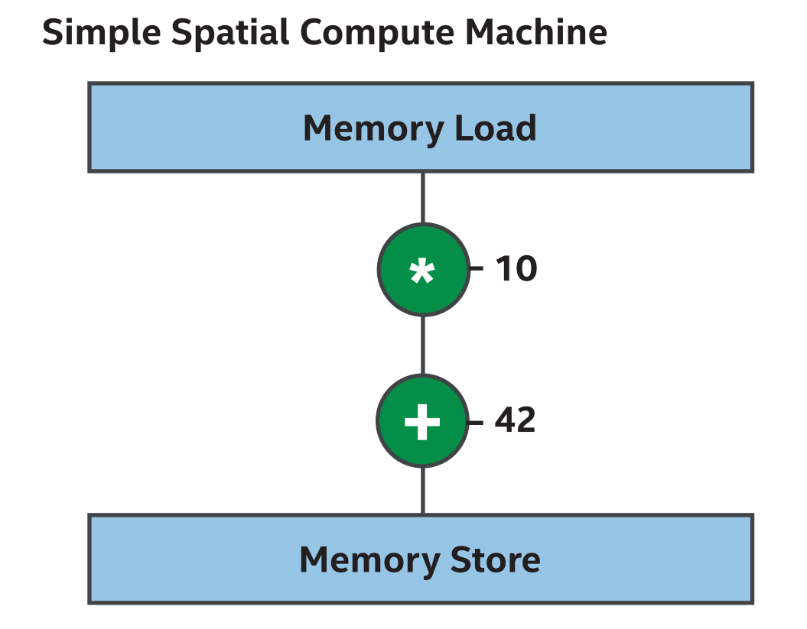

这个描程序过于简单，但在空间架构、程序的不同部分的不同设备上执行，而不是随着时间变化而变化。

由于FPGA的不同区域可以编程执行不同的操作，一些与基于ISA的加速器相关联的硬件则没必要这样做。例如，图17-2显示不再需要指令获取或解码单元、程序计数器或寄存器文件。空间体系结构将一条指令的输出与另一条指令的输入相连接，而不是将数据存储在寄存器文件中，这就是为什么空间体系结构通常称为数据流体系结构。

介绍的FPGA映射时，出现了几个问题。首先，由于程序中的每条指令都占用设备空间面积一定的百分比，如果程序需要超过100%的面积会发生什么?一些解决方案提供资源共享机制，使更大的程序能够以性能成本来适应，但FPGA又有程序适应的概念。这些既是优点也是缺点:


	-  好处:如果程序使用了FPGA上的大部分区域，并且在每个时钟周期中有足够的工作来保持所有硬件繁忙，由于极端的并行性，在设备上执行程序非常高效。更通用的体系可能在时钟周期中有大量未使用的硬件。使用FPGA时，可以为特定应用程序完美地定制面积，不会浪费。这种定制可以让应用程序通过大规模并行运行得更快，通常可以提高能源利用的效率。
	-  缺点:大型程序可能需要调整和重组才能适应设备。编译器的资源共享特性可以帮助解决这个问题，但通常会使性能下降，从而降低使用FPGA的好处。基于ISA的加速器是非常有效的资源共享实现——FPGA对计算有价值，主要是程序可以利用大多数可用区域。


极端的情况下，FPGA上的资源共享解决方案会看起来像基于ISA的加速器，在可重构逻辑中构建。可重构逻辑导致相对于固定设计的开销大——因此，FPGA通常不作为实现ISA的方法。当应用程序能够利用资源来实现高效的数据流算法时，FPGA是最有利的，将在下一节中讨论这些算法。


textbf{管道并行性}

图17-2中经常出现的另一个问题是，程序的空间实现如何与时钟频率相关，以及程序从开始到结束执行的速度。示例中，很容易看出数据可以很快地从内存中加载，执行乘法和加法运算，并将结果存储回内存中。随着程序变得越来越大，可能在FPGA设备上有成千上万的操作，所有的指令都要一个接一个地进行操作(操作通常取决于前一个操作产生的结果)，考虑到每个操作带来的处理延迟，可能会花费大量的时间

如图17-3所示的空间体系结构中，操作之间的中间结果会随着时间的推移而更新(传播)。例如，load执行后将其结果传递给乘数器，乘数器的结果再传递给加法器，以此类推。一段时间后，中间数据一直传播到操作链的末端，最终结果可用或存储到内存中。


图17-3 空间计算实现的传播时间

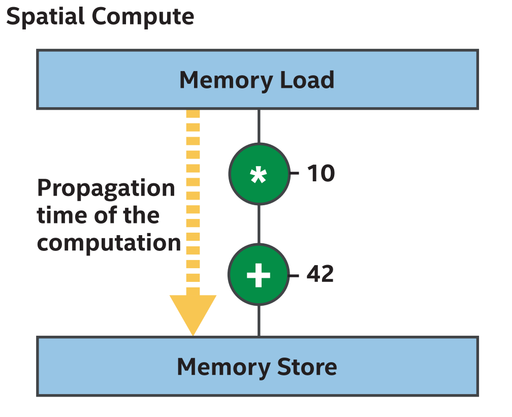

图17-3所示的空间实现非常低效，大多数硬件只在一小部分时间内执行有用的工作。大多数情况下，像乘法这样的操作要么等待加载中的新数据，要么保持其输出，以便让后续操作使用其结果。大多数空间编译器和实现通过流水线处理这种低效操作，这样单个程序的执行分散在多个时钟周期中。这是通过在一些操作之间插入寄存器(硬件中的数据存储原语)实现的，其中每个寄存器在一个时钟周期内保存一个二进制值。通过保存操作的输出结果，以便让下一个操作可以看到并对所保存的值进行操作，前一个操作可以自由地对不同的计算进行操作，而不会影响后续操作的输入。

算法流水线的目标是使每个操作(硬件单元)在每个时钟周期中处于繁忙状态。图17-4显示了前面简单示例的流水线实现。编译器会完成所有的流水线和平衡工作!我们讨论这个主题是为了在接下来的章节中理解如何用工作填充流水线。


图17-4 计算流水线:各个阶段并行执行

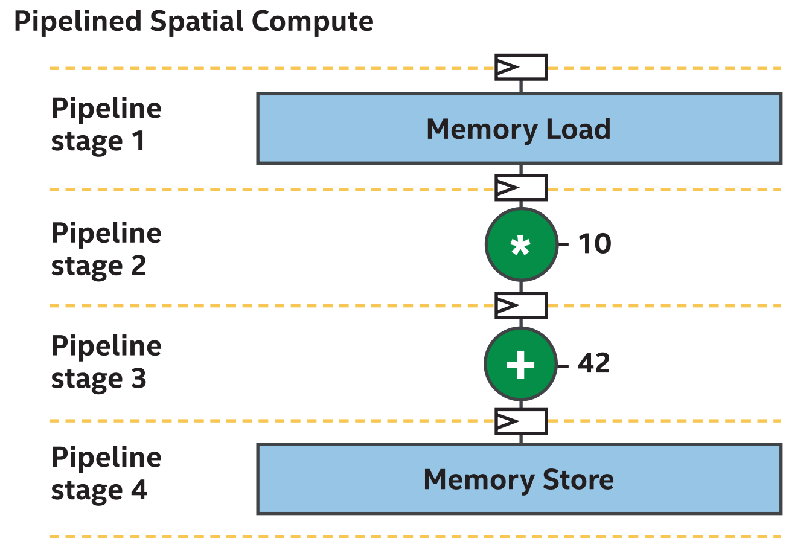

实现流水线化时，类似工厂装配线的方式就会让工作变得非常高效。每个管道阶段只执行总体工作的一小部分，执行得很快，然后立即开始处理下一个工作单元。管道从开始到结束处理单个计算需要许多时钟周期，但是管道可以同时计算不同数据上的不同计算实例。

当足够多的工作在流水线中执行，经过了足够多的连续时钟周期，那么每个流水线阶段和程序中的操作都可以在时钟周期中执行有用的工作，这样整个空间设备同时执行工作。这是空间架构的力量——整个设备可以在任何时候并行执行。我们称之为流水线并行性。

begin{tcolorbox}[colback=red!5!white,colframe=red!75!black]
流水线并行是FPGA上用来实现性能的并行的主要形式。
end{tcolorbox}

begin{tcolorbox}[colback=blue!5!white,colframe=blue!75!black, title=自动型流水线]
在用于FPGA的DPC++的Intel实现中，以及用于FPGA的其他高级编程解决方案中，算法的流水线是由编译器自动执行。大致理解空间体系结构上的实现是很有用，这样就可以更容易地利用流水线并行性。流水线寄存器的使用平衡由编译器控制，而不是由开发控制。
end{tcolorbox}

真正的程序和算法通常有控制流(例如，if/else结构)，这会使程序的某些部分在某些时钟周期中处于非活动状态。FPGA编译器通常会结合分支两边的硬件，尽可能减少浪费的空间面积，并在控制流发散期间最大化计算效率。这使得控制流分歧的成本大大降低，而且与其他方面(特别是向量化的体系结构)相比，开发上的关注点也更少。


textbf{消费核心——芯片“区域”}

现有的实现中，DPC++应用程序中的每个内核都会生成空间管道，消耗FPGA的一些资源(可以将其看作是设备上的空间或区域)，如图17-5所示。


图17-5 同一个FPGA二进制文件中的多个内核:内核可以并发运行

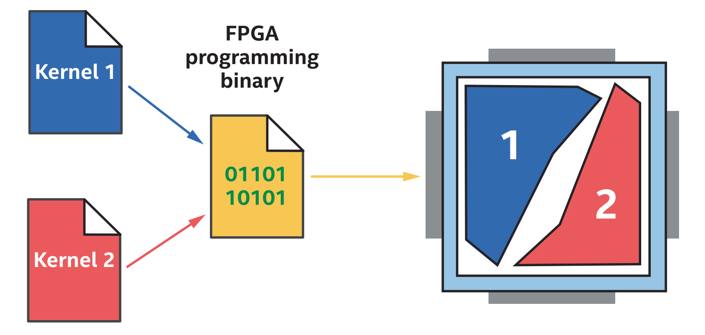

内核在设备上使用自己的区域，不同的内核可以并发执行。当内核正在等待内存访问之类的操作，FPGA上的其他内核可以继续执行，因为芯片上有其他独立的管道。这种思想形式上描述为内核之间的前向进程，是FPGA空间计算的关键。


## 17.3 何时使用FPGA

与任何加速器架构一样，预测FPGA何时是正确选择，何时需要替代方案，通常取决于对架构、应用程序特征和系统瓶颈的了解。


textbf{海量任务}

大多数现代的计算机加速器，想要获得良好的性能需要大量的工作。单个数据元素计算单个结果，对于加速器是没有加速效果的。这与FPGA一样，了解了FPGA编译器利用了流水线并行性，这一点就更加明显了。算法的流水化实现有很多阶段，通常是上千个甚至更多，每个阶段在任何时钟周期内都有不同的工作。如果没有足够的工作在占用流水线的大部分阶段，那么执行效率就会很低。

有多种方法可以在FPGA上生成工作来填充流水线阶段，我们将在接下来的章节中介绍这些方法。


textbf{自定义操作或操作宽度}

FPGA最初用来执行整数和位操作，并作为逻辑粘合剂，可以使其他芯片的接口工作。虽然FPGA已经发展为计算功能强大的设备，已不仅仅是粘合逻辑解决方案，但在位操作、自定义数据宽度或类型上的整数数学操作，以及对包头信息中的任意位字段的操作方面仍然非常高效。

本章末尾描述的FPGA的细粒度架构意味着可以有效地实现新的任意数据类型。例如，如果需要33位整数乘法器或129位加法器，FPGA可以以很高的效率提供这些操作。由于这种灵活性，FPGA通常用于快速发展的领域，例如：机器学习，其中数据宽度和操作的变化速度比内置在专用集成电路中要快。


textbf{标量数据流}

从图17-4可以明显看出，FPGA空间流水线的一个重要方面是，操作之间的中间数据不仅停留在芯片上(没有存储到外部内存)，而且每个管道阶段之间的中间数据都有专用的存储寄存器。FPGA的并行性来自于流水线，同时执行许多操作，每个操作在流水线的不同阶段。这与向量体系结构不同，在向量体系结构中，多个计算作为共享向量指令而执行。

空间流水线中并行性的标量性质，对于许多应用程序都很重要，即使在跨工作单元的数据依赖情况下仍然适用。可以在不损失性能的情况下处理这些数据依赖关系，我们将在本章后面讨论循环中的依赖关系时对此话题继续进行讨论。空间流水线对于不能破坏跨工作单元(如工作项)的数据依赖，并且可以进行细粒度通信。其他加速器的许多优化技术都侧重于打破这些依赖关系，或者通过子工作组等特性在可控范围内管理通信。相反，FPGA可以很好地处理依赖与通信，应该考虑在存在这种模式的算法中使用FPGA。

begin{tcolorbox}[colback=blue!5!white,colframe=blue!75!black, title=循环不是罪!]
对于数据流体系结构的一个常见误解是，具有固定或动态迭代计数的循环会导致糟糕的数据流性能，因为不是简单的前馈流水。至少对于Intel DPC++和FPGA工具链来说，这不正确。相反，循环迭代是在流水线中产生高占用率的一种好方法，而编译器是以重叠的方式执行多个循环迭代构建的。循环提供了一种简单的机制来保持流水线忙于工作!
end{tcolorbox}


textbf{低延迟和富连接}

利用设备上丰富的输入和输出收发器的FPGA的更传统的使用同样适用于使用DPC++的开发人员。例如，如图17-6所示，一些FPGA加速卡具有网络接口，可以将数据直接流进设备，进行处理后将结果直接流回网络。当需要最小化处理延迟、通过操作系统网络栈进行的处理太慢或需要加载时，通常会寻求这种系统。


图17-6 低延迟I/O流:FPGA连接网络数据和计算

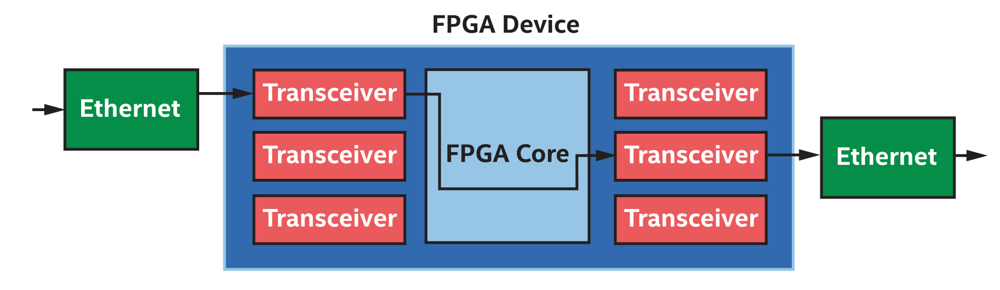

当考虑通过FPGA收发器直接输入/输出时，机会有很多，但选择确实取决于加速器上可用的东西。由于依赖于特定的加速卡和各种场景，除了在下一节中描述管道语言构造外，本章不深入研究这些程序。相反，我们应该阅读与特定加速卡相关的供应商文档，或者搜索与特定接口需求相匹配的加速卡。


textbf{定制的内存系统}

FPGA上的存储系统，私有存储器或工作组本地存储器，是由片上存储构建。每个内存系统都是为使用它的算法或内核的特定部分定制构建的。FPGA具有显著的片上存储带宽，并且结合形成定制存储器，可以在具有非典型存储器访问模式和结构的应用程序上表现得很好。图17-7显示了在FPGA上实现内存系统时，编译器可以执行的一些优化。


图17-7 FPGA存储系统是由编译器为特定代码定制的

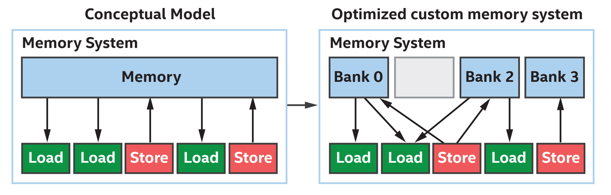

其他架构(如GPU)具有固定的内存结构，这很容易使有经验的开发人员理解，但在许多情况下很难进行优化。例如，其他加速器的许多优化都集中在内存模式修改，以避免内存块冲突。如果算法能够从自定义的内存结构中获益，比如每个内存块的访问端口数量不同，或者内存块数量异常，那么FPGA就有直接的优势。从概念上讲，两者的区别在于编写代码高效地使用固定的内存系统(大多数其他加速器)，而让编译器定制内存系统，来提升特定代码的性能(FPGA)。


## 17.4 在FPGA上运行程序

在FPGA上运行内核有两个步骤(与提前编译一样):

begin{enumerate}
	-  将源代码编译成二进制文件，可以在感兴趣的硬件上运行
	-  运行时选择感兴趣的加速器
end{enumerate}

为了编译内核在FPGA硬件上运行，可以使用命令行:

begin{tcolorbox}[colback=white,colframe=black]
dpcpp -fintelfpga my_source_code.cpp -Xshardware
end{tcolorbox}

这个命令告诉编译器将my_source_code.cpp中的所有内核转换为可以在Intel FPGA加速机上运行的二进制文件，然后打包到主机二进制文件中。当执行主机二进制文件时(例如，在Linux上运行./a.out)，在执行提交的内核之前，运行时将根据需要为FPGA自动编程，如图17-8所示。


图17-8 FPGA在运行时的自动编程

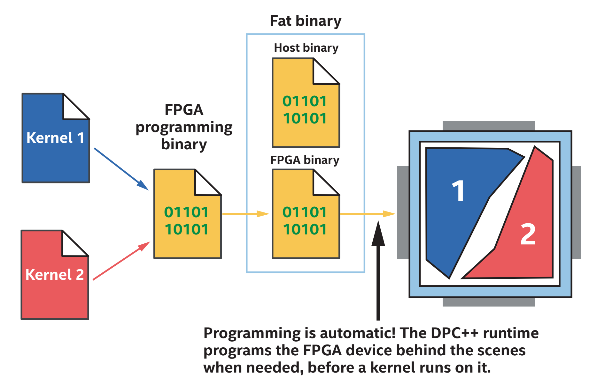

begin{tcolorbox}[colback=red!5!white,colframe=red!75!black]
FPGA编程二进制文件嵌入在主机上运行和编译的DPC++可执行文件中。FPGA在后台进行自动配置。

当运行主程序并在FPGA上提交内核执行时，在内核开始执行之前可能会有一个延迟。重新提交内核执行不会出现相同的延迟，因为内核已经编程到设备中，并准备运行。
end{tcolorbox}

运行时选择FPGA设备在第2章中讨论。需要告诉主程序希望内核在哪里运行，通常会有多个加速器选项可用，比如CPU和GPU，除了FPGA。为了快速回顾在程序执行期间选择FPGA的方法，可以使用如图17-9所示的代码。


图17-9 使用fpga_selector在运行时选择FPGA
```
#include <CL/sycl.hpp>
#include <CL/sycl/intel/fpga_extensions.hpp> // For fpga_selector
using namespace sycl;

void say_device (const queue& Q) {
	std::cout << "Device : "
			  << Q.get_device().get_info<info::device::name>() 
			  << "n";
}

int main() {
	queue Q{ INTEL::fpga_selector{} };
	say_device(Q);
	
	Q.submit([&](handler &h){
		h.parallel_for(1024, [=](auto idx) {
			// ...
		});
	});

	return 0;
}
```


textbf{编译时间}

很多传言说，为FPGA编译设计可能需要很长时间，比基于ISA的加速器编译时间长得多。传言是真的!本章的最后概述了FPGA的细粒度架构元素，它们带来了FPGA的优点和计算密集型的编译(位置和路径优化)，在某些情况下需要花费数小时。

从源代码到FPGA硬件执行的编译时间足够长，以至于我们不希望只在硬件中开发和迭代代码。FPGA开发流程提供了几个阶段，这些阶段最小化了硬件编译的数量，使硬件编译的时间不受影响时，仍然具有生产力。图17-10显示了典型的阶段，大部分时间都花在提供快速周转和快速迭代的早期步骤上。


图17-10 大多数验证和优化发生在冗长的硬件编译之前

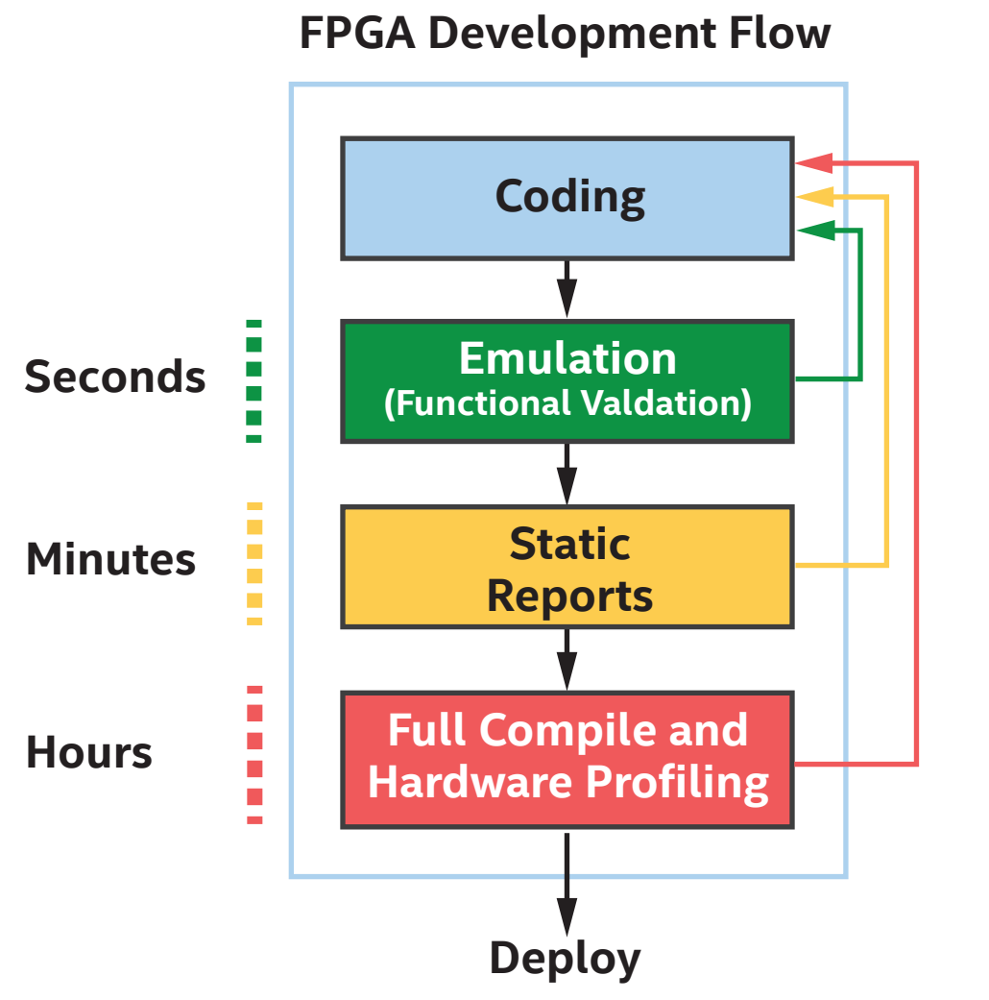

编译器的渲染和静态报告是DPC++中FPGA代码开发的基石。模拟器支持相关的扩展和执行模型，在主机上运行。因此，编译时间与期望从编译到CPU设备的时间相同，尽管看不到在实际FPGA硬件上执行所带来的性能提升。模拟器对于在应用程序中建立和测试功能正确性非常有用。

工具链可以快速生成静态报告，比如仿真。报告由编译器创建的FPGA结构，并由编译器识别的瓶颈。这两者都可以用来预测设计在FPGA硬件上运行时是否会有良好的性能，并用于优化代码。请阅读供应商的文档以获取有关报告的信息，这些报告通常会随着工具链的发布而不断改进(请参阅文档以获得最新和最伟大的特性!)供应商提供了详细的文档，说明如何根据报告进行解释和优化。这些信息将是另一本书的主题，所以不在这一章中详细讨论。


textbf{FPGA仿真器}

模拟主要用于从功能上调试应用程序，以确保它的行为符合预期并产生正确的结果。没有理由在编译时间较长的实际FPGA硬件上进行这种级别的开发。仿真流通过从dpcpp编译命令中删除-Xshardware标志来激活，并且在我们的主机代码中使用INTEL::fpga_emulator_selector，而不是使用INTEL::fpga_selector。然后，使用以下命令进行编译

begin{tcolorbox}[colback=white,colframe=black]
dpcpp -fintelfpga my_source_code.cpp
end{tcolorbox}

同时，将在运行时使用如图17-11所示的FPGA仿真器。通过使用FPGA模拟器选择器(使用主机处理器来模拟FPGA)，需要对实际的FPGA硬件进行冗长的编译之前，维护一个快速的开发和调试过程。


图17-11 利用FPGA仿真器进行快速开发和调试
```
#include <CL/sycl.hpp>

#include <CL/sycl/intel/fpga_extensions.hpp> // For fpga_selector
using namespace sycl;

void say_device (const queue& Q) {
	std::cout << "Device : "
			  << Q.get_device().get_info<info::device::name>() << "n";
}

int main() {
	queue Q{ INTEL::fpga_emulator_selector{} };
	say_device(Q);
	
	Q.submit([&](handler &h){
		h.parallel_for(1024, [=](auto idx) {
			// ...
			});
		});

	return 0;
}
```

如果经常在硬件和模拟器之间切换，可以在程序中使用宏在对设备选择器进行切换。如果需要，请查看供应商的文档和在线FPGA DPC++代码示例。


textbf{FPGA的AOT(Ahead-of-Time)编译}

图17-10中的完全编译和硬件分析阶段在SYCL术语中是AOT编译。意味着将内核编译为设备二进制文件，是发生在最初编译程序时，而不是在将程序提交给要运行的设备时。在FPGA上，这一点特别重要，因为

begin{enumerate}
	-  编译需要一段时间，这是运行程序时不希望发生的。
	-  DPC++程序可能会在没有主机处理器的系统上执行。FPGA二进制代码的编译过程得益于快速处理器和大量附加内存。AOT编译可以轻松地选择编译发生的位置，而不是让它在部署程序的系统上运行。
end{enumerate}

begin{tcolorbox}[colback=blue!5!white,colframe=blue!75!black, title=在FPGA上使用DPC++其实要经历很多!]
传统的FPGA设计(不使用高级语言)可能非常复杂。除了编写内核之外，还有许多步骤，比如：构建和配置与芯片外存储器通信的接口，通过插入寄存器来关闭计时，这些寄存器需要使编译后的设计运行得足够快，以便与某些外设通信。DPC++解决了这一切，所以不需要知道任何关于传统FPGA设计的细节来实现工作应用程序!该工具将内核当作代码来优化和提高设备效率，然后自动处理与芯片外外设通信、关闭计时和设置驱动程序的所有细节。

与任何其他加速器一样，要在FPGA上实现峰值性能仍然需要详细的架构知识，但使用DPC++从代码转移到工作设计的步骤，比传统FPGA流程要简单得多，生产率也更高。
end{tcolorbox}


## 17.5 为FPGA编写内核函数

当决定为程序使用FPGA时，或者决定尝试一下FPGA时，了解如何编写代码以获得良好的性能很重要。本节会来了解一些重要概念，并包括一些常引起混淆的主题，以便更快入门。


textbf{并行性}

我们了解了如何使用流水线并行在FPGA上有效地执行工作。简单的流水线示例如图17-12所示。


图17-12 具有5个阶段的简单管道:6个时钟周期来处理一个数据元素

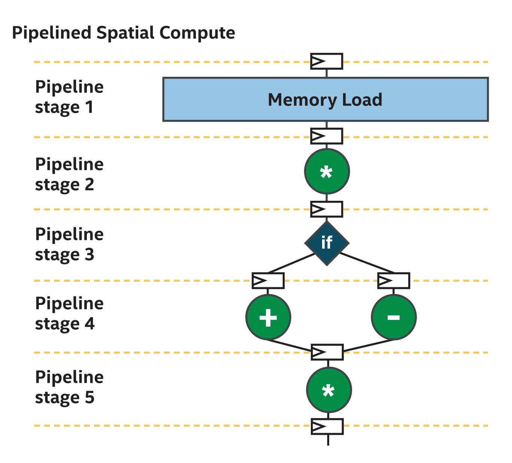

这个过程中，有5个阶段。数据在每个时钟周期中从一个阶段移动到下一个阶段，所以在这个非常简单的例子中，从数据进入阶段1到从阶段5退出需要6个时钟周期。

流水线的主要目标是使多个数据元素能够在不同阶段同时处理。为了明确这一点，图17-13展示了一个没有饱和(在本例中只有一个数据元素)的管道，这导致在大多数时钟周期中每个阶段都未使用。因为硬件大部分时间都是空闲的，所以这是对FPGA的浪费。


图17-13 如果只处理单个工作元素，几乎不使用流水线

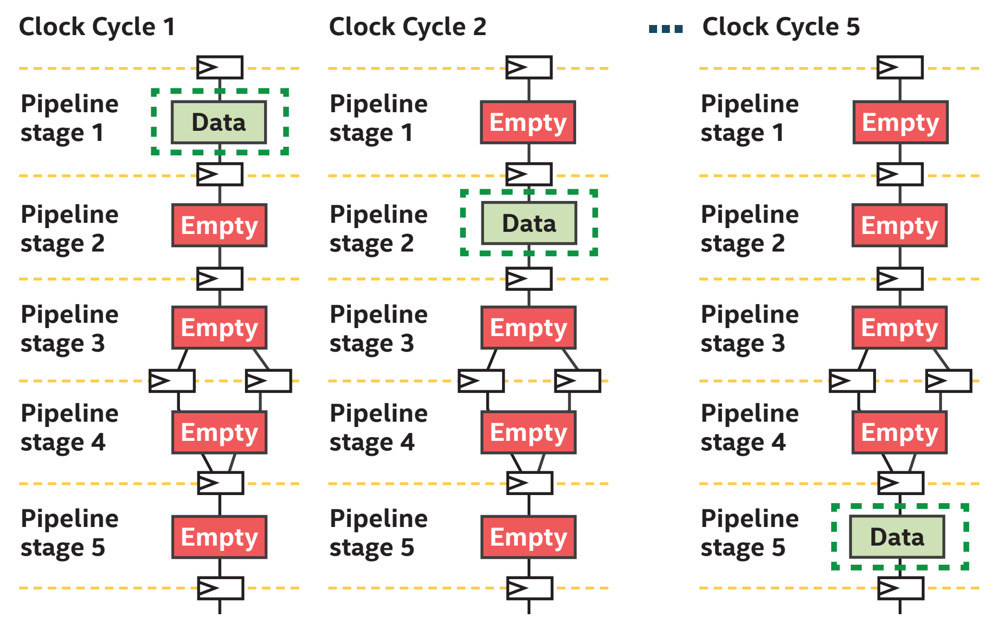

为了更好地利用流水线阶段，可以设想在为流水线提供数据的第一个阶段之前，有一个未启动的工作队列等待。每个时钟周期，管道可以从队列中消耗并启动一个工作，如图17-14所示。经过一些初始启动周期后，管道的每个阶段都被占用，并在每个时钟周期中做有用的工作，从而使FPGA资源得到有效利用。


图17-14 当每个管道阶段都保持忙碌时，就会产生高效的利用

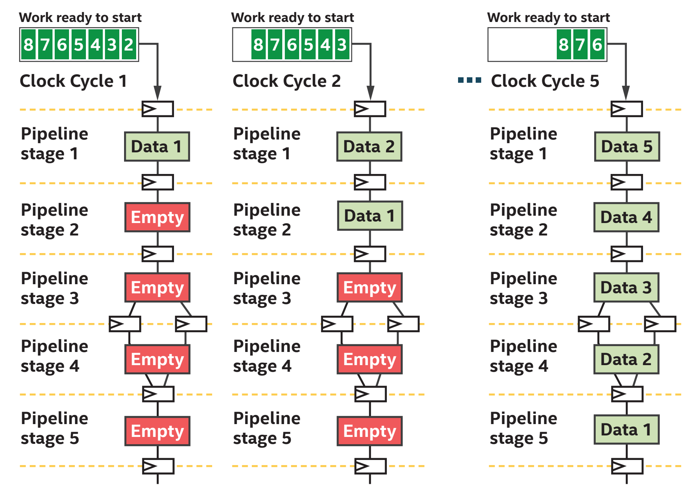

下面的两个部分介绍了一些方法，这些方法为队列向流水线输送做启动性工作：

begin{enumerate}
	-  ND-Range内核
	-  循环
end{enumerate}

选择将影响在FPGA上运行的内核的基本架构。某些情况下，算法很适合某种风格，而在其他情况下，开发者的偏好和经验决定了应该选择哪种方法。


textbf{使用ND-Range使流水线繁忙起来}

第4章描述了ND-Range分层执行模型。图17-15说明了关键概念:ND-Range执行模型，其中有工作项的分层分组，工作项是内核定义的基本工作单元。这个模型最初是用来来支持GPU的编程，其中工作项可以在执行模型层次结构的不同级别上并发执行。为了匹配GPU高效的工作类型，ND-Range工作项在大多数应用程序中相互不通信。


图17-15 ND-Range执行模型:工作项的分层分组

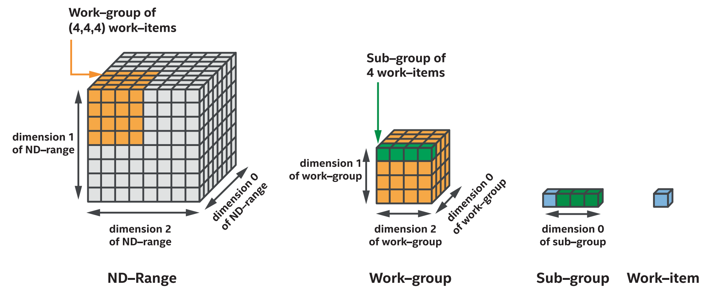

FPGA流水线可以非常有效地使用ND-Range进行填充。FPGA完全支持这种编程风格，可以将其看作如图17-16所示，每个时钟周期上，不同的工作项会进入第一阶段。


图17-16 ND-Range向流水线输送任务

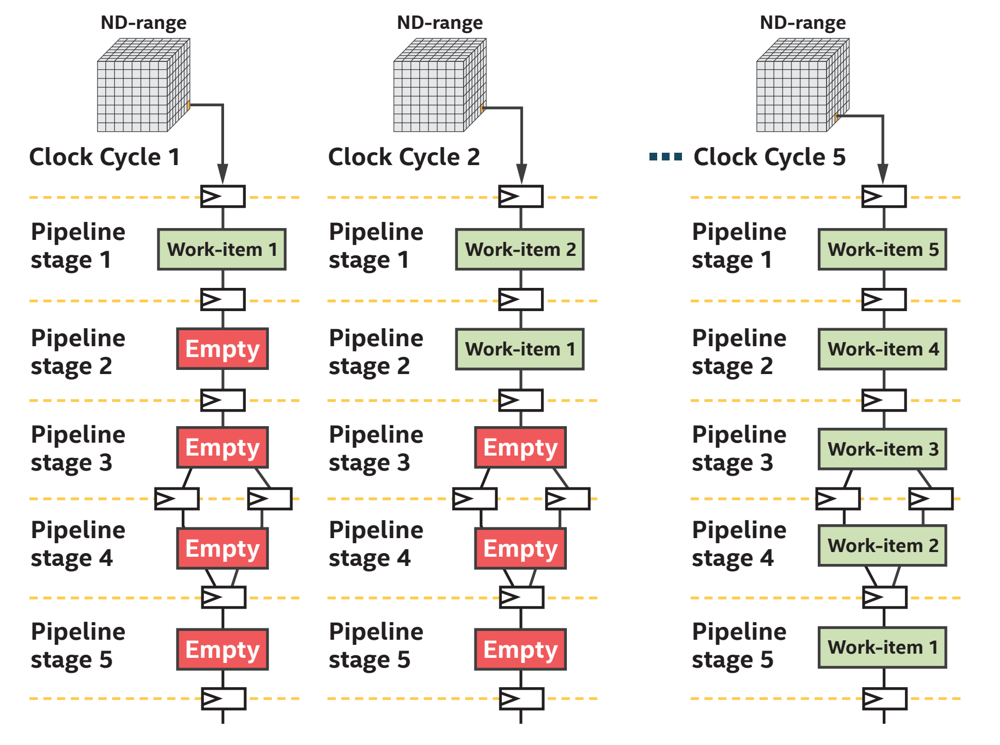

什么时候应该使用工作项在FPGA上创建ND-Range内核以保持流水线占用呢?可以将算法或应用程序构建为独立的工作项，而这些工作项不需要经常通信(或者理想情况下根本不需要交流)时，应该使用ND-Range!如果工作项确实需要经常通信，或者不考虑使用DN-Range，那么循环(在下一节中描述)提供了一种高效的方式来表示算法。

begin{tcolorbox}[colback=red!5!white,colframe=red!75!black]
如果可以构建算法，使工作项不需要太多(或根本不需要)交流，那么ND-Range是生成工作以保持流水线占满的好方法!
end{tcolorbox}

使用ND-Range输入流水线高效内核的一个例子是随机数生成器，在该序列中创建的数字独立于之前生成的数字。

图17-17展示了一个ND-Range内核，对16×16×16范围内的每个工作项进行了随机数生成。注意随机数生成函数如何将工作项id作为输入。


图17-17 随机数生成器的多工作项(16 × 16 × 16)
```
h.parallel_for({16,16,16}, [=](auto I) {
	output[I] = generate_random_number_from_ID(I);
});
```

示例展示了使用range的paralle_for，只指定了全局大小。可以交替使用带有nd_range的parallel_for，其中指定了全局工作大小和本地工作组大小。FPGA可以从片上资源实现工作组本地内存，所以只要有意义就可以随意使用工作组，要么因为想要工作组本地内存，要么因为有可用的工作组id可以简化代码。

begin{tcolorbox}[colback=blue!5!white,colframe=blue!75!black, title=并行随机数生成器]
图17-17中的示例假设generate_random_number_from_ID(I)是一个随机数生成器。例如，如果parallel_for内的不同工作项执行这个函数，期望每个工作项创建不同的序列，每个序列都符合生成器所期望的任何分布。并行随机数生成器本身是一个很复杂的主题，因此可以使用库或通过块超前跳过算法等技术了解。
end{tcolorbox}


textbf{流水线无视数据依赖!}

当一些工作项为向量架构(例如GPU)编程时，一个挑战是在工作项之间没有通信的情况下是一个高效的算法。有些算法和应用程序很适合向量硬件，有些则不行。导致问题的常见原因是，由于数据依赖于在某种意义上相邻的其他计算，算法需要共享数据。子工作组通过工作项之间的通信来解决向量体系结构上的挑战，如第14章所述。

FPGA对于不能分解成独立工作的算法起着重要的作用。FPGA流水线没有跨工作项进行向量化，而是跨流水线阶段执行连续的工作项。这种并行性的实现，意味着可以在流水线中轻松有效地实现工作项(甚至是不同工作组中的工作项)之间的细粒度通信!

例子是随机数生成器它的输出N+1取决于输出N是什么。这在两个输出之间创建了数据依赖关系，如果每个输出都是由ND-Range范围内的工作项生成的，那么工作项之间就存在着数据依赖关系，这可能需要在某些体系结构上进行复杂且代价高昂的同步。当按顺序编码这样的算法时，通常会写一个循环，其中迭代N+1使用迭代N的计算，如图17-18所示。每次迭代都依赖于前一次迭代计算的状态。


图17-18 携带数据依赖(状态)的循环
```
int state = 0;
for (int i=0; i < size; i++) {
	state = generate_random_number(state);
	output[i] = state;
}
```

该方法可以非常有效地将结果向后传递到后续循环中开始工作的流水线中，和空间编译器实现围绕此模式的许多优化。图17-19展示了从第5阶段到第4阶段的数据反向通信的思想。空间管道不会跨工作项向量化。通过在管道中向后传递结果，支持高效的数据依赖通信!


图17-19 向后通信使高效的数据依赖成为可能

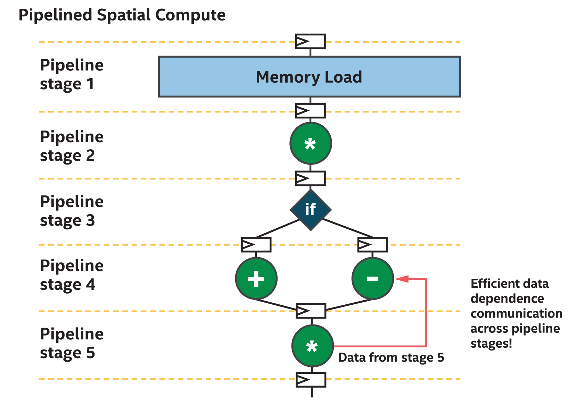

向后传递数据(到管道中的早期阶段)的能力是空间体系结构的关键，但是不清楚如何编写利用它的代码。有两种方法可以简化这种模式的表达:有两种方法可以简化这种模式的表达:

begin{enumerate}
	-  循环
	-  带有内部管道的ND-Range内核
end{enumerate}

第二个选项是基于管道的，我们将在本章后面描述它。供应商文档提供了关于管道方法的更多细节，但是常用的还是循环，除非有其他原因。


textbf{空间流水线循环的实现}

当编写具有数据依赖性的算法时，循环是一种自然的选择。循环经常表示迭代之间的依赖关系，即使在最基本的循环示例中，决定循环何时退出的计数器也会在迭代中执行(图17-20中的变量i)。


图17-20 带有两个循环依赖项(即i和a)的循环
```
int a = 0;
for (int i=0; i < size; i++) {
	a = a + i;
}
```

图17-20的简单循环中，a= a + i右边的a的值反映了前一次循环中存储的值，如果是第一次循环，则是初始值。当空间编译器实现循环时，可以使用循环的迭代来填充管道的各个阶段，如图17-21所示。请注意，现在准备开始的工作队列包含循环迭代，而不是工作项!


图17-21 流水线阶段由循环的连续迭代提供

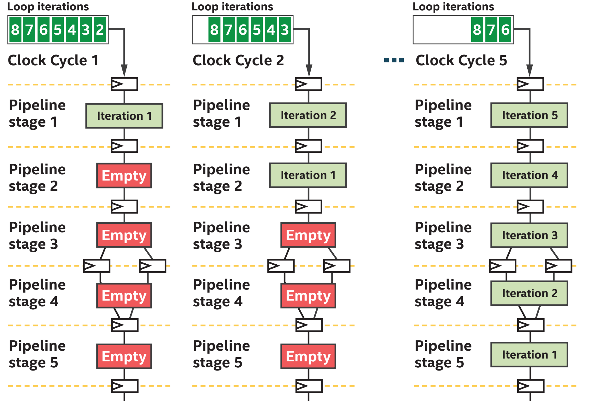

修改后的随机数生成器示例如图17-22所示。与基于工作项的id生成数字不同，如图17-17所示，生成器将先前计算的值将作为参数。


图17-22 依赖于之前生成的值的随机数生成器
```
h.single_task([=]() {
	int state = seed;
	for (int i=0; i < size; i++) {
		state = generate_incremental_random_number(state);
		output[i] = state;
	}
});
```

这个例子使用了single_task而不是paralle_for，因为重复的工作是通过单个任务中的循环表示，所以没有理由在此代码中还包含多个工作项(通过parallel_for)。single_task内部的循环使得将之前计算的temp值传递给随机数生成函数的每次使用更加容易(编程方便)。

如图17-22所示的情况下，FPGA可以有效地实现环路。许多情况下，它可以保持流水线完全占用的状态，或者至少可以通过报告告诉我们应该改变什么来增加占用率。考虑到这一点，如果用工作项替换循环迭代，那么同样的算法将更加难以描述，其中由一个工作项生成的值将需要传递给在增量计算中使用的另一个工作项。代码复杂性将迅速增加，特别是如果工作不能进行批处理，使每个工作项实际计算自己独立的随机数序列。


textbf{循环起始的间隔}

从概念上讲，认为C++中的循环迭代是一个接一个地执行，如图17-23所示。这是编程模型，也是思考循环的正确方式。实际中，编译器可以执行许多优化，只要程序的大部分行为没有明显的变化。不管编译器的优化如何，重要的是循环的执行看起来就像图17-23所示的那样。


图17-23 从概念上讲，循环迭代一个接一个地执行

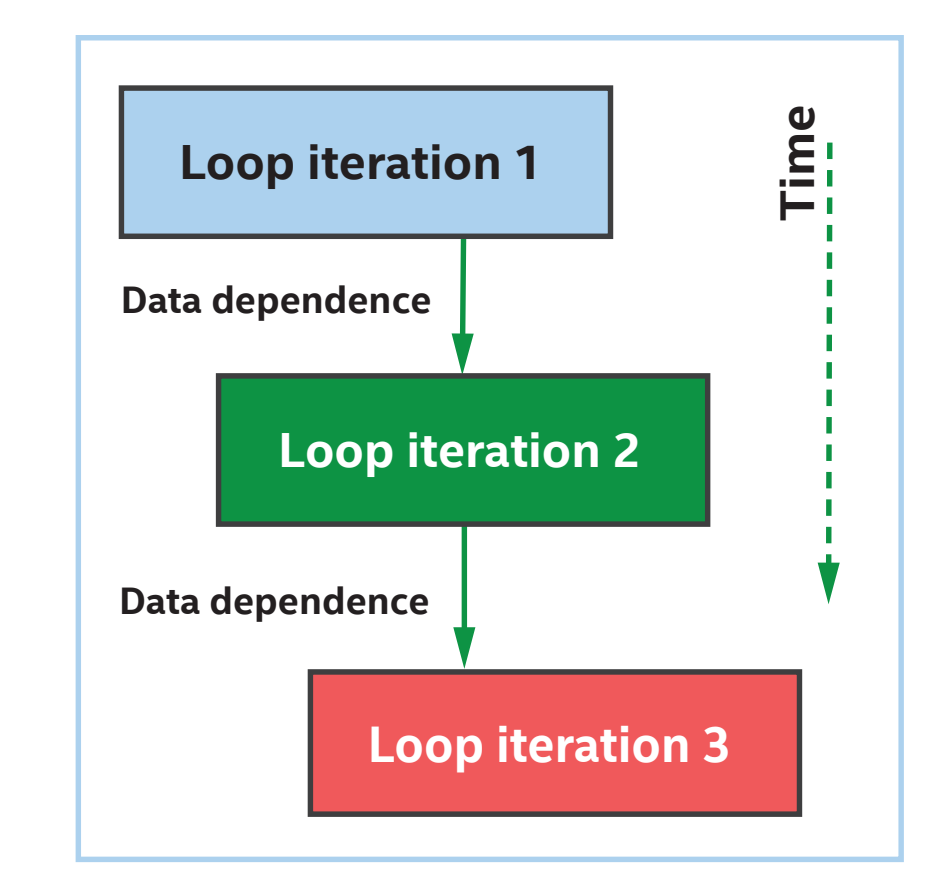

进入空间编译器透视图，图17-24显示了一个循环流水线优化，其中循环迭代的执行在时间上是重叠的。不同的迭代将彼此执行流水线的不同阶段，而各个阶段的数据依赖可以由编译器管理，以确保程序执行的迭代好似是顺序的(除了循环将更快地完成执行)。


图17-24 循环流水线允许循环的迭代在流水线阶段之间重叠

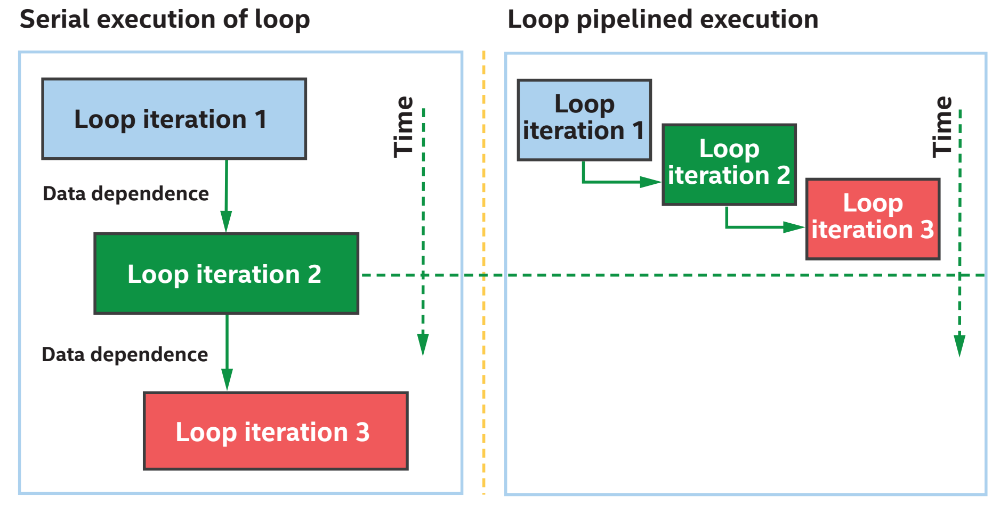

流水线中，当编译器决定这样做时，结果可以传递到更早的阶段，这样循环迭代中的许多结果可能在循环迭代完成所有工作之前就完成了计算。图17-25展示了这种思想，阶段1的结果在管道中向后反馈，允许未来的循环迭代在前一个迭代完成之前使用结果。


图17-25 增量随机数生成器的流水线实现

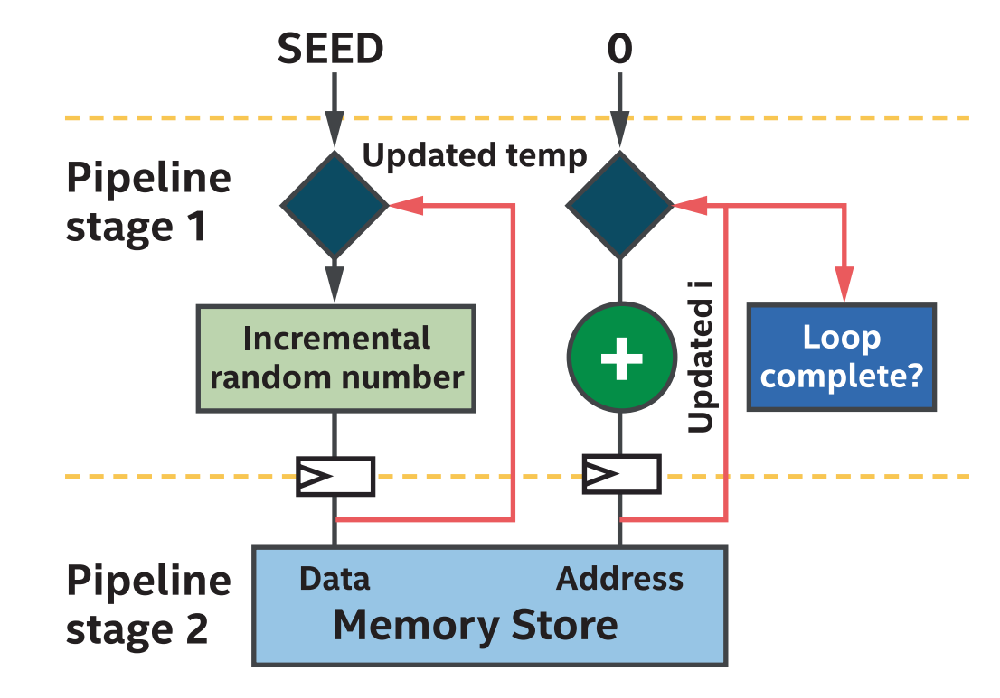

使用循环流水线，可以使循环的多次迭代重叠执行，即使使用循环携带的数据依赖项，循环迭代仍然可以用于用工作填充管道，从而实现高效利用。图17-26显示了循环迭代是如何在图17-25所示的同一个管道中的重叠执行。


图17-26 循环流水线同时处理多个循环迭代的部分

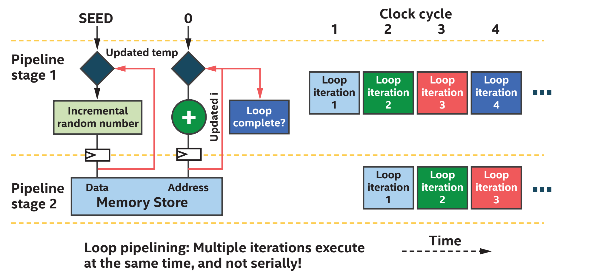

实际算法中，不可能在每个时钟周期中启动新的循环迭代，因为数据依赖可能需要多个时钟周期来计算。如果内存查找(特别是片外内存)处于依赖计算的关键路径上，则经常会出现这种情况。结果是一个管道，每N个时钟周期只能启动一个新的循环迭代，将其称为N个周期的起始间隔(II)。配置示例如图17-27所示。两个循环起始间隔(II)意味着一个新的循环迭代可以每秒钟开始一次，这导致管道阶段的次优占用。


图17-27 管道阶段的次优占用

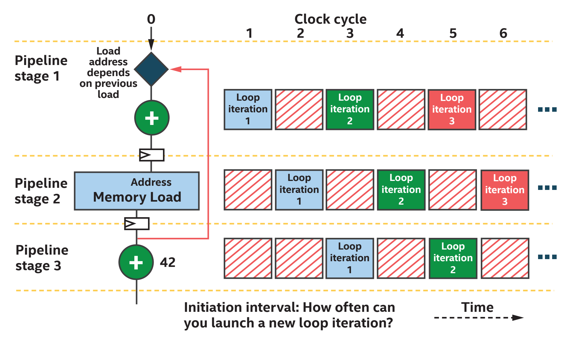

II大于1会导致流水线的效率低下，因为每个阶段的平均占用率都降低了。从图17-27中可以明显看出，II=2和管道阶段在很大比例(50%!)的时间内没有使用。有很多方法可以改善这种情况。

编译器执行优化以尽可能地减少II，所以报告也会告诉我们每个循环的初始间隔，并告诉我们为什么它大于1。基于报告在循环中重新构造计算通常可以减少II，可以进行编译器不允许的循环结构更改(因为是可观察的)。请阅读编译器报告，了解如何在特定情况下减少II。

降低II大于1的低效率的另一种方法是通过嵌套循环，可以通过将具有II>1的内环迭代与外部循环迭代的交错来填充所有阶段。查看供应商文档和编译器报告，了解使用详细信息。


textbf{管道}

空间和其他体系结构中的一个重要概念是先进先出(FIFO)缓冲区。FIFO之所以重要有很多原因，但在考虑编程时，有两个原因:

begin{enumerate}
	-  隐式控制信息与数据。这些信息告诉我们FIFO是空的还是满的，并且在将问题分解时非常有用。
	-  FIFO具有存储容量。在动态行为(如访问内存时的高可变延迟)时，可以更容易地实现性能。
end{enumerate}

图17-28展示了一个简单的FIFO操作示例。


图17-28 FIFO的示例操作

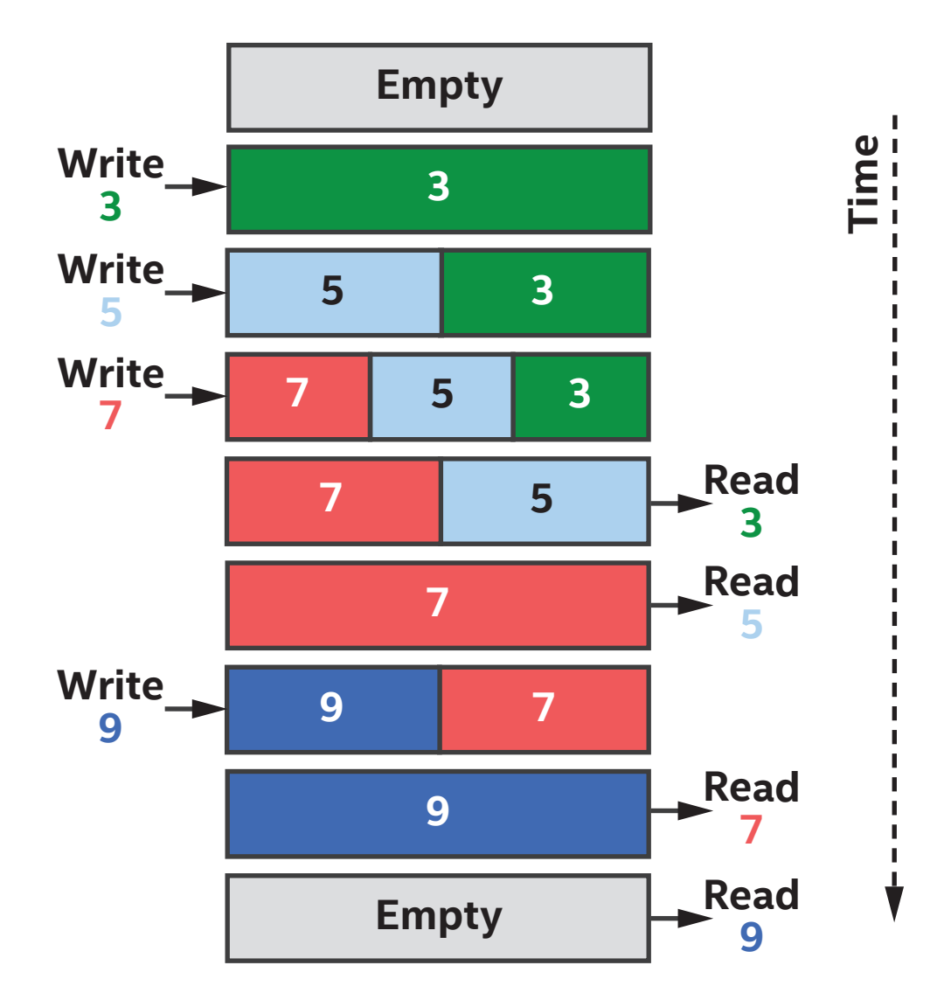

FIFO在DPC++中通过管道的特性对外使用。编写FPGA程序时，应该关心管道的原因是，管道可以分解问题，以更模块化的方式关注开发和优化。还允许利用FPGA丰富的通信特性。如图17-29所示。


图17-29 管道简化了模块化设计和对硬件外设的访问

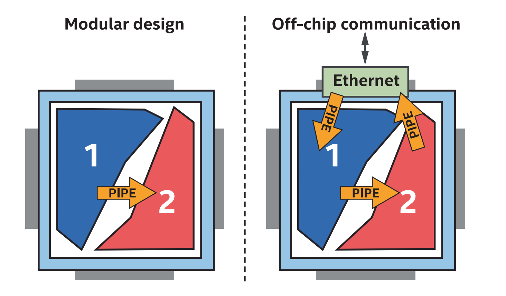

记住FPGA内核可以同时存在于设备上(芯片的不同区域)，在高效的设计中，内核的所有部分在每个时钟周期中都是活跃的。这意味着优化FPGA应用程序需要考虑内核的各个部分如何相互交互，而管道提供了一个抽象来简化这一过程。

管道是使用FPGA上的片内存储器实现的FIFO，因此允许在运行的内核之间和内部进行通信，而无需将数据移动到片外存储器。这可以提供廉价的通信，与管道(空/全信号)耦合的控制信息提供了轻量级的同步机制。

begin{tcolorbox}[colback=blue!5!white,colframe=blue!75!black, title=我们需要管道吗?]
不使用管道也可以编写高效的内核。可以使用所有的FPGA资源，并在没有管道的情况下使用传统编程风格实现最大性能。但是对于大多数开发人员来说，编程和优化模块化空间设计更容易，而管道是实现这一目标的好方法。
end{tcolorbox}

如图17-30所示，共有四种类型的管道。本节的其余部分中，将介绍第一种类型(内核间管道)，因为它们可以说明什么是管道，以及如何使用管道。管道还可以在单个内核中与主机或输入/输出外设通信。请查阅供应商文档，了解更多关于管道的形式和用途的信息。


图17-30 DPC++中管道连接的类型

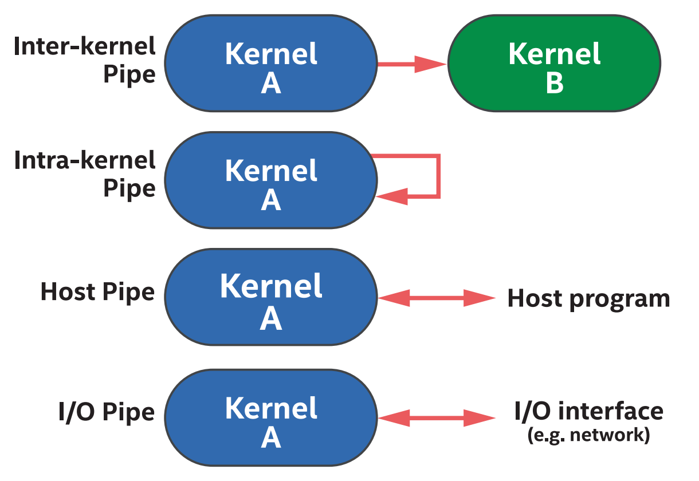

如图17-31所示。有两个内核通过管道进行通信，每个读或写操作都以int为单位。


图17-31 两个内核之间的管道:(1)ND-range和(2)单个任务和一个循环
```
// Create alias for pipe type so that consistent across uses
using my_pipe = pipe<class some_pipe, int>;

// ND-range kernel
Q.submit([&](handler& h) {
	auto A = accessor(B_in, h);
	
	h.parallel_for(count, [=](auto idx) {
		my_pipe::write( A[idx] );
	});
});

// Single_task kernel
Q.submit([&](handler& h) {
	auto A = accessor(B_out, h);
	
	h.single_task([=]() {
		for (int i=0; i < count; i++) {
			A[i] = my_pipe::read();
		}
	});
});
```

图17-31中有几点需要观察。首先，两个内核使用管道相互通信。如果内核之间没有访问器或事件依赖，DPC++运行时将同时执行，允许通过管道而不是完整的SYCL内存缓冲区或USM进行通信。

管道使用基于类型的方法进行标识，其中每个管道都使用管道类型的参数化进行标识，如图17-32所示。管道类型的参数化标识了特定的管道。对相同管道类型的读或写是对相同的FIFO。有三个模板参数一起定义了管道的类型，从而定义了管道的标识。


图17-32 参数化的管道类型
```
template <typename name,
		  typename dataT,
		  size_t min_capacity = 0>
class pipe;
```

建议使用类型别名来定义管道类型，如图17-31中的第一行代码所示，以减少编程错误并提高代码可读性。

begin{tcolorbox}[colback=red!5!white,colframe=red!75!black]
使用类型别名来标识管道，简化了代码并防止意外的创建管道。
end{tcolorbox}

管道有一个min_capacity参数，默认为0，如果指定了，保证至少有一定数量的数据可以写入管道，而不会读出任何数据。此参数在以下情况下有用

begin{enumerate}
	-  两个与管道通信的内核不会同时运行，需要管道中有足够的容量，让第一个内核在第二个内核开始运行并从管道中读取之前写入它的所有输出。
	-  如果内核突然生成或消耗数据，那么向管道添加容量可以提供内核隔离，将它们解耦。例如，产生数据的内核可以继续写(直到管道容量满了)，即使消耗数据的内核很忙，还没有准备好消耗任何东西。这提供了相对于其他内核执行的灵活性，仅以FPGA上的一些内存资源为代价。
end{enumerate}


textbf{阻塞和非阻塞管道访问}

像大多数FIFO接口一样，管道有两种类型的接口:阻塞和非阻塞。阻塞访问等待(阻塞/暂停执行!)操作成功，而非阻塞访问立即返回，并设置布尔值指示操作是否成功。

成功的定义很简单:如果正在从管道中读取数据，并且有可用数据可读(管道不为空)，则读取成功。如果正在写入，而管道还没有满，则写入成功。图17-33显示了pipe类的两种访问成员函数形式。我们看到管道的成员函数允许对其进行写入或读取。对管道的访问可以是阻塞的，也可以是非阻塞的。


图17-33 允许写入或读取管道的成员函数
```
// Blocking
T read();
void write( const T &data );

// Non-blocking
T read( bool &success_code );
void write( const T &data, bool &success_code ); 
```

阻塞访问和非阻塞访问都有用，这取决于程序试图实现什么。如果内核在从管道中读取数据之前不能做更多的工作，那么使用阻塞读取可能有意义。如果内核希望从一组管道中的任何一个读取数据，但不确定哪个管道可能有可用的数据，那么使用非阻塞调用从管道读取数据更有意义。内核可以从管道中读取数据并处理数据(如果有数据)，但如果管道是空的，它可以继续，尝试从可能有可用数据的下一个管道中读取数据。


textbf{有关管道的更多信息}

这一章中，只能粗略地了解管道，以及了解了如何使用它们的基本知识。FPGA供应商文档提供了更多的信息和在不同类型应用程序中使用的许例，因此如果认为管道与特定需求相关，应该先查看这些文档。


textbf{自定义内存系统}

为大多数加速器编程时，大部分优化工作都花在提高内存访问的效率上。FPGA设计也是如此，特别是当输入和输出数据通过片外存储器时。

FPGA上的内存访问值得优化有两个主要原因:

begin{enumerate}
	-  减少所需的带宽，特别是在带宽利用率低的情况下。
	-  修改内存的访问模式，避免流水线中的停顿。
end{enumerate}

流水线中，有必要简单谈一下暂停机制。编译器内置了读取或写入特定类型内存所需的时间的假设，并相应地优化和平衡了管道，在进程中隐藏了内存延迟。但是，如果以一种低效的方式访问内存，就会引入更长的延迟，并作为管道中的副产品停滞不前，因为等待，早期的阶段无法执行，管道阶段阻塞了(例如，内存访问)。如图17-34所示，超过负载的管道停止工作。


图17-34 内存停滞也会导致流水线阶段性停滞

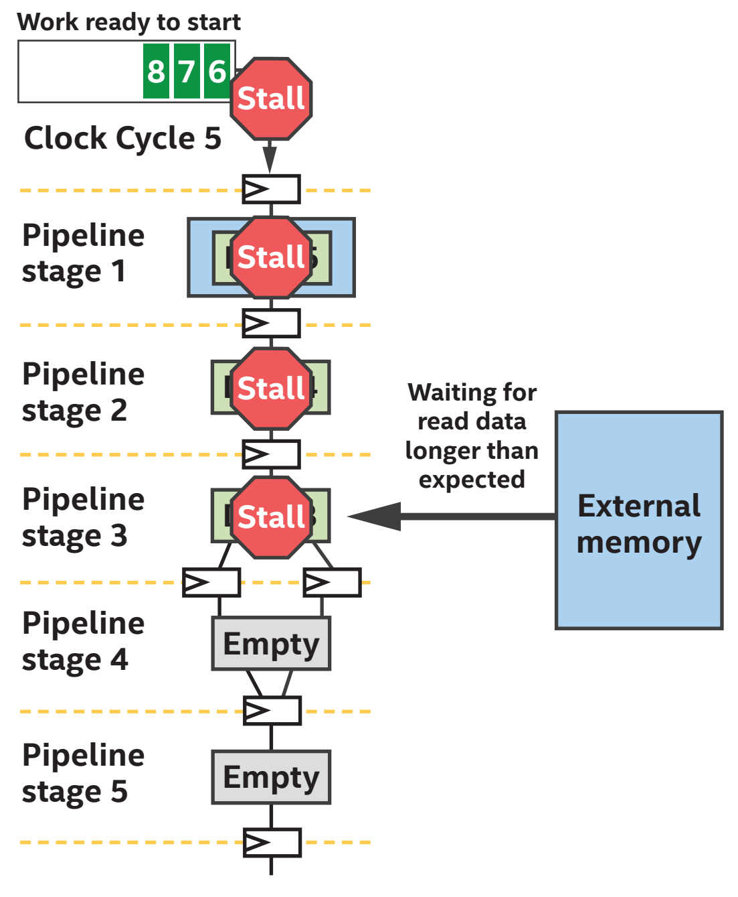

可以在几个方面执行内存系统优化。编译器报告是了解编译器为实现了什么，以及哪些可能值得调整或改进的重要指南。这里列出了一些优化主题，以突出显示可供使用的自由度。优化通常可以通过显式控制和修改代码，让编译器推断想要的结构来实现。编译器静态报告和供应商文档，是内存系统优化的关键，有时在硬件执行期间与分析工具结合使用，以捕获实际的内存行为，用于验证或优化的最后阶段。

begin{enumerate}
	-  静态合并:编译器可以将内存访问合并为更小、更宽的访问。这降低了存储系统的复杂性，包括流水线中的负载或存储单元的数量、存储系统上的端口、仲裁网络的大小和复杂性，以及其他存储系统等。通常希望尽可能启用静态合并，这个可以通过编译器报告来确认。在内核中简化寻址逻辑有时就足以让编译器执行更为激进的静态合并，所以总是检查编译器是否推断出我们所期望的报告!
	-  内存访问:编译器为内存访问创建加载或存储单元，这些单元适合被访问的内存技术(例如，片上、DDR、HBM)和从源代码推断的访问模式(例如，流、动态合并/扩展，或可能从特定大小的缓存中获益)。编译器报告告诉我们推断了什么，并允许修改或添加控件到我们的代码，以提高性能。
	-  内存结构:内存系统(包括片上和片外)可以具有由编译器实现的内存块结构和许多优化。可以使用许多控件和模式修改来控制这些结构和调优空间实现。
end{enumerate}


## 17.6 一些相关的话题

与FPGA的开发菜鸟交谈时，会发现从高层次上理解组成设备的组件常常会有帮助，而且时钟频率容易混淆。


textbf{FPGA构建块}

为了帮助理解工具流(特别是编译时)，有必要提到组成FPGA的构建块。构建块是DPC++和SYCL的抽象，在程序开发中不起作用(至少在使代码具有某些功能方面)。然而，它们的存在确实会影响空间架构的优化和工具流的开发，例如：为应用程序选择数据类型时，有时也会影响高级优化。

简化的FPGA设备由五个基本元素组成

begin{enumerate}
	-  查询表:一些二进制输入线产生二进制输出的基本块。相对于输入，输出通过写到查询表中使用。这些都是原始块，但在用于计算的现代FPGA上有许多(数百万)块。这些是大部分设计实现的基础!
	-  数学引擎:对于普通的数学操作，如单精度定位点数的加法或乘法，FPGA有专门的硬件使这些操作非常高效。FPGA有数千个这样的块——有些设备有8000多个——这样至少每个时钟周期都可以并行执行这些浮点基元操作!大多数FPGA将这些数学引擎命名为数字信号处理器(DSP)。
	-  片上内存:这是FPGA与其他加速器的区别，而内存有两种类型(实际上更多):(1)用于在操作和其他目的之间传输的寄存器，(2)提供分布在设备上的随机访问内存的块内存。FPGA可以有大约数百万个寄存器位和超过10,000个20kbit的RAM存储器块。由于每一个都可以在时钟周期中激活，因此当有效使用片上内存容量和带宽时，效果显著。
	-  外设接口:FPGA的扩展部分是由灵活的收发器和输入/输出连接，允许与所有的外存储器、网络接口等进行通信。
	-  连接结构:前文本中提到的FPGA中的每个元素都有很多，并且连接不是固定的。一个复杂的可编连接允许信号在FPGA的结构中，进行细粒度传递。
end{enumerate}

给定FPGA上每种特定类型的块的数量(有些块以百万计)和这些块的细粒度(如查询表)，生成FPGA配置位流时看到的编译时间可能更有意义。不仅需要为每个细粒度资源分配功能，还需要在它们之间配置连接。很多编译时间来自于在优化开始之前，找到FPGA结构的第一个合法映射!


textbf{时钟频率}

因为它是非常灵活和可配置的，与CPU或任何其他固定计算架构的同等设计相比，FPGA运行的频率的可配置性会带来了一些开销，但这不是问题!FPGA的空间架构大大弥补了时钟频率，因为有如此多的独立操作同时发生，分布在FPGA的区域。简单地说，由于可配置的设计，FPGA的频率比其他架构低，但每个时钟周期发生更多的事件，从而平衡了频率。在对基准和加速器进行比较时，应该比较计算吞吐量(例如每秒的操作数)，而不是原始频率。

当FPGA上的资源利用率接近100%时，工作频率可能会下降，主要是设备上的信号连接资源过度使用的结果。有一些方法可以弥补这一点，通常是增加编译时间。但是对于大多数应用程序，最好避免在FPGA上使用超过80-90%的资源，除非愿意深入研究，避免频率下降。

begin{tcolorbox}[colback=red!5!white,colframe=red!75!black]
经验法则:尽量不要超过FPGA上任何资源的90%，当然也不要超过多个资源的90%。超过可能导致连接资源耗尽，从而降低工作频率。
end{tcolorbox}

## 17.7 总结


本章中，介绍了流水线如何将算法映射到FPGA的空间架构中。还讨论了一些概念，可以帮助我们决定FPGA对应用程序是否有用，并且可以帮助我们更快地启动和运行开发代码。从这个起点出发，需要仔细地阅览供应商编程和优化手册，并开始编写FPGA代码!FPGA提供了在其他加速器上没有性能和启用的程序，所以我们应该把它们放在我们开发工具箱的最前面!
