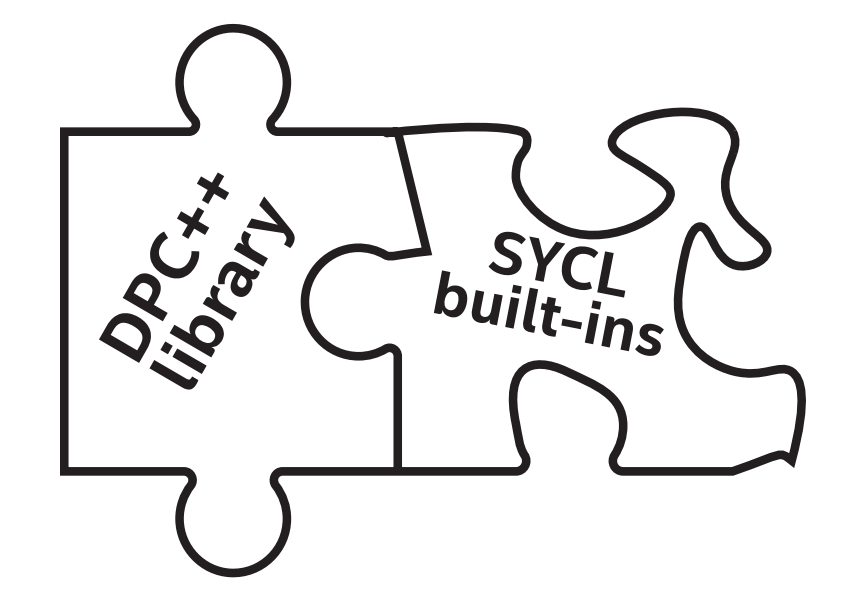
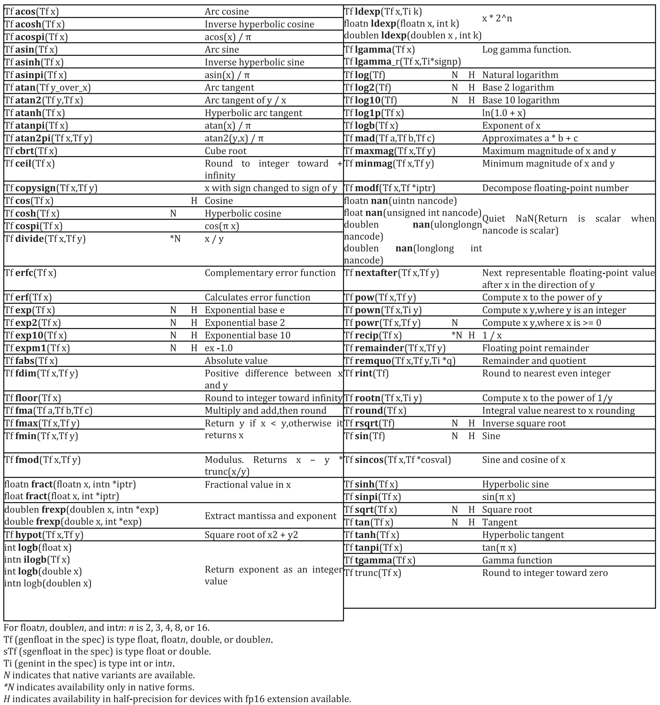
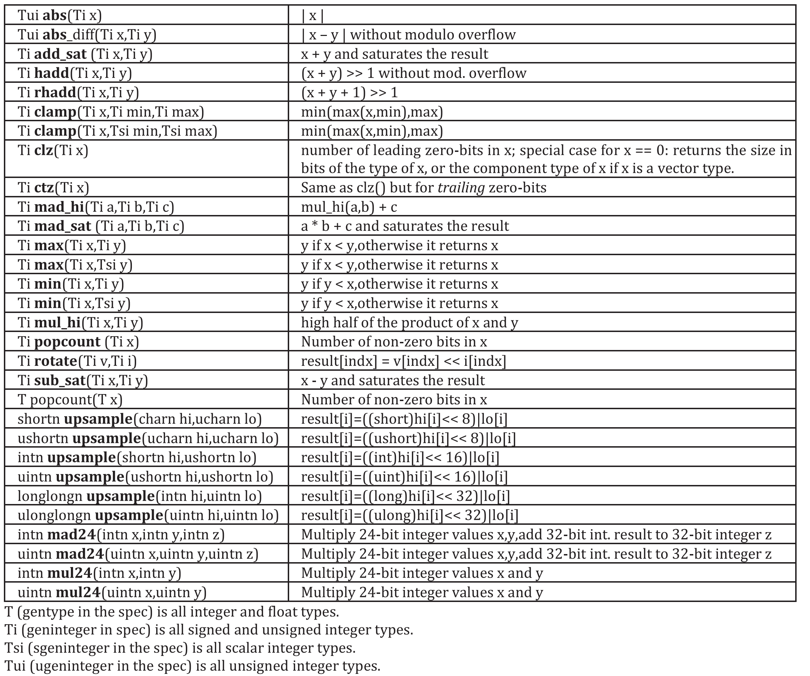
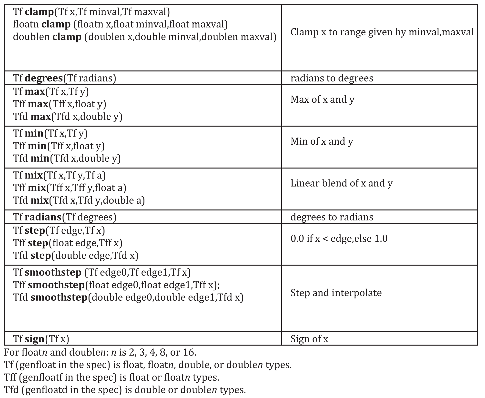
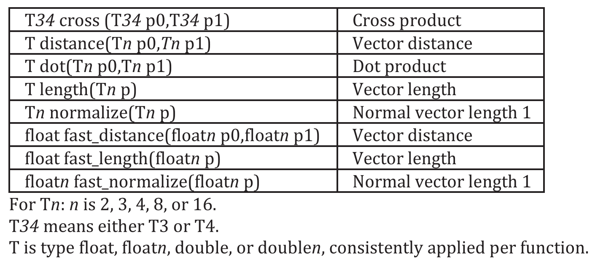
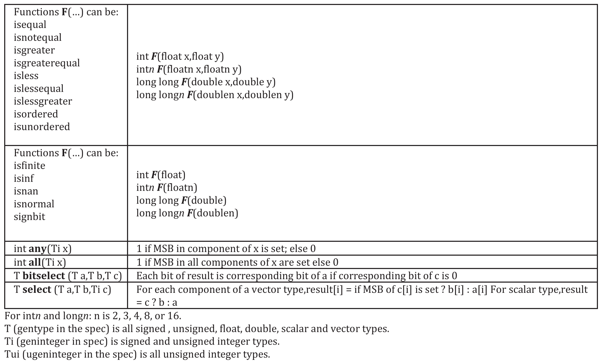
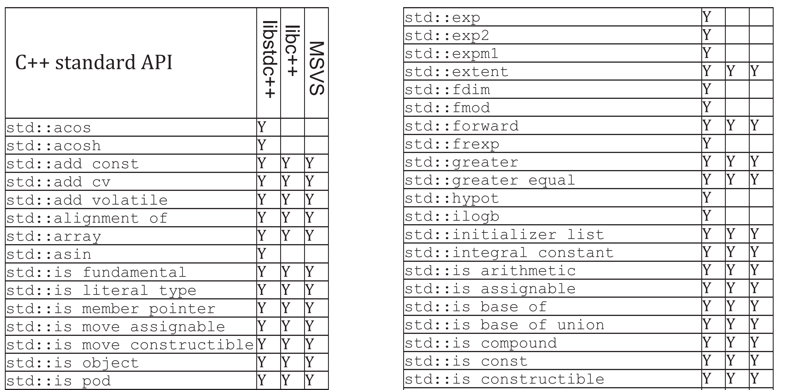
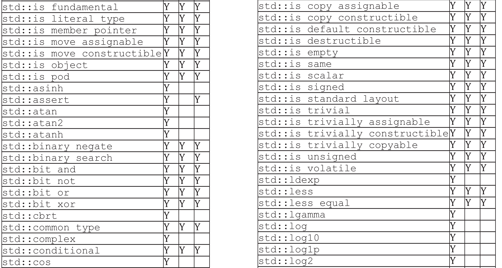
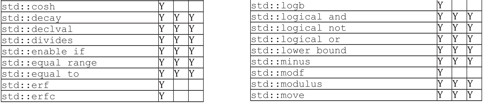
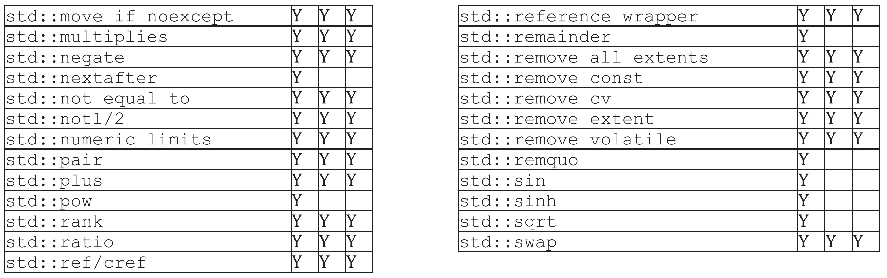

# 18 库




我们用整本书来推广代码的艺术，一些优秀的程序员已经编写了可以直接使用的代码，库是完成工作的最好方式。这并不是懒惰——这是一种比重塑他人工作更好的表现。这是一块值得拥有的拼图。

开源的DPC++项目包括一些库。这些库可以帮助我们使用libstdc++、libc++和MSVC库函数，甚至在内核代码中。这些库是英特尔的DPC++和oneAPI的一部分。这些库不绑定到DPC++编译器，因此可以与任何SYCL编译器一起使用。

DPC++库为创建异构应用程序和解决方案的程序员提供了另一种选择。它的API基于熟悉的标准——C++ STL、Parallel STL (PSTL)和SYCL——为开发者提供高生产率的API。这可以减少跨CPU、GPU和FPGA的编程工作，同时产生具有可移植性的高性能并行应用程序。

SYCL标准定义了丰富的内置函数，这些函数为主机和设备代码提供了一些功能。DPC++和许多SYCL实现通过数学库实现了关键的内置函数。

本章讨论的库和内置函数与编译器无关。换句话说，它们同样适用于DPC++编译器或SYCL编译器。fpga_device_policy类用于FPGA支持的DPC++特性。

由于在命名和功能上存在重叠，本章将从介绍SYCL内置函数开始。


## 18.1 内置函数

DPC++提供了一组关于各种数据类型的SYCL内置函数。内置函数可以在主机和设备上的sycl命名空间内使用，基于编译器选项(例如DPC++编译器提供的 `-mfma`、`-fast-math` 和 `-ffp-contract=fast`)对目标设备提供低、中、高精度支持。主机和设备上的内置函数分为以下几类:


- 浮点数学函数asin、acos、log、sqrt、floor等，如图18-2。
- 整数函数:abs、max、min等，如图18-3。
- 常用函数:clamp, smoothstep等，如图18-4。
- 几何函数:cross, dot, distance等，如图18-5。
- 关系函数:isequal, isless, isfinite等，如图18-6。


当函数是由C++ std库提供(如图18-8所示)，并且有对应的SYCL内置函数，则DPC++开发者可以使用其中任何一个。图18-1展示了C++ std::log函数和SYCL内置函数的用于主机和设备的 `sycl::log`，这两个函数产生相同的结果。本例中，内置函数 `sycl::isequal` 用于比较 `std:log` 和 `sycl:log` 的结果。


图18-1 使用std::log和sycl::log
```
constexpr int size = 9;
std::array<double, size> A;
std::array<double, size> B;

bool pass = true;

for (int i = 0; i < size; ++i) { A[i] = i; B[i] = i; }

queue Q;
range sz{size};

buffer<double> bufA(A);
buffer<double> bufB(B);
buffer<bool> bufP(&pass, 1);

Q.submit([&](handler &h) {
	accessor accA{ bufA, h};
	accessor accB{ bufB, h};
	accessor accP{ bufP, h};
	
	h.parallel_for(size, [=](id<1> idx) {
		accA[idx] = std::log(accA[idx]);
		accB[idx] = sycl::log(accB[idx]);
		if (!sycl::isequal( accA[idx], accB[idx]) ) {
			accP[0] = false;
		}
	});
});
```

除了SYCL中支持的数据类型外，DPC++设备库还提供了对std:complex数据类型，以及C++ std库中定义的相应数学函数的支持


### 18.1.1 内置函数中使用sycl::前缀

调用SYCL内置函数时，应该在名称前添加显式的 `sycl::`。对于当前的SYCL规范，即使使用了 `using namespace sycl;`，也不能保证只调用sqrt()就能调用所有实现上的内置SYCL。

> 使用SYCL内置函数时，应该始终在函数名称前面显式地加上sycl::。不遵循此建议可能会导致不可移植的结果。


在应用程序中，内置函数的名称与非模板函数冲突，在许多实现中(包括DPC++)，内置函数将占上风，这是因为C++的重载解析规则更喜欢非模板函数而不是模板函数。然而，当代码有一个与内置名称相同的函数名，那么为了保证可移植性，避免使用命名空间sycl，或者确保没有冲突。否则，一些SYCL编译器将由于无法解决冲突而拒绝编译代码。


图18-2 内置数学函数




图18-3 内置整数函数




图18-4 内置通用函数




图18-5 内置几何函数




图18-6 内置关系函数



## 18.2 DPC++库


DPC++库由以下组件组成:


- 经过测试的C++标准API——只需要包含相应的C++标准头文件并使用std命名空间。
- 包含相应头文件使用并行STL，只需 `#include <dpstd …>`，DPC++库就可使用dpstd名称空间。


### 18.2.1 DPC++中的标准C++ API

DPC++库包含一组经过测试的标准C++ API。许多C++标准API的基本功能已经完成，因此这些API可以在设备内核中使用。图18-7展示了如何在设备代码中使用 `std::swap` 的示例。


图18-7 设备代码中使用 `std::swap`
```
class KernelSwap;
std::array <int,2> arr{8,9};
buffer<int> buf{arr};

{
	host_accessor host_A(buf);
	std::cout << "Before: " << host_A[0] << ", " << host_A[1] << "n";
} // End scope of host_A so that upcoming kernel can operate on buf

queue Q;
Q.submit([&](handler &h) {
	accessor A{buf, h};
	h.single_task([=]() {
		// Call std::swap!
		std::swap(A[0], A[1]);
	});
});

host_accessor host_B(buf);
std::cout << "After: " << host_B[0] << ", " << host_B[1] << "n";
```

可以使用以下命令来构建和运行程序(假设它位于stdswap.cpp文件中):

`dpcpp –std=c++17 stdswap.cpp –o stdswap.exe ./stdswap.exe`


打印结果为:

```
8, 9
9, 8
```

图18-8列出了带有“Y”的C++标准API，以表明在编写本文时，这些API已经在用于CPU、GPU和FPGA设备的DPC++内核中进行了测试。空白表示在本书出版时，不完全覆盖(不是所有三种设备类型)。在线DPC++手册中也包含了一个表，并将随着时间的推移而更新——DPC++中的支持将继续扩大。

在DPC++库中，一些C++ std函数是基于设备上内置函数的实现，以达到与SYCL版本相同的性能水平。


图18-8 库支持CPU/GPU/FPGA覆盖(本书出版时)






在libstdc++ (GNU)与gcc 7.4.0和libc++ (LLVM)与clang 10.0和MSVC标准C++库与Microsoft Visual Studio 2017(主机CPU)支持的标准C++ API。

在Linux上，`GNU libstdc++` 是DPC++编译器的默认C++标准库，因此不需要编译或链接选项。如果我们想要使用 `libc++`，请使用编译选项 `-stdlib=libc++ -nodinc++` 来使用 `libc++`，不要包含系统中的C++ std头文件。DPC++编译器已经在Linux上的DPC++内核中使用libc++进行了验证，但是DPC++运行时需要用libc++而不是libstdc++重新构建。详情请参见https://intel.github.io/llvmdocs/GetStartedGuide.html#build-dpc-toolchain-with-libc-library。所以，libc++不是推荐使用的C++标准库。

在FreeBSD上，libc++是默认的标准库，-stdlib=libc++选项不是必需的。更多详情请登录https://libcxx.llvm.org/docs/UsingLibcxx.html。在Windows上，只能使用MSVC c++库。

> 为了实现跨架构的可移植性，如果std函数在图18-8中没有标记“Y”，在编写设备函数时需要注意是否可移植!


### 18.2.2 DPC++的Parallel STL

Parallel STL是C++标准库算法的实现，支持执行策略，如ISO/IEC 14882:2017标准，通常称为C++17。现有的实现还支持Parallelism TS version 2中指定的未排序执行策略，并在C++工作组P1001R1中为下一版本的C++标准提出了该策略。

当使用算法和执行策略时，如果没有特定于C++17的标准库实现，则指定命名空间 `std::execution`，否则指定命名空间 `pstl::execution`。

对于任何已实现的算法，都可以将seq、unseq、par或par_unseq中的值作为调用算法的第一个参数传递，以指定所需的执行策略。这些策略的含义如下:


执行策略 | 含义
-- | --
seq | 串行执行
unseq | 同步执行SIMD。此策略要求在SIMD中安全执行所有函数
par | 由多个线程并行执行
par_unseq | 合并了unseq与par的特性


对DPC++的Parallel STL进行了扩展，支持使用特殊执行策略的DPC++设备。DPC++执行策略指定了并行STL算法运行的位置和方式，继承了标准C++的执行策略。封装了一个SYCL设备或队列，并允许设置可选的内核名称。DPC++执行策略可以与所有支持C++17标准执行策略的算法一起使用。


#### 18.2.2.1 DPC++执行策略

目前，DPC++库只支持并行未串行策略(par_unseq)。使用DPC++执行策略，有三个步骤:

- 在代码中添加 `#include <dpstd/execution>`。
- 通过提供标准策略类型、作为模板参数唯一内核名的类型(可选)和以下构造函数参数之一来创建策略对象:
  - SYCL队列
  - SYCL设备
  - SYCL设备选择器
  - 具有不同内核名称的已存在策略对象
- 将创建的策略对象传递给Parallel STL算法。

`dpstd::execution::default_policy` 对象是预定义的 `device_policy`，使用默认的内核名和默认队列创建。这可以用于创建自定义策略对象，或者在调用算法时直接传递(如果默认选择足够的话)。

图18-9显示了使用 `using` 命名空间 `dpstd::execution` 的示例，引用策略类和函数。


图18-9 创建执行策略
```
auto policy_b = 
	device_policy<parallel_unsequenced_policy, class PolicyB> 
		{sycl::device{sycl::gpu_selector{}}};
std::for_each(policy_b, …);

auto policy_c = 
	device_policy<parallel_unsequenced_policy, class PolicyС> 
		{sycl::default_selector{}};
std::for_each(policy_c, …);

auto policy_d = make_device_policy<class PolicyD>(default_policy);
std::for_each(policy_d, …);

auto policy_e = make_device_policy<class PolicyE>(sycl::queue{});
std::for_each(policy_e, …);
```


#### 18.2.2.2 FPGA的执行策略

fpga_device_policy是一个DPC++策略类，用于在FPGA硬件上实现性能更好的并行算法。在FPGA硬件或FPGA仿真设备上运行应用程序时，可以使用该策略:

- FPGA实际设备运行时设置_PSTL_FPGA_DEVICE宏，以及在FPGA仿真器上运行时设置_PSTL_FPGA_EMU宏。
- 在代码中添加 `#include <dpstd/execution>`。
- 通过为内核名和展开因子(参见第17章)提供类类型作为模板参数(两个都是可选的)和以下构造函数参数之一来创建策略对象:
  - 为FPGA选择器构造的SYCL队列(任何其他设备类型的行为都未定义)
  - 具有不同内核名称和/或展开因子的FPGA策略对象
- 将创建的策略对象传递给Parallel STL算法。

fpga_device_policy的默认构造函数创建一个对象，其中包含为FPGA选择器构造的SYCL队列。如果定义了_PSTL_FPGA_EMU，则为FPGA仿真器选择器构造的SYCL队列。

`dpstd::execution::fpga_policy` 是 `fpga_device_policy` 类的预定义对象，使用默认的内核名称和默认的展开因子创建。使用它来创建定制的策略对象，或者在调用算法时直接使用。

图18-10中的代码假设 `using namespace dpstd::execution`;，用于策略，而 `using namespace sycl;`，用于队列和设备选择器。

指定策略的展开因子可以在算法的实现中展开循环，默认值为1。了解如何选择更好的值，可以回顾第17章。


图18-10 FPGA使用执行策略
```
auto fpga_policy_a = fpga_device_policy<class FPGAPolicyA>{};

auto fpga_policy_b = make_fpga_policy(queue{intel::fpga_selector{}});

constexpr auto unroll_factor = 8;
auto fpga_policy_c = 
make_fpga_policy<class FPGAPolicyC, unroll_factor>(fpga_policy);
```


#### 18.2.2.3 使用DPC++ Parallel STL

为了使用DPC++ Parallel STL，需要通过添加以下行集的子集来包含Parallel STL头文件。头包含哪些文件，取决于所要使用的算法:

```
	- #include <dpstd/algorithm>
	- #include <dpstd/numeric>
	- #include <dpstd/memory>
```


dpstd::begin和dpstd::end是特殊的辅助函数，允许将SYCL缓冲区传递给Parallel STL算法。这些函数接受SYCL缓冲区，并返回一个未指定类型的满足以下要求的对象:


- 可拷贝构造，可拷贝赋值，并且支持比较操作符==和!=。
- 以下表达式是有效的:a+n, a-n, a-b，其中a和b是该类型的对象，n是一个整数值。
- 有一个没有参数的get_buffer，会返回dpstd::begin和dpstd::end的SYCL缓冲区。


要使用这些辅助函数，先将 `#include <dpstd/iterators>` 添加到代码中。图18-11和18-12中的代码，使用 `std::fill` 函数作为使用开始/结束协助器的示例。


图18-11 使用 `std::fill`
```
#include <dpstd/execution>
#include <dpstd/algorithm>
#include <dpstd/iterators>

sycl::queue Q;
sycl::buffer<int> buf { 1000 };

auto buf_begin = dpstd::begin(buf);
auto buf_end = dpstd::end(buf);

auto policy = dpstd::execution::make_device_policy<class fill>( Q );
std::fill(policy, buf_begin, buf_end, 42);
// each element of vec equals to 42
```

**减少主机和设备之间的数据复制**
并行STL算法可以用普通(主机端)迭代器调用，如图18-11中的代码示例所示。

本例中，将创建临时SYCL缓冲区，并将数据复制到该缓冲区。设备上的临时缓冲区处理完成后，数据复制回主机。建议直接使用现有的SYCL缓冲区，以减少主机和设备之间的数据移动，以及避免创建和销毁缓冲区的不必要的开销。


图18-12 使用默认策略的 `std::fill`
```
#include <dpstd/execution>
#include <dpstd/algorithm>

std::vector<int> v( 1000000 );
std::fill(dpstd::execution::default_policy, v.begin(), v.end(), 42);
// each element of vec equals to 42
```

图18-13展示了一个示例，对提供的搜索序列中的每个值执行输入序列的二进制搜索。作为搜索序列的第i个元素的结果，将一个搜索值是否在输入序列中找到的布尔值，赋给结果序列的第i个元素。该算法返回的迭代器指向赋值序列的最后一个元素的下一个位置。该算法假定输入序列已提供了比较排序，如果没有提供比较器，则使用操作符<进行元素比较。

前面描述的复杂性强调了应该尽可能利用库函数，而不是自己编写算法实现，这可能需要大量的调试和调优时间。库作者通常都是设备架构的专家，他们可能能看到一些非公开的信息，所以当优化的库可用时，应该先使用。

图18-13所示的代码示例演示了使用DPC++并行STL算法时的三个步骤:


- 创建DPC++的迭代器。
- 从现有策略创建命名策略。
- 调用并行算法


图18-13中的示例使用 `dpstd::binary_search` 算法根据我们的设备选择在CPU、GPU或FPGA上执行二叉搜索。


图18-13 使用 `binary_search`
```
#include <dpstd/execution>
#include <dpstd/algorithm>
#include <dpstd/iterator>

buffer<uint64_t, 1> kB{ range<1>(10) };
buffer<uint64_t, 1> vB{ range<1>(5) };
buffer<uint64_t, 1> rB{ range<1>(5) };

accessor k{kB};
accessor v{vB};

// create dpc++ iterators
auto k_beg = dpstd::begin(kB);
auto k_end = dpstd::end(kB);
auto v_beg = dpstd::begin(vB);
auto v_end = dpstd::end(vB);
auto r_beg = dpstd::begin(rB);

// create named policy from existing one
auto policy = dpstd::execution::make_device_policy<class bSearch>
	(dpstd::execution::default_policy);

// call algorithm
dpstd::binary_search(policy, k_beg, k_end, v_beg, v_end, r_beg);

// check data
accessor r{rB};
if ((r[0] == false) && (r[1] == true) && 
(r[2] == false) && (r[3] == true) && (r[4] == true)) {
	std::cout << "Passed.nRun on "
	<< policy.queue().get_device().get_info<info::device::name>()
	<< "n";
} else
	std::cout << "failed: values do not match.n";
```


#### 18.2.2.4 并行STL与USM

下面的例子描述了并行STL算法与USM结合使用的两种方法:


- 通过USM指针
- 通过USM分配器


如果有USM分配器，可以将指向分配开始和结束的指针传递给并行算法。要确保执行策略和分配器本身是为相同的队列或上下文创建的，以避免在运行时出现未定义行为。

如果相同的内存要由多个算法处理，可以使用有序队列，或者显式地等待每个算法完成后再在下一个算法中使用相同的内存(这是使用USM时的操作顺序)。也需要等待操作完成后才能访问主机上的数据，如图18-14所示。

或者，可以使用 `std::vector` 和USM分配器，如图18-15所示。


图18-14 使用带有USM指针的并行STL
```
#include <dpstd/execution>
#include <dpstd/algorithm>

sycl::queue q;
const int n = 10;
int* d_head = static_cast<int*>(
	sycl::malloc_device(n * sizeof(int),
						q.get_device(), 
						q.get_context()));
						
std::fill(dpstd::execution::make_device_policy(q),
		  d_head, d_head + n, 78);
q.wait();

sycl::free(d_head, q.get_context());
```


图18-15 使用并行STL与USM分配器
```
#include <dpstd/execution>
#include <dpstd/algorithm>

sycl::queue Q;
const int n = 10;
sycl::usm_allocator<int, sycl::usm::alloc::shared> 
						 alloc(Q.get_context(), Q.get_device());
std::vector<int, decltype(alloc)> vec(n, alloc);

std::fill(dpstd::execution::make_device_policy(Q), 
							vec.begin(), vec.end(), 78);
Q.wait();
```


### 18.2.3 错误处理与DPC++的执行策略

如第5章所述，DPC++错误处理模型支持两种类型的错误。对于同步错误，运行时抛出异常，而异步错误只在程序执行期间，会指定用户处理程序错误的时间。

对于使用DPC++策略执行的并行STL算法，处理所有错误(同步或异步)是调用者的责任。具体地说


- 算法不会显式抛出异常。
- 运行时在主机CPU上抛出的异常(包括DPC++同步异常)，并传递给调用者。
- Parallel STL不处理DPC++异步错误，因此必须由程序处理。


要处理DPC++异步错误，必须用错误处理程序对象创建与DPC++策略关联的队列。预定义的策略对象(default_policy和其他)没有错误处理程序，因此如果需要处理异步错误，应该创建自己的策略。


## 18.3 总结


DPC++库是DPC++编译器的伙伴，帮助我们为异构应用程序的某些部分提供解决方案，为常用功能和并行模式使用预构建和调优库。DPC++库允许在内核中显式使用C++ STL API，通过并行STL算法扩展简化了跨体系结构编程，并通过自定义迭代器增加了并行算法的成功应用。除了支持常用库(libstdc++、libc++、MSVS)之外，DPC++还提供了对SYCL内置函数的支持。本章概述了利用库的好处(而不是自己编写所有代码的方法)，并且应该在任何可行的地方使用这种方法来简化应用程序开发，并实现更好的性能。