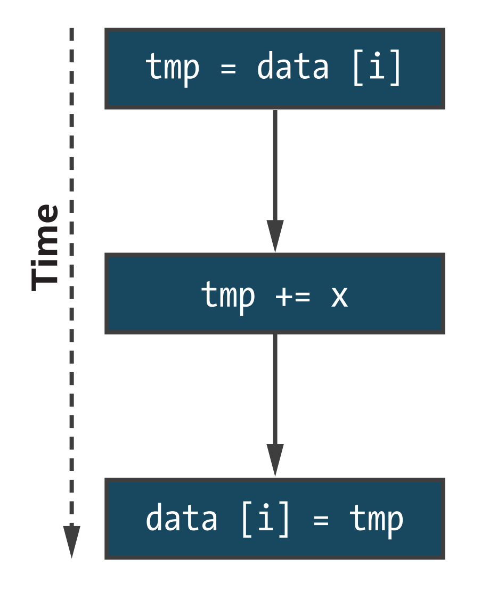
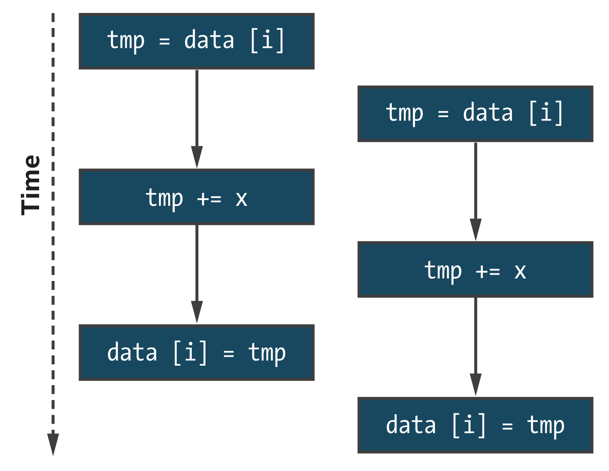
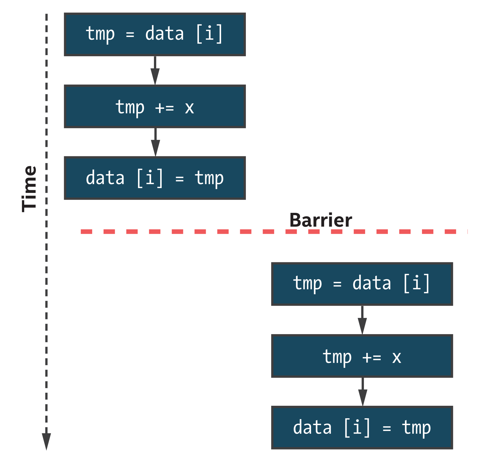
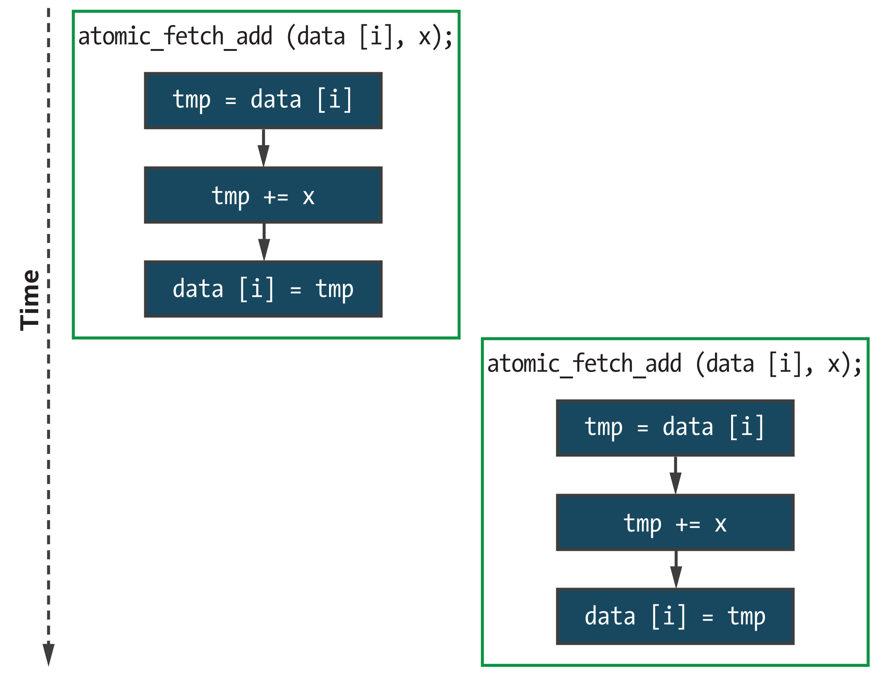
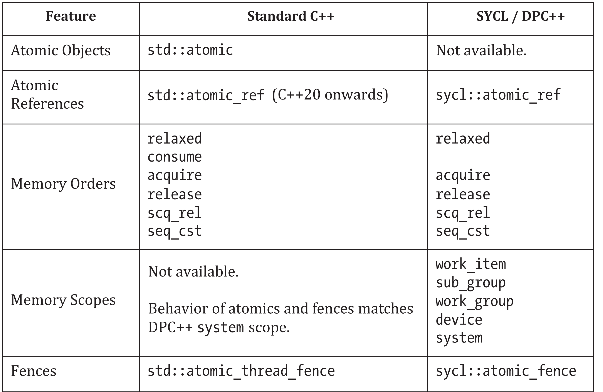
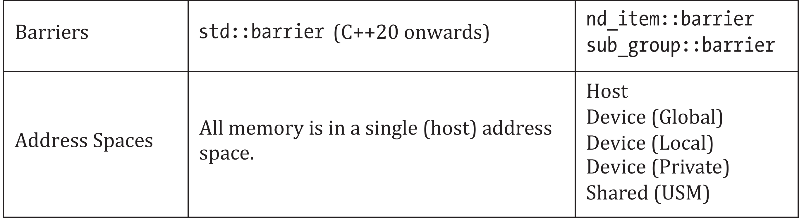
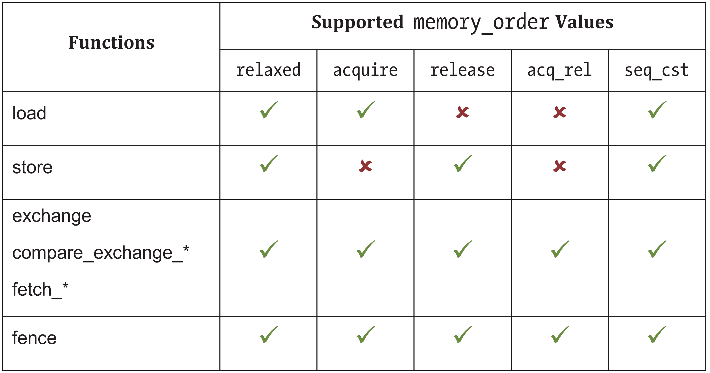

# 19 内存模型和原子操作


如果想成为优秀的并行开发者，必须了解内存一致性。它是拼图的关键部分，帮助我们确保数据在需要时就在需要的地方。这一章阐明了需要掌握的关键，以确保程序正常运行。

对于内存进行并发更新来说，对编程语言的内存(一致性)模型有基本的了解是必要的(这些更新是来自同一个内核中的多个工作项，多个设备，或者两者都是)。无论内存是如何分配的，选择使用缓冲区还是USM分配，本章的内容对我们来说都很重要。

前面的章节中，我们重点讨论了简单内核的开发，实例要么操作完全独立的数据，要么使用结构化通信模式共享数据，这些模式可以使用语言和/或库直接表示。当要编写更复杂和更现实的内核时，可能会遇到这样的情况:程序实例可能需要以更不结构化的方式进行通信——要完成可移植的高效程序，理解内存模型如何与DPC++语言特性和硬件功能相关联是正确设计的前提。

标准C++的内存一致性模型足以编写在主机设备上执行的应用程序，但DPC++对其进行了修改，以解决在编写异构系统时的复杂性，以及在讨论程序实例时不能清晰地映射到C++线程概念时可能出现的复杂性。


- 系统中设备可以访问哪些类型的内存分配:使用缓冲区和USM。
- 内核执行期间防止不安全的并发内存访问(数据竞争):使用栅栏和原子操作。
- 启用执行相同内核的程序实例之间的安全通信，以及不同设备之间的安全通信:使用组内栅栏、内存栅栏、原子操作、内存序和内存域。
- 防止与期望不兼容的优化:使用组内栅栏、内存栅栏、原子操作、内存序和内存域。
- 启用依赖于开发者的优化: 使用内存序和内存域。


内存模型是个复杂的主题，可以根据兴趣进行了解——处理器架构师关心的是让处理器和加速器尽可能高效地执行代码!本章中，我们努力的打破了这种复杂性，并强调了关键概念和语言特性。本章开启了一条道路，不仅了解内存模型的内部和外部，并且享受并行编程。如果这里的描述和示例代码存在问题，强烈推荐访问本章末尾列出的网站或参考C++、SYCL和DPC++语言规范。

## 19.1 内存模型中有什么？

本节详述了编程语言包含内存模型的动机，并介绍了并行开发者应该了解的几个核心概念:


- 数据竞争和同步
- 计算和内存栅栏
- 原子操作
- 内存序


要理解这些概念在C++、SYCL和DPC++中的表达和用法，必须从高层次来考虑这些概念。具有丰富的并行编程经验，特别是使用C++的读者，可以跳过前面的内容。


### 19.1.1 数据竞争和同步

在程序中编写的操作不会直接映射到单个硬件指令或微操作。简单的加法操作，例如 `data[i] += x`，可以分解成一系列的指令或微操作:

- 将data[i]加载到一个临时内存中(寄存器)。
- 计算将x添加到data[i]中。
- 将结果存储回data[i]。

这不是在开发应用程序时需要担心的事情——添加的三个阶段将按照顺序执行，如图19-1所示。


图19-1 `data[i] += x`的连续执行分为三个独立的操作



切换到并行应用程序开发带来的复杂性:如果有多个操作同时应用于相同的数据，如何确定数据的一致性?考虑图19-2所示的情况，其中 `data[i] += x` 的两次执行交织在一起。如果两次执行，使用了不同的i值，则应用程序将正确执行。如果使用相同的i值，会从内存中加载相同的值，并且其中一个结果会被另一个覆盖!这只是调度它们的操作之一，程序的行为取决于哪个程序实例首先到达——这就是数据竞争。


图19-2 可能的 `data[i] += x` 交错并发执行



图19-3中的代码和图19-4中的输出展示了并发极易发生。如果M大于或等于N，则每个程序实例中j的值是唯一的;如果不是，j的值将会冲突，更新可能会丢失。我们说可能丢失是因为包含数据竞争的程序，仍然可能在某个时间点产生正确的答案(取决于实现和硬件如何安排工作)。无论编译器还是硬件都不可能知道这个程序要做什么，也不可能知道在运行时N和M的值是多少——作为开发者，有责任了解的程序是否包含数据竞争，以及是否对执行顺序敏感。


图19-3 包含数据竞争的内核
```
int* data = malloc_shared<int>(N, Q);
std::fill(data, data + N, 0);

Q.parallel_for(N, [=](id<1> i) {
	int j = i % M;
	data[j] += 1;
}).wait();

for (int i = 0; i < N; ++i) {
	std::cout << "data [" << i << "] = " << data[i] << "n";
}
```


图19-4 图19-3中的代码输出示例，用于小值N和M
```
N = 2, M = 2:
data [0] = 1
data [1] = 1

N = 2, M = 1:
data [0] = 1
data [1] = 0
```

通常，开发大规模并行应用程序时，不应该关注单个工作项执行的确切顺序——可能有数百(或数千!)个工作项同时执行，而特定的顺序将对可扩展性和性能产生负面影响。相反，我们的重点应该是开发可移植的正确执行的应用程序，可以通过向编译器(和硬件)提供关于程序实例何时共享数据、共享发生时，需要什么保证，以及哪些执行顺序是合法的信息来实现这一点。

> 大规模并行应用程序不应该关注单个工作项执行的顺序!


### 19.1.2 计算和内存栅栏

防止同一组中工作项之间的数据竞争的方法是，使用工作组栅栏和适当的内存栅栏在不同程序实例之间引入同步。可以使用工作组栅栏对 `data[i]` 的更新进行排序，如图19-5所示，图19-6给出了示例内核的更新版本。请注意，因为工作组栅栏不会同步不同组中的工作项，所以只有将自己限制在单个工作组中时，示例才能保证正确执行!


图19-5 `data[i] += x` 的两个实例被栅栏隔开




图19-6 使用栅栏避免数据竞争
```
int* data = malloc_shared<int>(N, Q);
std::fill(data, data + N, 0);

// Launch exactly one work-group
// Number of work-groups = global / local
range<1> global{N};
range<1> local{N};

Q.parallel_for(nd_range<1>{global, local}, [=](nd_item<1> it) {
	int i = it.get_global_id(0);
	int j = i % M;
	for (int round = 0; round < N; ++round) {
		// Allow exactly one work-item update per round
		if (i == round) {
			data[j] += 1;
		}
		it.barrier();
	}
}).wait();

for (int i = 0; i < N; ++i) {
	std::cout << "data [" << i << "] = " << data[i] << "n";
}
```

尽管使用栅栏实现此模式没什么问题，但不鼓励这样做——强制组中的工作项按顺序和特定的顺序执行，这可能导致在负载不平衡的情况下长时间的存在。还可能引入比严格要求更多的同步——如果不同的程序实例碰巧使用了不同的i值，仍需要在组内栅栏上进行同步。

栅栏同步是一种有用的工具，确保工作组或子工作组中的所有工作项在进入下一个阶段之前完成内核的某部分，但是对于细粒度的(可能依赖于数据的)同步来说，栅栏同步过重了。对于更通用的同步模式，必须使用原子操作。


### 19.1.3 原子操作

原子操作允许在不引入数据竞争的情况下并发访问内存位置。当多个原子操作访问同一内存时，保证不会重叠。如果只有一些访问具有原子性，这个保证就没意义，开发者有责任确保不使用具有不同原子性的操作，去并发访问相同的数据。

> 同一个内存位置同时混合原子和非原子操作会导致未定义行为的发生!

如果使用原子操作来表示加法，结果可能如图19-8所示——每个更新都是不可分割的工作块，并且程序将产生正确的结果。对应的代码如图19-7所示——在本章后面重新讨论atomic_ref类及其模板参数的含义。


图19-7 使用原子操作避免数据竞争
```
int* data = malloc_shared<int>(N, Q);
std::fill(data, data + N, 0);

Q.parallel_for(N, [=](id<1> i) {
	int j = i % M;
	atomic_ref<int, memory_order::relaxed, memory_scope::system,
			   access::address_space::global_space> atomic_data(data[j]);
	atomic_data += 1;
}).wait();

for (int i = 0; i < N; ++i) {
	std::cout << "data [" << i << "] = " << data[i] << "n";
}
```


图19-8 与原子操作交错执行的 `data[i] += x`



需要注意的是，这仍然只是一个### 可能}的执行顺序。使用原子操作可以保证更新不重叠(如果两个实例使用相同的i值)，但不能保证两个实例中哪一个会先执行。更重要的是，不能保证这些原子操作相对于不同程序实例中的任何非原子操作的执行顺序。


### 19.1.4 内存序

即使在顺序应用程序中，优化编译器和硬件可以对操作进行地重新排序。换句话说，应用程序的行为必须与开发者编写的程序完全一样即可。

然而，这种假设还不足以推断并行程序的执行。现在有两个需要担心的重排来源:编译器和硬件可能会在每个顺序的程序实例中重新排序语句的执行，而程序实例本身可能以任何(可能是交错的)顺序执行。为了设计和实现程序实例之间的安全通信协议，需要能够约束这种重新排序。为编译器提供我们想要的内存顺序的信息，可以防止与应用程序的预期行为不兼容的重排优化。

常用的三种内存序

- 自由的内存序
- 获取-释放或释放-获取的内存序
- 顺序一致的内存序

在自由内存排序下，内存操作可以不受任何限制地重排。自由内存模型最常见的用法是增加共享变量(例如，一个计数器，直方图计算的一个值数组)。

获取-释放内存顺序下，程序实例释放一个原子变量，而另一个程序实例获取同一个原子变量，这两个程序实例充当同步点，并保证释放实例之前对内存的任何写操作对获取实例可见。通常，可以考虑原子操作将其他内存操作释放到其他程序实例，或者获取其他程序实例的内存操作。如果想通过内存在程序实例对之间传递值，就需要一个内存模型，这可能比想象的更常见。当程序获得锁时，通常会执行一些额外的计算，并在最终释放锁之前修改内存——只有锁会自动更新，但是我们希望由锁保护的内存更新能够避免数据竞争。这种行为依赖于获取-释放内存排序，使用自由内存序无法实现锁。

顺序一致的内存序下，获取-释放顺序仍然有效，但所有原子操作的全局顺序一致。这种内存序行为是三种方法中最直观的，也是最接近开发顺序应用程序时的习惯。有了顺序一致性，对程序实例组(而不是成对)之间的通信进行推理就会变得容易得多。

设计可移植的并行应用程序时，必须了解编程模型和设备的组合支持哪些内存序。明确地描述应用程序所需的内存序，可以确保当需要的行为不受支持时，可以预见地失败(例如，在编译时)，并避免做出不安全的假设。

## 19.2 内存模型

目前为止，本章已经介绍了理解内存模型所需的概念。本章的其余部分详细解释了内存模型，包括

- 如何表达内核的内存序要求
- 如何查询指定设备支持的内存
- 内存模型如何对待不相交的地址空间和多个设备
- 内存模型如何与计算栅栏、内存栅栏和原子交互
- 缓冲区和USM之间使用原子操作有何不同

内存模型是基于标准C++的内存模型，但在一些重要方面有所不同。这些差异反映了我们的长期愿景，即DPC++和SYCL应该有助于预告未来的C++标准:类的默认行为和命名与C++标准库紧密一致，目的是扩展标准C++功能，而不是限制它。

图19-9中的表格总结了在标准 `C++(C++11, C++14, C++17, C++20)` 与SYCL和DCP++中不同的内存模型概念是如何作为语言特性使用的。 C++14, C++17和C++20标准还包括了一些对C++实现影响的说明。这些说明不应该影响程序代码，所以这里不讨论它们。


图19-9 比较标准C++和SYCL/DPC++内存模型





### 19.2.1 memory_order枚举类

内存模型通过memory_order枚举类的6个值表示不同的内存序，这些值可以作为参数提供给内存栅栏和原子操作。为一个操作提供一个内存序参数，告诉编译器相对于该操作的所有其他内存操作(任何地址)需要以什么内存序，如下所述:


- `memory_order::relaxed` 读写操作可以在操作之前或之后重排，没有任何限制。没有顺序保证。
- `memory_order::acquire` 操作之后出现的读和写操作必须在该操作之后出现(也就是说，不能在操作之前重排)。
- `memory_order::release` 操作之前出现的读操作和写操作必须在程序的操作之前发生(即，不能在操作之后重排)，并且前面的写操作保证对其他程序实例可见，这些程序实例已经通过相应的获取操作(即，使用相同的变量和 `memory_order::acquire` 或 `barrier` 函数的原子操作)。
- `memory_order::acq_rel` 操作既是获取也是释放。读和写操作不能围绕操作重排，前面的写操作必须像前面描述的 `memory_order::release` 一样可见。
- `memory_order::seq_cst` 该操作分别作为获取、释放或两者都起作用，具体取决于它是读操作、写操作或读-改-写操作。以顺序一致的内存序执行操作。


对于每个操作所支持的内存顺序有几个限制。图19-10中的表格总结了有效的组合。


图19-10 使用 `memory_order` 支持原子操作



加载操作不会将值写入内存，因此与释放语义不兼容。类似地，存储操作不从内存中读取值，因此与获取语义不兼容。其余的读-改-写原子操作和内存栅栏与所有内存序兼容。

**C++中的内存序**
C++内存模型还包括memory_order::consume，其行为与memory_order::acquire类似。然而，C++17标准不鼓励使用它，注意到它的定义正在修订。它在DPC++中的实现会推迟到未来的版本。


### 19.2.2 memory_scope枚举类

标准的C++内存模型假设应用程序，在具有单个地址空间的单个设备上执行。这两种假设都不适用于DPC++应用程序:应用程序的不同部分在不同的设备上执行(例如，一个主机设备和一个或多个加速器设备);每个设备有多个地址空间(即，私有，本地和全局);并且每个设备的全局地址空间可能是是断开的(取决于USM支持)。

为了解决这个问题，DPC++扩展了C++内存顺序的概念，以包括原子操作的范围，表示给定内存顺序约束应用的最小工作集。作用域集合是通过memory_scope枚举类定义的:


- `memory_scope::work_item` 内存序约束仅应用于调用工作项。这个作用域只对映像操作有用，因为工作项中的所有其他操作已经保证按程序顺序执行。
- `memory_scope::sub_group`, `memory_scope::work_group` 内存序约束仅应用于与调用工作项相同的子工作组或工作组中的工作项。
- `memory_scope::device` 内存序约束仅适用于在与调用工作项相同的设备上执行的工作项。
- `memory_scope::system` 内存排序约束适用于系统中的所有工作项。


除了设备功能所施加的限制，所有内存作用域都是所有原子操作和内存栅栏操作的有效参数。但在以下三种情况之一中，作用域参数可能会自动降级为较窄的作用域:

- 当原子操作更新了工作组本地内存中的值，则任何比 `memory_scope::work_group` 范围更宽的作用域都会缩小(因为本地内存只对同一个工作组中的工作项可见)。
- 当设备不支持USM，指定 `memory_scope::system` 等同于 `memory_scope::device`(因为缓冲区不能被多个设备同时访问)。
- 当原子操作使用 `memory_order::relaxed`，则没有顺序保证，并且内存作用域参数会被忽略。


### 19.2.3 查询设备能力

为了确保与SYCL以前版本支持的设备的兼容性，并最大化可移植性，DPC++支持OpenCL 1.2设备和其他可能无法支持完整C++内存模型的硬件(例如，某些类型的嵌入式设备)。DPC++提供设备查询来帮助我们推断系统中，可用设备支持的内存序和内存范围:


- `atomic_memory_order_capabilities` `atomic_fence_order_capabilities` 返回特定设备上原子操作和内存栅栏操作支持的所有内存序列表。所有设备都必须支持memory_order::relaxed，并且主机设备必须支持所有内存序。
- `atomic_memory_scope_capabilities` `atomic_fence_scope_capabilities` 返回特定设备上原子操作和fence操作支持的所有内存作用域的列表。所有设备都必须至少支持memory_order::work_group，并且主机设备必须支持所有内存作用域。


一开始可能很难记住哪些内存顺序和作用域支持哪些功能和设备功能的组合。在实践中，可以通过以下两种开发方法来避免这种复杂性:

- **开发具有顺序一致性和系统栅栏的应用程序。**  性能调优期间，只考虑采用不那么严格的内存序。
- **开发具有自由一致性和工作组栅栏的应用程序。** 只有在需要正确性时，才考虑采用更严格的内存序和更广泛的作用域。

第一种方法确保所有原子操作和栅栏语义匹配标准C++的默认行为。这是最简单、最不容易出错的选项，但是具有性能和可移植性最差的特征。

第二种方法更符合SYCL以前版本和OpenCL等语言的默认行为。虽然更复杂——因为它要求我们更加熟悉不同的内存序和作用域——确保我们编写的大部分DPC++代码可以在任何设备上运行，而不会造成性能损失。


### 19.2.4 栅栏

目前为止，本书中所有之前使用的栅栏都忽略了内存序和作用域的问题，而是依赖于默认行为。

DPC++中的每一个工作组栅栏对于调用工作项可访问的所有地址空间都起到了获取-释放的作用，并且使得前面的写操作至少对同一组中的所有其他工作项可见。这确保了一组工作项在栅栏之后的内存一致性，这与我们对同步的直观理解(以及同步的定义——与C++中的关系)一致。

atomic_fence函数提供了比这更细粒度的控制，允许工作项以指定的内存顺序和范围执行栅栏。DPC++的未来版本中，工作组栅栏可能同样接受一个可选参数来调整与栅栏相关的获取-释放栅栏的内存作用域


### 19.2.5 DPC++中的原子操作

DPC++支持对各种数据类型的多种原子操作。所有设备都保证支持通用操作(例如，加载、存储、算术操作符)的原子版本，以及实现无锁算法所需的原子比较和交换操作。该语言为所有基本整数、浮点数和指针类型定义了这些操作——所有设备都必须支持32位类型的这些操作，但64位类型的支持是可选的。


#### 19.2.5.1 atomic类

C++11中的 `std::atomic` 类提供了一个创建和操作原子变量的接口。原子类的实例拥有数据，不能移动或复制，只能使用原子操作进行更新。这些限制大大减少了不正确使用类和引入未定义行为的机会。它们也阻止了类在DPC++内核中使用——在主机上创建原子对象并将它们传输到设备上是不可能的!我们可以在宿主代码中继续使用 `std::atomic`，但是尝试在设备内核中使用将导致编译错误。

**原子类在SYCL 2020和DPC++中已弃用**
SYCL 1.2.1规范包括一个 `cl::sycl::atomic` 类，它基于C++11中的 `std::atomic` 类。这两个类的接口有一些不同，最值得注意的是SYCL 1.2.1版本不拥有自己的数据，默认情况下使用宽松的内存序。

DPC++完全支持 `cl::sycl::atomic` 类，但是为了避免混淆，不建议使用它。我们建议使用 `atomic_ref` 类(将在下一节中讨论)代替它。


#### 19.2.5.2 atomic_ref类

C++20中的 `std::atomic_ref` 类为原子操作提供了一个替代接口，它比 `std::atomic` 提供了更大的灵活性。这两个类之间最大的区别是 `std::atomic_ref` 的实例并不拥有数据，而是从现有的非原子变量构造而来。创建原子引用实际上相当于一个承诺，即引用的变量只在引用的生命周期内进行原子访问。这些正是DPC++所需要的语义，因为它们允许在主机上创建非原子数据，将数据传输到设备，并且只有在它传输之后才将其视为原子数据。因此，DPC++内核中使用的atomic_ref类是基于 `std::atomic_ref` 的。

我们说基于，因为类的DPC++版本包括三个额外的模板参数，如图19-11所示。


图19-11 atomic_ref类的构造函数和静态成员
```
template <typename T,
			memory_order DefaultOrder,
			memory_scope DefaultScope, 
			access::address_space AddressSpace>
class atomic_ref {
public:
	using value_type = T;
	static constexpr size_t required_alignment =
		/* implementation-defined */;
	static constexpr bool is_always_lock_free =
		/* implementation-defined */;
	static constexpr memory_order default_read_order =
		memory_order_traits<DefaultOrder>::read_order;
	static constexpr memory_order default_write_order =
		memory_order_traits<DefaultOrder>::write_order;
	static constexpr memory_order default_read_modify_write_order =
		DefaultOrder;
	static constexpr memory_scope default_scope = DefaultScope;
	
	explicit atomic_ref(T& obj);
	atomic_ref(const atomic_ref& ref) noexcept;
};
```

正如前面所讨论的，不同DPC++设备的功能是不同的。为DPC++的原子类选择一个默认行为比较困难:默认为标准C++行为(即，`memory_order::seq_cst`，`memory_scope::system`)限制代码只能在最有能力的设备上执行;另一方面，在迁移现有C++代码时，打破C++约定并默认使用最小公分母(即`memory_order::relaxed`, `memory_scope::work_group`)可能会导致意外行为。DPC++采用的设计提供了一种折中方案，允许我们将所需的默认行为定义为对象类型的一部分(使用DefaultOrder和DefaultScope模板参数)。其他排序和作用域可以作为运行时参数提供给特定的原子操作——DefaultOrder和DefaultScope只影响那些没有或不能覆盖默认行为的操作(例如，当使用像+=这样的简写操作符时)。模板的最后一个参数表示被引用对象分配的地址空间。

原子引用根据所引用对象的类型为不同的操作提供支持。所有类型支持的基本操作如图19-12所示，提供了原子地将数据移动到内存和从内存中移动数据的能力。


图19-12。使用atomic_ref对所有类型进行操作
```
void store(T operand,
	memory_order order = default_write_order,
	memory_scope scope = default_scope) const noexcept;
T operator=(T desired) const noexcept; // equivalent to store

T load(memory_order order = default_read_order,
	memory_scope scope = default_scope) const noexcept;
operator T() const noexcept; // equivalent to load

T exchange(T operand,
	memory_order order = default_read_modify_write_order,
	memory_scope scope = default_scope) const noexcept;
	
bool compare_exchange_weak(T &expected, T desired,
	memory_order success,
	memory_order failure,
	memory_scope scope = default_scope) const noexcept;
	
bool compare_exchange_weak(T &expected, T desired,
	memory_order order = default_read_modify_write_order,
	memory_scope scope = default_scope) const noexcept;
	
bool compare_exchange_strong(T &expected, T desired,
	memory_order success,
	memory_order failure,
	memory_scope scope = default_scope) const noexcept;
	
bool compare_exchange_strong(T &expected, T desired,
	memory_order order = default_read_modify_write_order,
	memory_scope scope = default_scope) const noexcept;
```

对整数和浮点类型对象的原子引用扩展了可用原子操作集，以包括算术操作，如图19-13和19-14所示。设备必须支持原子浮点类型，不管是否具有对硬件中浮点原子的支持，而且许多设备都希望使用原子比较交换来模拟原子浮点加法。这种模拟是DPC++中提供性能和可移植性的重要部分，可以自由地在算法需要的地方使用浮点原子——结果代码将正确工作，并将受益于浮点原子硬件的改进而无需任何修改!


图19-13 仅对整数类型使用atomic_ref的附加操作
```
Integral fetch_add(Integral operand,
	memory_order order = default_read_modify_write_order,
	memory_scope scope = default_scope) const noexcept;
	
Integral fetch_sub(Integral operand,
	memory_order order = default_read_modify_write_order,
	memory_scope scope = default_scope) const noexcept;
	
Integral fetch_and(Integral operand,
	memory_order order = default_read_modify_write_order,
	memory_scope scope = default_scope) const noexcept;
	
Integral fetch_or(Integral operand,
	memory_order order = default_read_modify_write_order,
	memory_scope scope = default_scope) const noexcept;
	
Integral fetch_min(Integral operand,
	memory_order order = default_read_modify_write_order,
	memory_scope scope = default_scope) const noexcept;

Integral fetch_max(Integral operand,
	memory_order order = default_read_modify_write_order,
	memory_scope scope = default_scope) const noexcept;

Integral operator++(int) const noexcept;
Integral operator--(int) const noexcept;
Integral operator++() const noexcept;
Integral operator--() const noexcept;
Integral operator+=(Integral) const noexcept;
Integral operator-=(Integral) const noexcept;
Integral operator&=(Integral) const noexcept;
Integral operator|=(Integral) const noexcept;
Integral operator^=(Integral) const noexcept;
```


图196-4 仅用于浮点类型的atomic_ref的附加操作
```
Floating fetch_add(Floating operand,
	memory_order order = default_read_modify_write_order,
	memory_scope scope = default_scope) const noexcept;
	
Floating fetch_sub(Floating operand,
	memory_order order = default_read_modify_write_order,
	memory_scope scope = default_scope) const noexcept;
	
Floating fetch_min(Floating operand,
	memory_order order = default_read_modify_write_order,
	memory_scope scope = default_scope) const noexcept;
	
Floating fetch_max(Floating operand,
	memory_order order = default_read_modify_write_order,
	memory_scope scope = default_scope) const noexcept;
	
Floating operator+=(Floating) const noexcept;
Floating operator-=(Floating) const noexcept;
```


#### 19.2.5.3 缓冲区中使用原子操作

如上一节所讨论的，在DPC++中没有办法分配原子数据，也不能在主机和设备之间移动。将原子操作与缓冲区结合使用，必须创建非原子数据缓冲区，以便将其传输到设备，然后通过原子引用访问该数据。


图19-15 通过显式创建的atomic_ref访问缓冲区
```
Q.submit([&](handler& h) {
	accessor acc{buf, h};
	h.parallel_for(N, [=](id<1> i) {
		int j = i % M;
		atomic_ref<int, memory_order::relaxed, memory_scope::system,
				access::address_space::global_space> atomic_acc(acc[j]);
		atomic_acc += 1;
	});
});
```

图19-15中的代码是在DPC++中使用显式创建的原子引用对象表示原子性的示例。缓冲区存储普通整数，需要具有读和写权限的访问器。然后，可以为每个数据访问创建atomic_ref实例，使用+=操作符作为fetch_add成员函数进行替代。

如果想在同一个内核中混合对缓冲区的原子和非原子访问，这个模式是有用的，以避免在不需要原子操作时产生性能开销。如果已知缓冲区中只有一个内存位置的子集将被多个工作项并发访问，那么只需要在访问那个子集时使用原子引用即可。或者，如果已知同一个工作组中的工作项仅在内核的一个阶段(即两个工作组栅栏之间)同时访问本地内存，那么只需要在该阶段使用原子引用。

有时，我们很乐意为每个访问支付原子性的开销，要么是因为为了正确性，要么是因为关心生产力而不是性能。对于这种情况，DPC++为声明访问器必须始终使用原子操作提供了一种简写，如图19-16所示。


图19-16 通过原子访问器隐式创建的atomic_ref访问缓冲区
```
buffer buf(data);

Q.submit([&](handler& h) {
	atomic_accessor acc(buf, h, relaxed_order, system_scope);
	h.parallel_for(N, [=](id<1> i) {
		int j = i % M;
		acc[j] += 1;
	});
});
```

缓冲区像以前一样存储普通整数，但我们将常规访问器替换为特殊的atomic_accessor类型。这样的原子访问器自动使用原子引用包装的每个成员，从而简化了内核代码。

最好是直接使用原子引用类，还是通过访问器使用。我们的建议是在原型设计和初始开发期间从访问器开始(只是简单)，只有在性能调优期间(例如，如果分析显示原子性操作是性能瓶颈)或者原子性只在定义良好的内核阶段才需要(例如，在本章后面的直方图代码中可见)。


#### 19.2.5.4 统一共享内存中使用原子

如图19-17(从图19-7中复制)所示，可以用与缓冲区完全相同的方式从USM中存储的数据构造原子引用。实际上，此代码和图19-15中所示的代码之间的唯一区别是USM代码不需要缓冲区或访问器。


图19-17 通过显式创建的atomic_ref实现USM分配
```
q.parallel_for(range<1>(N), [=](size_t i) {
	int j = i % M;
	atomic_ref<int, memory_order::relaxed, memory_scope::system,
				access::address_space::global_space> atomic_data(data[j]);
	atomic_data += 1;
}).wait();
```

没有办法只使用标准的DPC++特性，来模仿原子访问器为USM指针提供的简写语法的方法。我们希望未来的DPC++版本能够在C++23中，为的mdspan类提供缩写。


## 19.3 实际中的原子操作

原子操作的用法广泛和多样，以至于不可能在本书中提供每种用法的示例。我们展示了两个具有代表性的例子，它们具有广泛的适用性:
	
- 计算直方图
- 实现设备范围内的同步


### 19.3.1 计算直方图

图19-18中的代码演示了如何使用自由原子操作和工作组栅栏来计算直方图。内核被栅栏分为三个阶段，每个阶段都有自己的原子性需求。这个栅栏既是一个同步点，又是一个获取-释放栅栏——这确保了一个阶段中的任何读和写，对后面阶段中工作组的所有工作项都是可见的。

第一阶段将某个工作组本地内存的内容设置为零。每个工作组中的工作项不能按照设计争用条件更新工作组本地内存中的位置，并且不需要原子性。

第二阶段将部分直方图结果累加到本地内存中。同一个工作组中的工作项可以更新工作组本地内存中的相同位置，但是同步可以推迟到该阶段的结束——可以使用memory_order::relaxed和memory_scope::work_group来满足原子性需求。

第三阶段将部分直方图结果存储在全局内存中。保证同工作组中的工作项从工作组本地内存中的位置读取，但是会更新全局内存中的相同位置——不再需要工作组本地内存的原子性，可以像以前一样使用memory_order::relaxed和memory_scope::system来满足全局内存的原子性要求。


图19-18 使用不同内存空间中的原子操作计算直方图
```
// Define shorthand aliases for the types of atomic needed by this kernel 
template <typename T>
using local_atomic_ref = atomic_ref<
	T,
	memory_order::relaxed, 
	memory_scope::work_group,
	access::address_space::local_space>; 
	
template <typename T>
using global_atomic_ref = atomic_ref<
	T,
	memory_order::relaxed, 
	memory_scope::system,
	access::address_space::global_space>; 
	
Q.submit([&](handler& h) {
	auto local = 1ocal_accessor<uint32_t, 1>{B, h};
	h.parallel_for(
		nd_range<1>{num_groups * num_items, num_items},[=](nd_item<1> it){ 
			// Phase 1:Work-items co-operate to zero local memory
			for (int32_t b=it.get_local_id(0); b <B; b+=it.get_local_range(0)){
				local[b]=0;
			}
		
			it.barrier();// Wait for all to be zeroed
		
			// Phase 2:Work-groups each compute a chunk of the input 
			//Work-items co-operate to compute histogram in local memory 
			auto grp=it.get_group();
		
			const auto [group_start, group_end] = distribute_range (grp, N); 
			for (int i = group_start + it.get_local_id(0); i < group_end; 
				i +=it.get_local_range(0)){
			
				int32_t b = input[i] % B;
				local_atomic_ref<uint32_t>(local[b])++;
			}
			it.barrier(); // Wait for all local histogram updates to complete 
			
			// Phase 3: Work-items co-operate to update global memory
			for (int32_t b = it.get_local_id(0); b < B; b +=it.get_local_range(0)){
				
				global_atomic_ref<uint32_t>(histogram[b]) += local[b];
			}
		});
	}).wait();
```


### 19.3.2 实现设备范围内的同步

第4章警告不要编写跨工作组同步工作项的内核。然而，我们完全期望本章的几个示例能在原子操作之上实现对设备范围的同步。

> 设备范围内的同步目前是不可移植的，最好留给专业开发者使用。语言的未来版本将解决这个问题。

本节中讨论的代码是危险的，不应该期望在所有设备上工作，因为在调度和并发保证方面可能存在差异。原子操作提供的内存序保证与前进进度保证是正交的；在编写本文时，SYCL和DPC++中的工作组调度完全是由实现定义的。讨论执行模型和调度保证所需的概念和术语是目前学术研究领域的热门，DPC++的未来版本预计将在此工作的基础上提供额外的调度查询和控制。

图19-19展示了一个设备级锁存器(一次性栅栏)的简单实现，图19-20展示了一个简单的使用示例。每个工作组选择一个单独的工作项，以发出该组到达的信号，并使用自旋环等待其他组，而其他工作项使用工作组栅栏等待所选的工作项。正是这种自旋环使得设备范围的同步不安全，当工作组还没有开始执行，或者当前执行的工作组没有平衡地调度，代码可能会死锁。

> 如果没有进度保证，单独依赖内存序来实现同步原语可能会导致死锁!

要使代码正确工作，必须满足以下三个条件:

- 为了保证生成正确的内存栅栏，原子操作必须使用严格的内存序。
- ND-Range中的每个工作组必须能够执行，避免单个工作组在循环中自旋，从而使尚未增加计数器的工作组挨饿。
- 设备必须能够同时执行ND-Range中的所有工作组，以确保ND-Range中的所有工作组最终达到门闩处。


图19-19 原子引用的顶部构建一个简单的设备级闩锁
```
struct device_latch {
	using memory_order = intel::memory_order;
	using memory_scope = intel::memory_scope;
	
	explicit device_latch(size_t num_groups) :
			counter(0), expected(num_groups) {}
			
	template <int Dimensions>
	void arrive_and_wait(nd_item<Dimensions>& it) {
		it.barrier();
		// Elect one work-item per work-group to be involved
		// in the synchronization
		// All other work-items wait at the barrier after the branch
		if (it.get_local_linear_id() == 0) {
			atomic_ref<
				size_t,
				memory_order::acq_rel,
				memory_scope::device,
				access::address_space::global_space> atomic_counter(counter);
				
			// Signal arrival at the barrier
			// Previous writes should be visible to 
			// all work-items on the device
			atomic_counter++;
			
			// Wait for all work-groups to arrive
			// Synchronize with previous releases by
			// all work-items on the device
			while (atomic_counter.load() != expected) {}
		}
		it.barrier();
	}
	size_t counter;
	size_t expected;
};
```


图19-20 使用图19-19中的设备级闩锁
```
// Allocate a one-time-use device_latch in USM
void* ptr = sycl::malloc_shared(sizeof(device_latch), Q);
device_latch* latch = new (ptr) device_latch(num_groups);
Q.submit([&](handler& h) {
	h.parallel_for(R, [=](nd_item<1> it) {
		// Every work-item writes a 1 to its location
		data[it.get_global_linear_id()] = 1;
		
		// Every work-item waits for all writes
		latch->arrive_and_wait(it);
		
		// Every work-item sums the values it can see
		size_t sum = 0;
		for (int i = 0; i < num_groups * items_per_group; ++i) {
			sum += data[i];
		}
		sums[it.get_global_linear_id()] = sum;
	});
}).wait();
free(ptr, Q);
```

虽然这段代码不能保证可移植性，但强调两个关键点:1)DPC++具有足够的表达能力，可以实现特定于设备的调优，有时需要以牺牲可移植性为代价；2)DPC++包含了实现高级同步例程所需的构建块，这可能会包含在语言的未来版本中。


## 19.4 总结


本章提供了内存模型和原子类的高级介绍。理解如何使用(以及如何不使用)这些类是正确开发、可移植和高效并行程序的关键。

内存模型是非常复杂的主题，重点是为编写真实的应用程序建立基础。如果需要更多的信息，下面有一些专门介绍内存模型的网站、书籍和讲座


### 19.4.1 更多信息


- A. Williams, C++ Concurrency in Action: Practical Multithreading, Manning, 2012, 978-1933988771
- H. Sutter, “atomic<> Weapons: The C++ Memory Model and Modern Hardware”, https://herbsutter.com/2013/02/11/atomic-weapons-the-c-memorymodel-and-modern-hardware/
- H-J. Boehm, “Temporarily discourage memory_order_consume,” http://wg21.link/p0371
- C++ Reference, “std::atomic,”https://en.cppreference.com/w/cpp/atomic/atomic
- C++ Reference, “std::atomic_ref,” https://en.cppreference.com/w/cpp/atomic/atomic_ref

