# 2 代码执行的位置


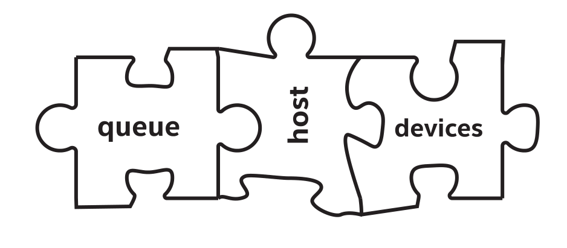

并行编程并不是真的在快车道上行驶，而是在所有车道上快速行驶。这一章是关于能够把代码放到可以执行的地方执行，并且选择在合适的时候启用异构系统中的计算资源。因此，需要知道有哪些计算资源(找到它们)，并让它们工作(执行代码)。

可以控制代码的执行位置——可以控制内核代码运行的设备。SYCL为异构编程提供了框架，代码可以在主机CPU和设备的混合上执行。决定代码在何处执行的机制，对于我们理解和使用异构系统非常重要。

本章描述了代码可以在什么地方，什么时候执行，以及用来控制执行位置的机制。第3章将了解如何管理数据，使其在代码执行时使用，然后第4章返回到代码本身，讨论内核代码的编写。

## 2.1 单个源文件


SYCL程序可以是单个源文件，意味着同一个源码单元(通常是源文件及其头文件)既包含定义要在SYCL设备上执行的计算内核的代码，也包含调度这些内核执行的主机代码。图2-1显示了这两个代码路径，图2-2给出了标有主机和设备代码区域的应用示例。

将设备代码和主机代码合并到单个源文件(或源码)可以更容易地理解和维护异构应用程序。这种组合还提供了语言的安全性，编译器可以对代码进行更多的优化。

图2-1 单个源文件代码包含主机代码(CPU上运行)和设备代码(SYCL设备上运行)
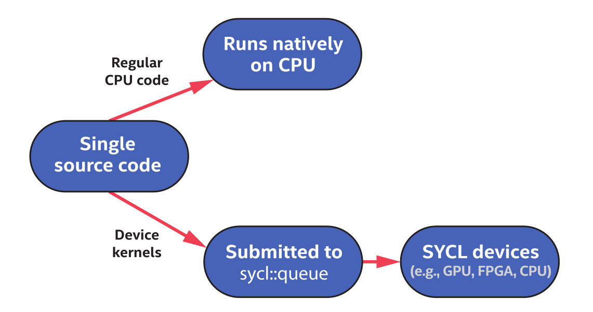


图2-2 简单的SYCL程序
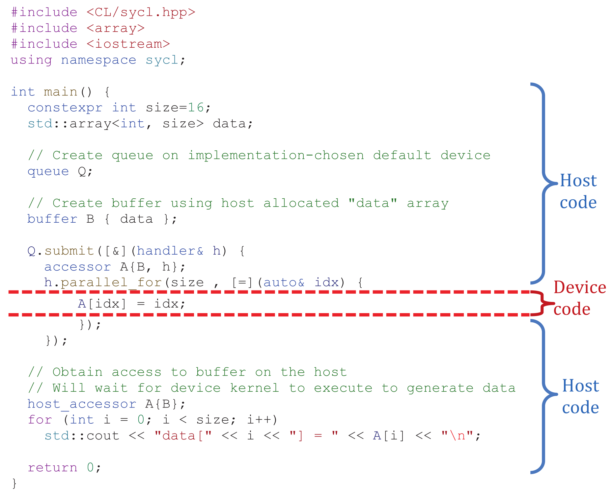


### 2.1.1 主机端代码

应用程序包含C++主机代码，由操作系统启动CPU执行应用。主机端代码是应用程序的主要部分，它定义和控制对可用设备的工作分配，也是定义运行时数据和依赖项的接口。

主机端代码特定于SYCL的构造和C++标准的扩展类，这些构造和类设计可实现为库，使得主机端代码(只要C++允许)更容易实现，并且可以简化与构建系统的集成。

> SYCL应用是用扩充的C++标准，可以实现为C++库。通过“理解”这些库，SYCL编译器可以为程序提供更高的性能。


应用程序中的主机端代码会协调设备端数据移动和计算，也可以执行计算密集型工作，并可以使用任何C++的库。

### 2.1.2 设备端代码

设备对应于加速器或处理器，在概念上独立于执行主机代码的CPU。主机处理器也可以作为一个设备，但主机处理器和设备是逻辑上相互独立的。主机处理器运行本机C++代码，而设备运行设备端代码。

队列是一种将工作提交给设备执行的机制。设备端代码有三个重要的属性:

- **主机端代码会异步执行** 主机程序向设备提交设备代码，运行库只在满足所有的执行依赖关系时才跟踪和启动，并且主机程序在提交在设备上启动之前执行。提供设备上的执行与主机程序异步，除非显式地将两者结合在一起。
- **对设备代码有限制** 加速设备上编译和实现性能。例如，设备代码不支持动态内存分配和运行时类型信息(RTTI)，这会导致许多加速器的性能下降。设备代码限制的小集合将在第10章中详细介绍。
- **SYCL定义的一些函数和查询只能在设备代码中使用** 例如：工作项标识符查询，允许设备代码的执行实例查询其在数据范围内的位置(在第4章中描述)。


通常，我们将包括提交在内的工作称为操作。在第3章中，将学习执行设备代码，还包括内存移动命令。本章中，我们关注的是操作的设备代码方面，所以在大部分时间提及的是设备端代码。


## 2.2 选择设备

为了探索设备代码将在何处执行，我们来看五个用例:

方法1:当不关心使用哪个设备时，随意在某个地方运行设备代码即可。这通常是开发的第一步。

方法2:在主机设备上显式地运行设备代码，通常用于调试。主机设备保证在任何系统上始终可用。

方法3:将设备代码分配到GPU或加速器上。

方法4:将设备代码分配到异构设备集，如同时分配到GPU和FPGA上。

方法5:从更一般的设备类别中选择特定的设备，例如：从一组可用FPGA类型中选择特定类型的FPGA。

> 开发人员通常会使用方法2调试代码，并且只有在使用方法2对代码进行了实际测试后，才会使用方法3-5。


## 2.3 方法1:在任何类型的设备上运行


不关心设备代码在哪里运行时，可以让运行时库帮忙选择。这种自动选择是不关心选择了什么设备时，可以很容易地开始编写和运行代码。这种设备选择没有考虑要运行的代码特性，所以是一个随意的选择，这个选择很可能不是最优的。

讨论设备的选择(即使是实现为选择的设备)之前，应该首先讨论与设备交互的机制:\textbf{队列}。

### 2.3.1 队列

队列是一种抽象，将操作提交给它在单个设备上执行。图2-3和图2-4给出了\textit{queue}类的定义。入队的通常是数据并行的计算，当需要更多的控制时，也可以使用其他命令，如手动控制数据移动。提交到队列的工作需要满足运行时跟踪的先决条件(例如输入数据的可用性)进行执行。这些先决条件在第3章和第8章中有介绍。


图2-3 简化的queue类
```
class queue {
public:
	// Create a queue associated with the default device
	queue(const property_list = {});
	queue(const async_handler&, 
		  const property_list = {});
	
	// Create a queue associated with an explicit device
	// A device selector may be used in place of a device
	queue(const device&, const property_list = {});
	queue(const device&, const async_handler&, 
	      const property_list = {});
	
	// Create a queue associated with a device in a specific context
	// A device selector may be used in place of a device
	queue(const context&, const device&, 
		  const property_list = {});
	queue(const context&, const device&, 
		  const async_handler&, 
		  const property_list = {});
};
```


图2-4 简化了queue类中的关键成员函数
```
class queue {
public:
	// Submit a command group to this queue.
	// The command group may be a lambda or functor object.
	// Returns an event representation the action 
	// performed in the command group.
	template <typename T>
	event submit(T);
	
	// Wait for all previously submitted actions to finish executing.
	void wait();
	
	// Wait for all previously submitted actions to finish executing.
	// Pass asynchronous exceptions to an async_handler if one was provided.
	void wait_and_throw();
};
```
	
队列绑定到单个设备，绑定发生在队列的构造过程中。提交给队列的工作是在该队列绑定的设备上执行的。队列不能映射到设备集合，因为这会不明确应该在哪个设备上执行工作。同样，队列也不能将提交的工作分散到多个设备上。相反，队列和提交给队列的工作将在执行设备之间有一个明确的映射，如图2-5所示。

图2-5 队列绑定到单个设备，提交到队列中的工作在相应的设备上执行
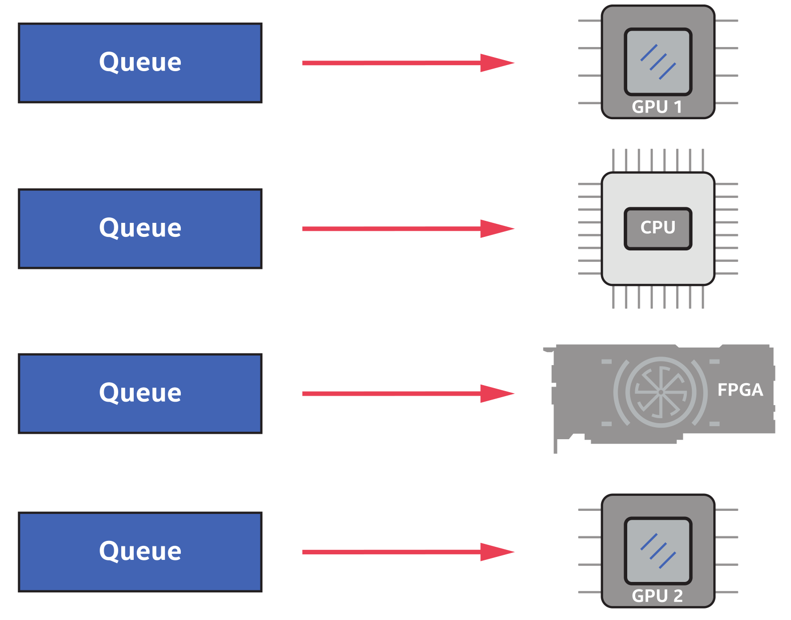

程序中可以创建多个队列，让每个队列与不同的设备绑定，或者让主机中的不同线程使用。多个不同的队列可以绑定到单个设备上，提交到这些不同队列的工作将组合在设备上执行，如图2-6所示。相反，正如我们前面提到的，队列不能绑定到多个设备，因为在执行操作的位置上不能有任何歧义。例如，想要一个能够跨多个设备加载平衡工作的队列，需要先创建这个对象。

图2-6 多个队列可以绑定到单个设备
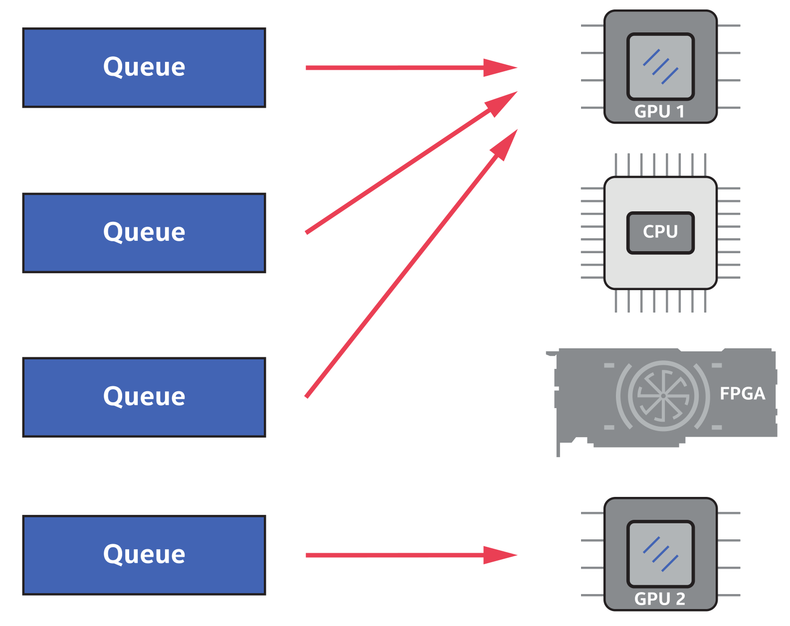


因为队列绑定到特定的设备，所以提交给队列的操作是将相应工作在设备上执行的常用方法。构造队列时选择设备是通过设备选择器和\textit{device\_selector}类实现的。

### 2.3.2 绑定队列与设备(任何设备都可以)

图2-7是没有指定队列绑定设备的示例。queue的构造函数没有任何参数(如图2-7所示)，只是选择一些可用的设备。SYCL保证至少有一个设备可用，即主机。主机也可以运行内核代码，它是执行主机程序的处理器，所以总是存在。

图2-7 通过队列的隐式构造，选择默认设备
```
#include <CL/sycl.hpp>
#include <iostream>
using namespace sycl;

int main() {
	// Create queue on whatever default device that the implementation
	// chooses. Implicit use of the default_selector. 
	queue Q;
	
	std::cout << "Selected device: " <<
	Q.get_device().get_info<info::device::name>() << "\n";
	
	return 0;
}
```
```
Possible Output:
Device: SYCL host device
```

使用queue的构造函数是启动设备代码的最简单方法。对于绑定到队列的设备的选择，因为与我们的应用程序相关，可以添加更多的控制。


## 2.4 方法2:使用主机设备进行开发和调试

可以将主机看作是独立设备，可以执行设备代码。总是有一些处理器运行主机程序，因此主机对我们的应用程序总是可用的。主机设备提供了保证，设备代码可以始终运行(不依赖加速器硬件)，并有以下几个用途:

- **设备代码的开发** 在没有任何加速器的系统上:常用的方式是在部署到HPC集群进行性能测试和优化之前，在本地系统上开发和测试设备代码。
- **使用非加速工具调试设备代码** 加速工具通常通过公开底层API让开发者使用，这些API可能没有像主机端那样的调试工具。考虑到这一点，主机设备应该支持使用CPU开发，以便开发人员熟悉调试工具。
- **备份** 如果没有其他设备保证代码可以执行:主机端运行设备代码可能不以性能作为主要目标，因此需要考虑作一个功能性的备份，确保设备代码可以执行。


主机在功能上类似于硬件加速器设备，可以绑定队列，可以执行设备代码。图2-8展示了主机设备中与其他加速器是对等的。可以执行设备代码，就像CPU、GPU或FPGA一样，并且可以绑定一个或多个队列。

图2-8 主机可以像任何加速器一样执行设备代码
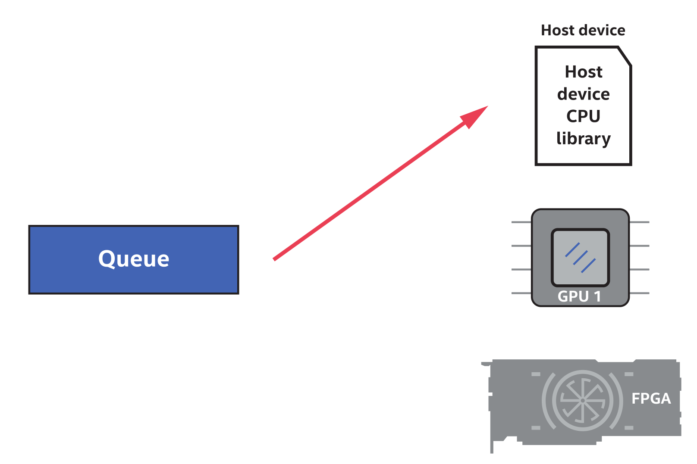

应用程序可以显式地将`host_selector`传递给队列构造，来选择创建一个绑定到主机设备的队列，如图2-9所示。

图2-9 使用host\_selector选择主机设备
```
#include <CL/sycl.hpp>
#include <iostream>
using namespace sycl;

int main() {
	// Create queue to use the host device explicitly
	queue Q{ host_selector{} };
	
	std::cout << "Selected device: " <<
	Q.get_device().get_info<info::device::name>() << "\n";
	std::cout << " -> Device vendor: " <<
	Q.get_device().get_info<info::device::vendor>() << "\n";
	
	return 0;
}
```
```
Possible Output:
Device: SYCL host device
```

即使没有特别的要求(例如，使用`host_selector`)，主机也会作为默认选项，如图2-7中的输出所示。

一些设备选择器类，可以很容易地指定一种类型的设备。`host_selector`是这些选择器类的一个例子，我们将在接下来的几节中讨论其他的选择器类。


## 2.5 方法3:使用GPU(或其他加速器)

GPU会在下一个例子中进行展示，不过对于任何类型的加速器都一样。为了针对常见的加速器类，设备分为几个大类，SYCL提供了内置的选择器类。要从设备类型类别中进行选择，例如“系统中可用的GPU”，相应的代码非常短。

### 2.5.1 设备类型

队列可以绑定的设备主要有两类:

- 主机。
- 加速设备，如GPU、FPGA或CPU设备，用于加速程序中的负载。

#### 2.5.1.1 加速器设备

加速器类型主要有以下几种:

- CPU设备
- GPU设备
- 加速器，捕捉既不为CPU，也不是GPU的设备。这包括FPGA和DSP。


使用内置的选择器类，这些类别中的任何设备都可以很容易地绑定到队列，这些选择器类可以传递到队列(和其他一些类)的构造中。

### 2.5.2 设备选择器

必须绑定到特定设备的类，如：queue类。其构造函数可以接受从`device_selector`派生的类。queue构造函数是

```
queue( const device_selector &deviceSelector, const property_list &propList = {});
```

有5种常用的内置选择器:


- **default_selector** 默认选择设备 
- **host_selector** 选择主机(始终可用) 
- **cpu_selector** 选择一个标识为CPU的设备
- **gpu_selector** 选择一个标识为GPU的设备
- **accelerator_selector** 选择一个标识为“加速器”的设备，其中包括FPGA。

DPC++中包含的另一个选择器(SYCL中不可用)可以通过包含头文件 `CL/sycl/intel/fpga_extensions.hpp` 来使用:

- **INTEL::fpga_selector** 选择一个标识为FPGA的设备


可以使用内置选择器来构造队列，例如：

```
queue myQueue { cpu_selector{} };
```

图2-10给出了使用 `cpu_selector` 的完整示例，图2-11给出了队列与可用CPU设备的对应绑定。

图2-12展示了使用各种内置选择器类的例子，演示了设备选择器与另一个类(device)的使用，该类在构造时接受一个 `device_selector`。

图2-10 CPU设备选择器示例
```
#include <CL/sycl.hpp>
#include <iostream>
using namespace sycl;

int main() {
	// Create queue to use the CPU device explicitly
	queue Q{ cpu_selector{} };
	
	std::cout << "Selected device: " <<
		Q.get_device().get_info<info::device::name>() << "\n";
	std::cout << " -> Device vendor: " <<
		Q.get_device().get_info<info::device::vendor>() << "\n";
		
	return 0;
}
```
```
// Possible Output:
// Selected device: Intel(R) Core(TM) i5-7400 CPU @ 3.00GHz
//  -> Device vendor: Intel(R) Corporation
```

图2-11 将CPU设备绑定到程序队列
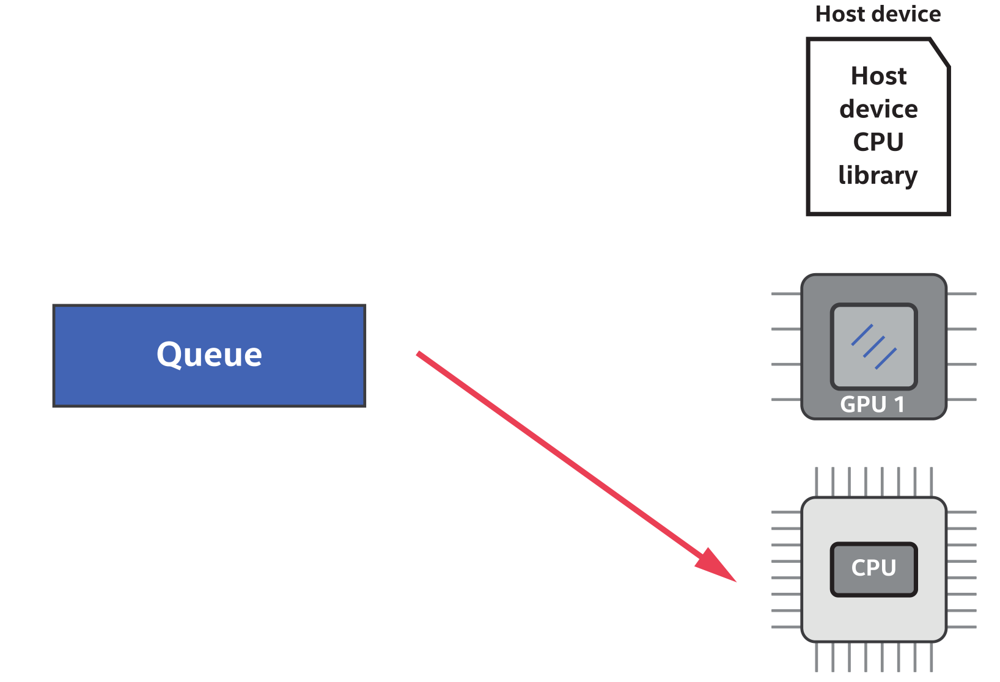

图2-12 各种设备选择器类的标识输出，设备选择器可以用于构造多个队列(本例中，构造了类实例)
```
#include <CL/sycl.hpp>
#include <CL/sycl/INTEL/fpga_extensions.hpp> // For fpga_selector
#include <iostream>
#include <string>
using namespace sycl;

void output_dev_info( const device& dev, 
					  const std::string& selector_name) {
	std::cout << selector_name << ": Selected device: " <<
		dev.get_info<info::device::name>() << "\n";
	std::cout << " -> Device vendor: " <<
		dev.get_info<info::device::vendor>() << "\n";
}

int main() {
	output_dev_info( device{ default_selector{}}, 
							"default_selector" );
	output_dev_info( device{ host_selector{}}, 
							"host_selector" );
	output_dev_info( device{ cpu_selector{}}, 
							"cpu_selector" );
	output_dev_info( device{ gpu_selector{}}, 
							"gpu_selector" );
	output_dev_info( device{ accelerator_selector{}},
							"accelerator_selector" );
	output_dev_info( device{ INTEL::fpga_selector{}}, 
							"fpga_selector" );
	
	return 0;
}
```
```
//Possible Output:
//default_selector: Selected device: Intel(R) Gen9 HD Graphics NEO
//					-> Device vendor: Intel(R) Corporation
//host_selector: Selected device: SYCL host device
//					-> Device vendor:
//cpu_selector: Selected device: Intel(R) Core(TM) i5-7400 CPU @ 3.00GHz
//					-> Device vendor: Intel(R) Corporation
//gpu_selector: Selected device: Intel(R) Gen9 HD Graphics NEO
//					-> Device vendor: Intel(R) Corporation
//accelerator_selector: Selected device: Intel(R) FPGA Emulation Device
//					-> Device vendor: Intel(R) Corporation
//fpga_selector: Selected device: pac_a10 : PAC Arria 10 Platform
//					-> Device vendor: Intel Corp
```


#### 2.5.2.1 设备选择失败时

`gpu_selector` 创建的对象(比如：队列)使用时，但没有可供运行时使用的GPU设备，那么这个选择器会抛出 `runtime_error` 异常。对于所有的设备选择器类都是如此，没有所需的设备可用，则抛出 `runtime_error` 异常。对于复杂的应用程序来说，捕获这个错误并使用不太理想的(对于应用程序/算法)设备类作为替代是合理的。异常和错误处理将在第5章中详细讨论。


## 2.6 方法4:使用多个设备

如图2-5和2-6所示，可以在程序中构造多个队列。可以将这些队列绑定到单个设备上(队列的工作汇集到单个设备上)，绑定到多个设备上，或者绑定到这些设备的组合上。以GPU绑定队列和FPGA绑定队列为例，如图2-13所示。对应的映射如图2-14所示。

图2-13 创建GPU和FPGA设备的队列
```
#include <CL/sycl.hpp>
#include <CL/sycl/INTEL/fpga_extensions.hpp> // For fpga_selector
#include <iostream>
using namespace sycl;

int main() {
	queue my_gpu_queue( gpu_selector{} );
	queue my_fpga_queue( INTEL::fpga_selector{} );
	
	std::cout << "Selected device 1: " <<
		my_gpu_queue.get_device().get_info<info::device::name>() << "\n";
		
	std::cout << "Selected device 2: " <<
		my_fpga_queue.get_device().get_info<info::device::name>() << "\n";
	
	return 0;
}
```
```
//Possible Output:
//Selected device 1: Intel(R) Gen9 HD Graphics NEO
//Selected device 2: pac_a10 : PAC Arria 10 Platform
```

图2-14 GPU+FPGA设备选择器示例:一个队列绑定GPU，另一个队列绑定FPGA
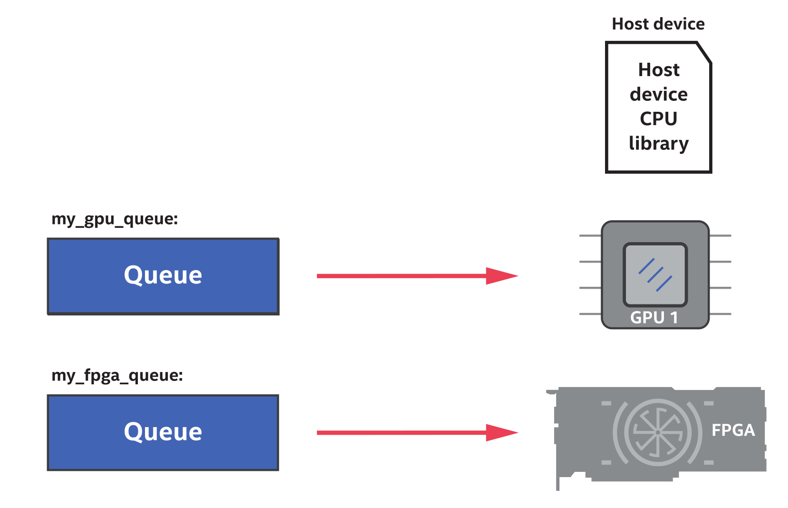


## 2.7 方法5:选择自定义(非常具体的)设备
现在来看看如何编写自定义选择器。除了本章的例子，第12章还有一些例子。内置的设备选择器旨在快速启动代码并运行。真正的程序通常需要对设备进行选择，例如:从系统中可用的一组GPU类型中选择所需的GPU。设备选择机制很容易扩展为复杂的逻辑，因此可以编写代码来选择设备。

### 2.7.1 device_selector 基类

所有的设备选择器都从 `device_selector` 基类派生，在派生类中定义函数操作符:

```
virtual int operator()(const device &dev) const {
	; /* User logic */
}
```

从 `device_selector` 派生的类中定义这个操作符，是定义复杂选择逻辑所必须的，需要了解以下三件事:

- 当运行时发现程序可访问的设备(包括主机设备)，函数调用操作符会自动调用。
- 操作符每次调用时都返回一个分数，可用设备中得分最高的会是选择器所选择的设备。
- 函数操作符返回负整数表示不能选择相应的设备。


### 2.7.2 设备评分机制

有很多机制为设备来给定一个分数，例如:

- 返回特定设备类的正值。
- 匹配设备名称和/或设备供应商字符串。
- 基于设备或平台查询，可以在代码中指向整数值。


例如，选择Intel Arria族中FPGA设备的一种方式如图2-15所示。

图2-15 Intel Arria FPGA设备的自定义选择器
```
class my_selector : public device_selector {
	public:
	int operator()(const device &dev) const override {
		if (
		dev.get_info<info::device::name>().find("Arria")
			!= std::string::npos &&
		dev.get_info<info::device::vendor>().find("Intel")
			!= std::string::npos) {
		  return 1;
		}
	  return -1;
	}
};
```

第12章有更多关于设备选择的讨论和例子(图12-2和12-3)，并会更加深入地讨论`get_info`。


## 2.8 在CPU上执行设备端代码的三种方式


由于CPU上有多种代码执行的机制，所以会造成一些混乱，如图2-16所示。

CPU最直接执行的还是主机代码，要么是单源应用程序的一部分(主机代码区域)，要么是主机代码对其他主机代码或库(如库函数)的调用。

其他两个设备用于执行设备代码。第一段设备代码在CPU上是通过主机执行，这种方式在本章前面已经了解过。

SYCL在CPU上执行设备代码的第二种可选方式是，使用CPU加速器对性能进行优化。该设备通常由OpenCL等底层运行时库实现，因此其可用性需要依赖于系统上安装的驱动程序和其他运行时库。SYCL中，主机设备旨在通过本机CPU工具对设备代码进行调试，而CPU作为设备时，设备代码会运行在对性能有优化的实现上。

图2-16 SYCL在CPU上的执行机制
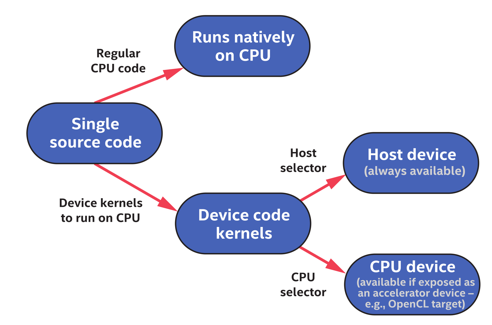

有一种机制本书没有涉及，可以在满足任务图中的先决条件时，将常规CPU代码(图2-16的顶部部分)入队。这个特性可以用来执行任务图中的CPU代码和设备代码，也称为主机任务。


## 2.9 在设备上创建任务

应用程序通常是包含主机代码和设备代码的组合。有一些类成员允许提交设备代码，并且这些工作分发机制是提交到设备执行的唯一方式，以便我们轻松地区分设备代码和主机代码。

本章的其余部分将介绍工作分发机制，目的是帮助了解和辨别在主机处理器上本机执行的设备代码和主机代码之间的区别。

### 2.9.1 任务图

SYCL执行模型中的基本概念是节点图。图中的每个节点(工作单元)都包含在设备上执行的操作，其中最常见的操作是数据并行设备的内核调用。图2-17展示了有四个节点的示例图，其中每个节点都可以看作是一个设备内核。

图2-17中的节点具有依赖边，定义了节点的工作何时开始。依赖边最常见的是数据依赖项自动生成的，尽管也可以在需要时手动添加额外的依赖项，例如：图中的节点B与节点A有一条依赖边，这条边意味着节点A必须在B开始前完成执行，然后将结果数据放在节点B的设备上。运行时控制依赖项的解析和节点执行的触发，与主机程序的完全异步。定义应用程序的节点图在本书中称为任务图，并在第3章中进行更详细的介绍。

图2-17 任务图定义了要在一个或多个设备上执行的操作(与主机程序异步执行)，还定义了何时可以安全执行某个操作的依赖项
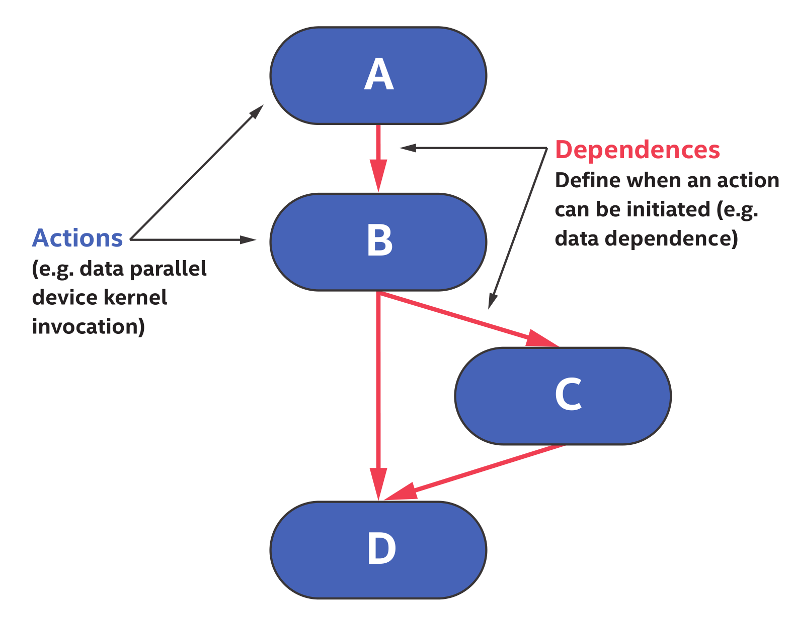


图2-18 提交设备代码
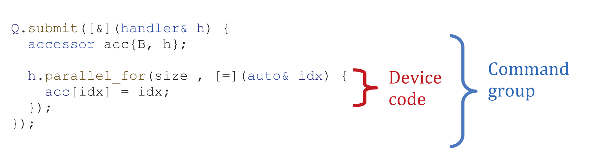

### 2.9.2 设备代码在哪里?

有多种机制可以在设备上执行代码，但需要例子展示了如何识别这些代码。即使示例中的模式看上去很复杂，但其模式在所有设备代码定义中都是相同的，因此就成为了第二特性。

图2-18中定义为Lambda，作为最后一个参数传递给 `parallel_for` 的代码，这个Lambda表达式就是要在设备上执行的设备代码。并行的 `parallel_for` 中可以区分设备代码和主机代码。`parallel_for` 是设备调度机制的一个小集合，都是handler类的成员，其定义了要在设备上执行的代码。图2-19给出了handler类的定义。

图2-19 handler类中成员函数的定义

```
class handler { 
public:
	// Specify event(s) that must be complete before the action 
	// defined in this command group executes.
	void depends_on(std::vector<event>& events);
	
	// Guarantee that the memory object accessed by the accessor
	// is updated on the host after this action executes.
	template <typename AccessorT>
		void update_host(AccessorT acc);
	
	// Submit a memset operation writing to the specified pointer.
	// Return an event representing this operation.
	event memset(void *ptr, int value, size_t count); 
	
	// Submit a memcpy operation copying from src to dest.
	// Return an event representing this operation.
	event memcpy(void *dest, const void *src, size_t count);
	
	// Copy to/from an accessor and host memory.
	// Accessors are required to have appropriate correct permissions.
	// Pointer can be a raw pointer or shared_ptr.
	template <typename SrcAccessorT, typename DestPointerT>
		void copy(SrcAccessorT src, DestPointerT dest);
		
	template <typename SrcPointerT, typename DestAccessorT>
		void copy(SrcPointerT src, DestAccessorT dest);
	
	// Copy between accessors.
	// Accessors are required to have appropriate correct permissions.
	template <typename SrcAccessorT, typename DestAccessorT>
		void copy(SrcAccessorT src, DestAccessorT dest);
	
	// Submit different forms of kernel for execution.
	template <typename KernelName, typename KernelType>
		void single_task(KernelType kernel);
		
	template <typename KernelName, typename KernelType, int Dims>
		void parallel_for(range<Dims> num_work_items, 
							KernelType kernel); 
							
	template <typename KernelName, typename KernelType, int Dims>
		void parallel_for(nd_range<Dims> execution_range, 
							KernelType kernel);
							
	template <typename KernelName, typename KernelType, int Dims>
		void parallel_for_work_group(range<Dims> num_groups, 
							KernelType kernel);
							
	template <typename KernelName, typename KernelType, int Dims>
		void parallel_for_work_group(range<Dims> num_groups,
									range<Dims> group_size, 
									KernelType kernel);
};
```

除了调用handler类的成员来提交设备代码之外，还有允许提交工作的queue类成员。图2-20表示queue类成员是某些模式的快捷方式，我们将在以后的章节中看到这些快捷方式的使用。

图2-20 queue类中成员函数的定义，该成员函数充当handler类中等效函数的快捷方式
```
class queue {
public:
	// Submit a memset operation writing to the specified pointer.
	// Return an event representing this operation.
	event memset(void *ptr, int value, size_t count)
	
	// Submit a memcpy operation copying from src to dest.
	// Return an event representing this operation.
	event memcpy(void *dest, const void *src, size_t count);
	
	// Submit different forms of kernel for execution.
	// Return an event representing the kernel operation.
	template <typename KernelName, typename KernelType>
		event single_task(KernelType kernel);
		
	template <typename KernelName, typename KernelType, int Dims>
		event parallel_for(range<Dims> num_work_items, 
						KernelType kernel); 
						
	template <typename KernelName, typename KernelType, int Dims>
		event parallel_for(nd_range<Dims> execution_range, 
						KernelType kernel); 
						
	// Submit different forms of kernel for execution. 
	// Wait for the specified event(s) to complete 
	// before executing the kernel. 
	// Return an event representing the kernel operation.
	template <typename KernelName, typename KernelType>
		event single_task(const std::vector<event>& events, 
						KernelType kernel);
						
	template <typename KernelName, typename KernelType, int Dims>
	event parallel_for(range<Dims> num_work_items, 
						const std::vector<event>& events, 
						KernelType kernel);
	
	template <typename KernelName, typename KernelType, int Dims>
		event parallel_for(nd_range<Dims> execution_range, 
						const std::vector<event>& events, 
						KernelType kernel);
};
```

### 2.9.3 执行机制

图2-18中的代码包含一个 `parallel_for`，定义了要在设备上执行的工作。`parallel_for` 位于提交给队列的命令组(CG)中，队列定义了要在其上执行工作的设备。在命令组中，有两类代码:

- 一项行动只有一次调用，设备代码将排队等待执行，或执行手动内存操作(如复制)。
- 主机代码会设置依赖项，这些依赖项定义了代码时何时开始执行(1)是安全的，例如：创建缓冲区的访问器(在第3章介绍)。

handler类包含一组成员函数，这些函数定义了在执行任务图节点时要执行的操作。图2-21对这些操作进行了总结。

图2-21中只有一个动作可以在命令组中调用(调用多个是错误的)，而且每个提交调用只能将一个命令组提交到队列中。这样，图2-21中的单个操作存在于每个任务图节点上，当节点依赖关系满足，且运行时安全时，就可以执行了。

> 命令组中只能有一个操作，例如：内核启动或显式内存操作。


代码异步执行，这就是主机程序一部分运行在CPU上和满足依赖关系时运行的设备代码之间的关键区别。命令组通常包含来自每种类别的代码，其中的代码定义了作为主机程序运行的依赖项(以便运行时知道这些依赖项是什么)，以及在满足这些依赖项后在将要运行的设备代码。

图2-21 调用设备代码或执行显式内存的操作

工作类型 | 行为(handler类的成员函数 | 总结
-- | -- | --
设备代码执行 | `single_task` | 执行一个设备函数的单例
设备代码执行 | `parallel_for` | 有多种形式可用来启动不同组合的设备代码 
设备代码执行 | `parallel_for_work_group`| 使用层次并行启动一个内核，在第4章介绍
显式内存操作 | `copy` | 访问器、指针和/或 `shared_ptr` 指定的位置之间复制数据。复制作为DAG的一部分发生，包括依赖性跟踪
显式内存操作 | `update_host` | 触发缓存对象在主机端的备份更新
显式内存操作 | `fill` | 将内存中的数据初始化为指定的值。 


图2-22 提交设备代码
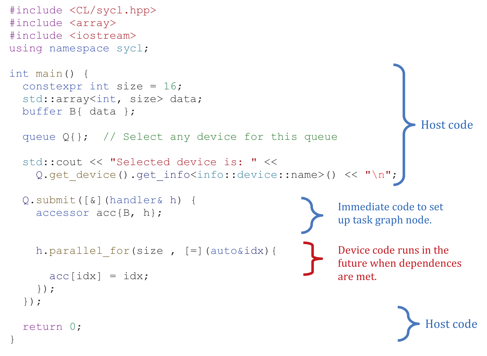

图2-22中有三类代码:

- 主机代码：驱动应用程序，包括创建和管理数据缓冲区，并向队列提交任务，在任务图中形成新的节点，以便异步执行。
- 命令组中的主机代码：代码在执行主机代码的处理器上运行，并在submit操作返回前执行，例如：代码通过创建访问器来设置节点依赖关系。任何的CPU代码都可以在这里执行，但最佳实践是将其限制为配置节点依赖关系的代码。
- 执行机制：图2-21中列出的任何命令都可以包含在命令组中，它定义了在节点满足要求(由(2)设置)时要异步执行的工作。

为了理解应用程序中的代码何时会运行，注意图2-21中列出的启动设备代码的动作，以及图2-21中列出的显式内存操作，都会在DAG节点依赖满足时异步执行，所有代码会作为主程序的一部分立即运行。

### 2.9.4 后备队列机制

通常，命令组在提交的命令队列上执行。某些情况下，命令组提交到队列会失败(例如，当请求的工作大小超过设备的限制)，或者成功提交的操作无法执行(例如，当硬件设备发生故障)。要处理这种情况，可以为执行的命令组指定后备队列。不过，不推荐这种错误管理方式，因为可控性太低，更建议捕捉和管理这些问题，会在第5章中进行介绍。这里简要介绍下后备队列，因为其在SYCL中比较有名，所以有些人喜欢这种方式。

这种类型的回退，适用于设备队列会提交失败的机器，但这不是解决加速器不存在问题的机制。在没有GPU设备的系统上，图2-23中的程序会在Q声明(尝试构造)处抛出一个错误，指示“请求的设备类型不可用”。

基于现有设备的后备队列将在第12章中进行介绍。

图2-23 后备队列的例子

```
#include <CL/sycl.hpp>
#include <array>
#include <iostream>
using namespace sycl;

int main() {
	constexpr int global_size = 16;
	constexpr int local_size = 16;
	buffer<int,2> B{ range{ global_size, global_size }};
	
	queue gpu_Q{ gpu_selector{} };
	queue host_Q{ host_selector{} };
	
	nd_range NDR {
		range{ global_size, global_size },
		range{ local_size, local_size }};
	
	gpu_Q.submit([&](handler& h){
		accessor acc{B, h};
		h.parallel_for( NDR , [=](auto id) {
			auto ind = id.get_global_id();
			acc[ind] = ind[0] + ind[1];
		});
	}, host_Q); /** <<== Fallback Queue Specified **/

	host_accessor acc{B};
	for(int i=0; i < global_size; i++){
		for(int j = 0; j < global_size; j++){
			if( acc[i][j] != i+j ) {
				std::cout<<"Wrong result\n";
				return 1;
	} } }
	std::cout<<"Correct results\n";
	return 0;
}
```

由于工作组请求的大小，图2-23所示的代码会在一些GPU上执行失败。可以指定一个后备队列作为submit函数的参数，如果命令组无法进入主队列，则使用后备队列(本例中是主机设备)。

> 通过向提交调用传递后备队列来启用后备队列。不过，建议对捕获的初始错误进行处理，而不是使用提供较少可控性的后备队列机制。


## 2.10 总结

本章中，概述了队列、选择与队列相关联的设备，以及如何创建自定义设备选择器。还了解了，如何在设备上异步执行的代码，以及设备代码在主机端如何执行。第3章中来了解一下如何控制数据移动。

