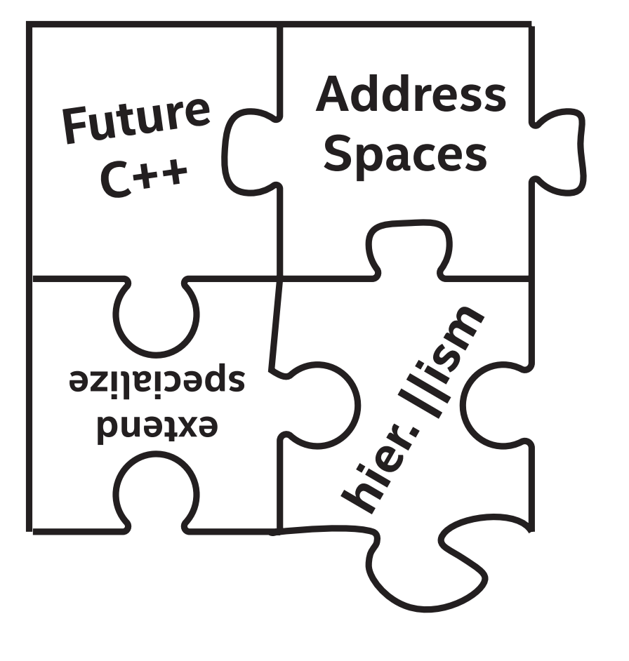

# 20 结语：DPC++的未来方向



现在让我们感受一下平静，因为我们终于了解了使用SYCL和DPC++编程的所有知识。所有的谜团都已解开。

但还是要注意，这本书是在SYCL和DPC++刚出现的时候写的。随着第一个DPC++规范和SYCL 2020临时规范的发布，这是一个快速发展的时期，我们努力确保代码示例，与开源DPC++编译器编译的时候(2020年第三季)和执行广泛的硬件上时，出版了本书。但是，本结语中显示的未来代码到2020年年中还不能使用任何编译器进行编译。

结语中，我们对未来进行了展望。我们的水晶球可能有点难以解读。

这本书的绝大部分内容将会流传很长时间。也就是说，这是一个热门的区域，而且正在发生的变化可能会破坏我们已经了解的一些知识。这包括一些最初作为供应商扩展出现的项目，后来纳入了规范(比如子工作组和USM)。如此多的新特性将成为下一个SYCL标准的一部分，但这也使得讨论这些特性变得复杂:我们应该将这些特性称为供应商扩展、SYCL的实验/临时特性，还是SYCL的一部分?

这个结语提供了一个即将到来的DPC++特性的先睹所快，我们对这些特性感到非常兴奋。但在本书出版时，这些特性还没有完全完成。不保证本结语中的代码示例可以编译:一些可能已经与本书之后发布的SYCL或DPC++编译器兼容，而另一些可能需要经过一些语法调整后才编译。一些特性可能作为扩展发布或合并到未来的标准中，而其他特性可能无限期地保持实验特性。随着本书的发展，GitHub存储库中的代码样本可能会更新，以使用新的语法。同样地，我们将为这本书提供勘误表。我们建议检查这两个地方的更新(代码库和图书勘误表链接可以在第1章中找到)。

## 20.1 与C++20和C++23对齐

保持SYCL、DPC++和ISO C++之间的紧密一致有两个优点。首先，使SYCL和DPC++能够利用标准C++的最新和最伟大的特性来提高开发人员的生产力。其次，增加了SYCL或DPC++中引入的异构编程特性，以及影响标准C++未来发展方向(例如，executor)的机会。

SYCL 1.2.1是基于C++11的，而对SYCL 2020和DPC++接口的许多最大的改进都是在C++14(例如，通用Lambda)和C++17(例如，类模板参数演绎-CTAD)中引入的语言特性中才可能实现的。

C++20规范是在2020年发布的(当时我们正在写这本书!)它包括一些已经被DPC++和SYCL预先采用的特性(例如，std::atomic_ref, std::bit_cast)，随着我们走向SYCL的下一个官方版本(2020之后的临时版本)和DPC++的下一个版本，我们期望与C++20更紧密地结合。例如，C++20以std::latch和std::barrier的形式引入了一些额外的线程同步例程；我们已经在第19章探讨了如何使用类似的接口来定义设备范围的栅栏，并且在C++20的新语法中重新检查子工作组和工作组的栅栏也是有意义的

C++23的工作已经开始了，因为规范还没有最终定稿，所以在SYCL或DPC++规范中采用任何这些特性都将是一个错误——这些特性可能会在进入C++23之前发生重大变化，导致难以修复的不兼容性。然而，有许多正在讨论的特性可能会改变未来SYCL和DPC++程序的形式和行为。最令人兴奋的提议特性之一是mdspan，这是一个非拥有的数据内存，它为指针提供多维数组语法，并提供一个AccessorPolicy作为控制对底层数据访问的扩展点。这些语义与SYCL访问器的语义非常相似，mdspan将使访问器类语法能够用于缓冲区和USM分配，如图EP-1所示。


图EP-1 使用mdspan将类似访问器的索引附加到USM指针
```
queue Q;
constexpr int N = 4;
constexpr int M = 2;
int* data = malloc_shared<int>(N * M, Q);
stdex::mdspan<int, N, M> view{data};
Q.parallel_for(range<2>{N, M}, [=](id<2> idx) {
	int i = idx[0];
	int j = idx[1];
	view(i, j) = i * M + j;
}).wait();
```

希望mdspan成为标准C++只是时间问题。同时，我们建议感兴趣的读者尝试参考Kokkos项目的开源产品质量参考实现。

另一个令人兴奋的特性是std::simd类模板它试图为C++中的显式向量并行提供可移植的接口。采用这个接口将在第11章中描述的两种不同的向量类型使用之间提供明确的区别:使用向量类型来方便程序员，使用向量类型来进行底层性能调优。同一种语言中同时支持SPMD和SIMD编程风格也提出了一些有趣的问题:应该如何声明内核使用哪种风格，是否能够在同一个内核中混合和匹配样式?希望未来的供应商扩展能够探索这些问题，因为在标准化之前，供应商会在这个领域进行试验。

## 20.2 地址空间

正如前面章节中所看到的，简单的代码会因为内存空间的存在变得复杂。我们可以自由地使用常规C++指针，但有时候需要使用multi_ptr类，并显式地指定期望支持的地址空间。

许多现代体系结构通过为所谓的通用地址空间提供硬件支持来解决这个问题，指针可以指向任何内存空间中的内存，因此我们(和编译器!)可以利用运行时查询，特化不同内存空间需要不同处理的情况下的代码(例如，访问工作组本地内存可能使用不同的指令)。对泛型地址空间的支持在其他编程语言中已经可用，比如OpenCL，预计SYCL的未来版本将采用默认泛型代替推理规则。

这一更改将极大地简化许多代码，并使multi_ptr类成为可选的性能调优特性，而不是正确性所必需的特性。图EP-2显示了一个使用现有地址空间编写的简单类，图EP-3和EP-4显示了通过引入通用地址空间可以实现的两种可选设计。


图EP-2 类中存储指向特定地址空间的指针
```
// Pointers in structs must be explicitly decorated with address space
// Supporting both address spaces requires a template parameter
template <access::address_space AddressSpace>
struct Particles {
	multi_ptr<float, AddressSpace> x;
	multi_ptr<float, AddressSpace> y;
	multi_ptr<float, AddressSpace> z;
};
```


图EP-3 类中存储指向泛型地址空间的指针
```
// Pointers in structs default to the generic address space
struct Particles {
	float* x;
	float* y;
	float* z;
};
```


图EP-4 类中存储带有可选地址空间的指针
```
// Template parameter defaults to generic address space
// User of class can override address space for performance tuning
template <access::address_space AddressSpace =
access::address_space::generic_space>

struct Particles {
	multi_ptr<float, AddressSpace> x;
	multi_ptr<float, AddressSpace> y;
	multi_ptr<float, AddressSpace> z;
};
```


## 20.3 扩展与更特化的机制
第12章引入了一组查询，使主机能够在运行时提取有关设备的信息。这些查询允许针对特定设备调优工作组大小等运行时参数进行查询，并允许将实现不同算法的不同内核分派到不同类型的设备。

未来的版本预计将使用编译时查询来扩充这些运行时查询，允许基于实现是否理解供应商扩展而对代码进行特化。图EP-5显示了如何使用预处理器来检测编译器是否支持特定的供应商扩展


图EP-5 使用#ifdef检查Intel子工作组的编译器扩展支持情况
```
#ifdef SYCL_EXT_INTEL_SUB_GROUPS
sycl::ext::intel::sub_group sg = it.get_sub_group();
#endif
```

我们还计划引入编译时查询，使内核能够根据目标设备的属性(我们称之为方面)进行特化(例如，设备类型、对特定扩展的支持、工作组本地内存的大小、编译器选择的子工作组大小)。这些的常量表达式，目前在C++中不存在——在编译主机代码时不一定是constexpr，但在目标设备时就变成了constexpr。用于公开设备constexpr的机制仍在设计中。我们希望SYCL 2020临时规范引入的专用常量化特性，并且形式和行为上类似于图EP-6中所示。


图EP-6 内核编译时基于设备方面特化内核代码
```
h.parallel_for(..., [=](item<1> it) {
	if devconstexpr (this_device().has<aspect::cpu>()) {
		/* Code specialized for CPUs */
	}
	else if devconstexpr (this_device().has<aspect::gpu>()) {
		/* Code specialized for GPUs */
	}
});
```


## 20.4 分层并行

第4章中提到的，我们认为旧版本SYCL中的分层并行是一种实验性特性，在使用新的语言特性时，预计会比基本的数据并行和ND-Range内核慢一些。

DPC++和SYCL 2020中有很多新的语言特性，其中一些与分层并行不兼容(例如子工作组、组算法、归约减)。消除这种差异将有助于提高程序员的工作效率，并为一些简单的情况提供了更紧凑的语法。图EP-7中的代码显示了将归约支持扩展到层次并行的可能，从而实现层次归约:每个工作组计算一个总和，内核作为一个整体计算所有工作组中所有总和的最大值。


图EP-7 使用层次并行进行层次归约
```
h.parallel_for_work_group(N, reduction(max, maximum<>()),
[=](group<1> g, auto& max) {
	float sum = 0.0f;
	g.parallel_for_work_item(M, reduction(sum, plus<>()),
	[=](h_item<1> it, auto& sum) {
		sum += data[it.get_global_id()];
	});
	max.combine(sum);
});
```

第4章中简要提到的分层并行性的另一个方面是实现的复杂性。将嵌套的并行性映射到加速器并不是SYCL或DPC++特有的挑战，这个主题是很多人感兴趣和研究的课题。随着在实现分层并行性和不同设备的能力方面的经验积累，我们期望SYCL和DPC++中的语法能够与标准保持一致。

## 20.5 总结


关于SYCL和DPC++已经有很多令人兴奋的事情了，而这仅仅是开始!我们(作为一个社区)还有很长的路要走，我们需要持续不断的努力来提炼异构编程的能力，并设计新的语言特性，在性能、可移植性和生产力之间达到理想的平衡。

我们需要你的帮助!如果SYCL或DPC++缺少您喜欢的C++(或任何其他编程语言)特性，请联系我们。我们可以共同塑造SYCL、DPC++和ISO C++的未来方向。


### 20.5.1 更多信息


- Khronos SYCL Registry, www.khronos.org/registry/SYCL/
- J. Hoberock et al., “C++的执行提案,” http://wg21.link/p0443
- H. Carter Edwards et al., “mdspan:非拥有多维数组引用，” http://wg21.link/p0009
- D. Hollman et al., “生产型mdspan实现,” https://github.com/kokkos/mdspan

